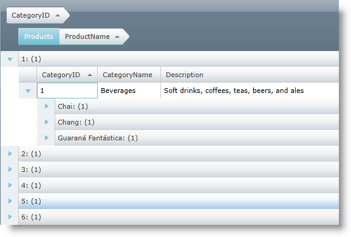
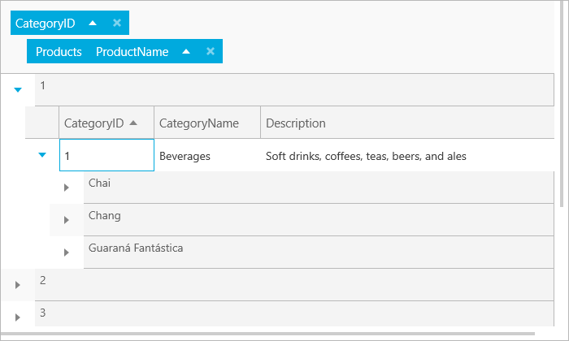
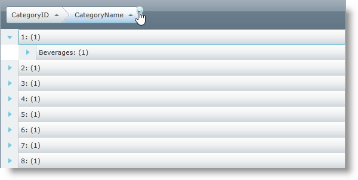
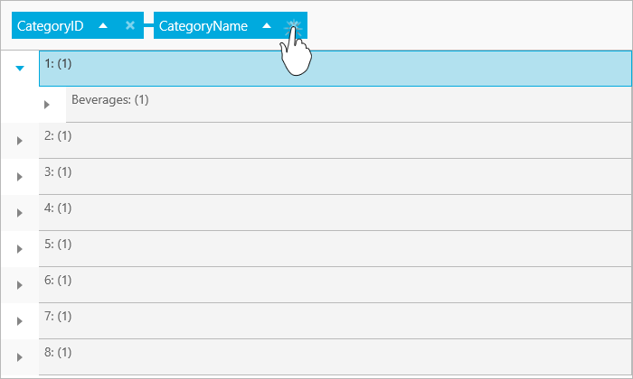
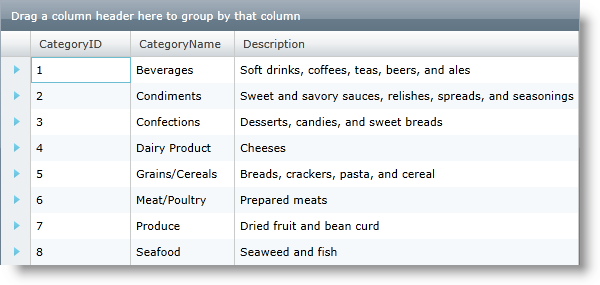
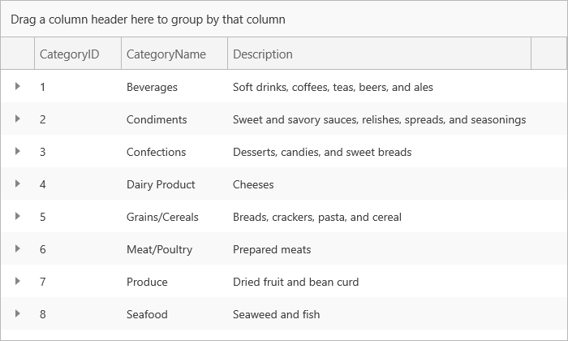
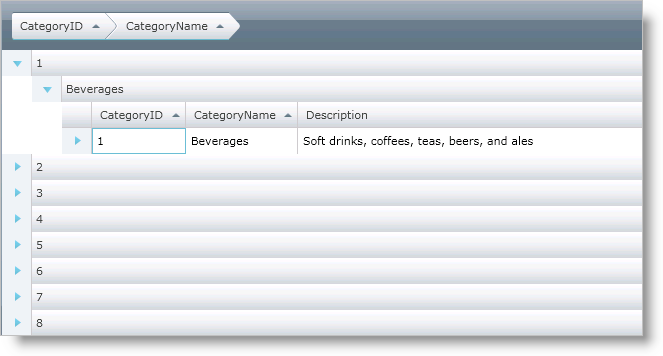
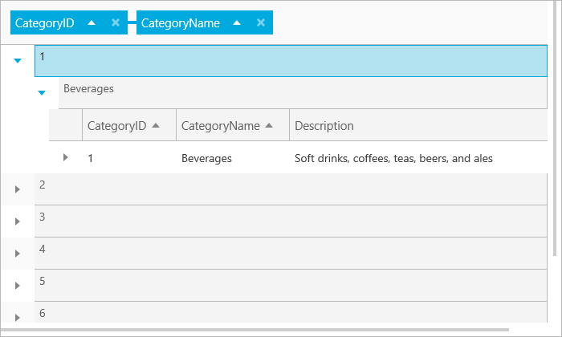
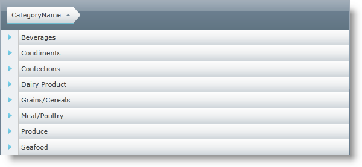
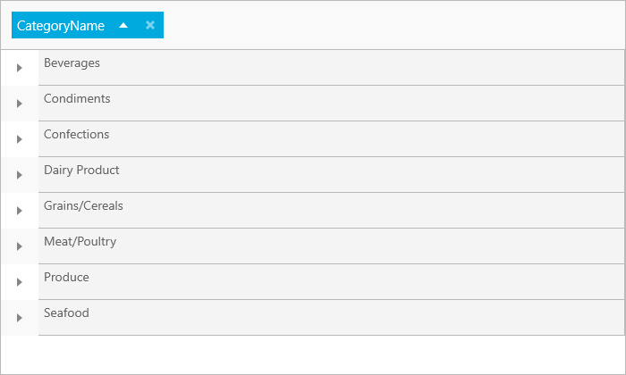

////

|metadata|
{
    "name": "xamgrid-groupby",
    "controlName": ["xamGrid"],
    "tags": ["Grids","Grouping","How Do I"],
    "guid": "{D3B841A9-4E1F-48E4-AB8C-17C01AE7571E}",  
    "buildFlags": [],
    "createdOn": "2016-05-25T18:21:55.9172007Z"
}
|metadata|
////

= GroupBy

The GroupBy feature of xamGrid™ allows your end users to group data into a more readable and navigable view. The feature displays a section at the top or bottom of the control in which your end users can drag columns there in order for their data to be grouped. Once a column is grouped, the control displays the column header in the GroupBy area with link:{ApiPlatform}controls.grids.xamgrid.v{ProductVersion}~infragistics.controls.grids.primitives.groupbyrow.html[GroupByRow] objects displaying in place of the normal link:{ApiPlatform}controls.grids.xamgrid.v{ProductVersion}~infragistics.controls.grids.row.html[Row] objects. A GroupBy row displays the value and number of items in the group by default, and can be expanded to display the grouped data nested within.

ifdef::win-rt[]
The user can group the xamGrid data by a specific column using the column menu that appears when he clicks/taps on that column’s header and selecting the 'Group By' menu item. For more information about group by feature using touch interactions, see the link:xamgrid-touch-support.html[Touch support] topic.
endif::win-rt[]

You can use the link:{ApiPlatform}controls.grids.xamgrid.v{ProductVersion}~infragistics.controls.grids.groupbysettings.html[GroupBySettings] object to configure the GroupBy feature on the entire xamGrid control or on individual link:{ApiPlatform}controls.grids.xamgrid.v{ProductVersion}~infragistics.controls.grids.columnlayout.html[ColumnLayout] objects. You can also group columns using the link:{ApiPlatform}controls.grids.xamgrid.v{ProductVersion}~infragistics.controls.grids.groupbysettings~groupbycolumns.html[GroupByColumns] property or setting a column's link:{ApiPlatform}controls.grids.xamgrid.v{ProductVersion}~infragistics.controls.grids.column~isgroupby.html[IsGroupBy] property.

.Note
[NOTE]
====
The link:{ApiPlatform}controls.grids.xamgrid.v{ProductVersion}~infragistics.controls.grids.row~childbands.html[ChildBands] property is not supported for a `GroupByRow` object. This collection property returns `null` in this particular case.
====

== GroupBy Behavior

If a column already exists in the GroupBy area, when dragging in a column, that column can be placed ahead or behind the existing column. The arrow indicator guides your end user in the positioning of the column. Only columns of the same ColumnLayout object can be ordered with each other.

If deferred scrolling is enabled in xamGrid, use the link:{ApiPlatform}controls.grids.xamgrid.v{ProductVersion}~infragistics.controls.grids.deferredscrollingsettings~groupbydeferredscrolltemplate.html[GroupByDeferredScrollTemplate] property to set a template to display custom content while scrolling, such as the current row the user is on. For more information on deferred scrolling, see link:xamgrid-deferred-scrolling.html[Deferred Scrolling].

Dragging a column from a child collection into the GroupBy area displays the ColumnLayout object's header followed by the column header in the GroupBy area.

ifdef::sl,wpf[]

endif::sl,wpf[]

ifdef::win-rt[]

endif::win-rt[]

Pressing the Escape key while a column is being dragged cancels the GroupBy attempt.

Grouping a column appends the column to the GroupByColumns Collection, unless that column has been grouped previously. Further, the column is sorted and the sort has higher priority than any sorts thereafter. The sort cannot be removed unless the column is ungrouped.

To ungroup a column, highlight a column header in the GroupBy area and click on the X icon or drag the column header out of the GroupBy area.

ifdef::sl,wpf[]

endif::sl,wpf[]

ifdef::win-rt[]

endif::win-rt[]

Editing the data of a grouped column will not regroup the row. To force the regroup, call xamGrid's link:{ApiPlatform}controls.grids.xamgrid.v{ProductVersion}~infragistics.controls.grids.xamgrid~invalidatedata.html[InvalidateData] method.

== Enabling GroupBy

The following code shows you how to enable the GroupBy feature.

*In Visual Basic:*

----
Me.xamGrid1.GroupBySettings.AllowGroupByArea = Infragistics.Controls.Grids.GroupByAreaLocation.Top
Me.xamGrid1.Columns.ColumnLayouts("Products").GroupBySettings.IsGroupable = True
----

*In C#:*

----
this.xamGrid1.GroupBySettings.AllowGroupByArea = Infragistics.Controls.Grids.GroupByAreaLocation.Top;
this.xamGrid1.Columns.ColumnLayouts["Products"].GroupBySettings.IsGroupable = true;
----

ifdef::sl,wpf[]

endif::sl,wpf[]

ifdef::win-rt[]

endif::win-rt[]

== Grouping Data in Code

The following code shows you how to use the GroupBy feature for columns in two different ways: set a column's IsGroupBy property and add a column to the GroupByColumns Collection.

*In Visual Basic:*

----
' Column 1
Dim col1 As Column = Me.xamGrid1.Columns.DataColumns(0)
' Column 2
Dim col2 As Column = Me.xamGrid1.Columns.DataColumns(1)
' Group Column 1 by adding it to groupby collection
Me.xamGrid1.GroupBySettings.GroupByColumns.Add(col1)
' Group Column 2 by setting its GroupBy property
col2.IsGroupBy = True
----

*In C#:*

----
// Column 1
Column col1 = this.xamGrid1.Columns.DataColumns[0];
// Column 2
Column col2 = this.xamGrid1.Columns.DataColumns[1];
// Group Column 1 by adding it to groupby collection
this.xamGrid1.GroupBySettings.GroupByColumns.Add(col1);
// Group Column 2 by setting its GroupBy property
col2.IsGroupBy = true;
----

ifdef::sl,wpf[]

endif::sl,wpf[]

ifdef::win-rt[]

endif::win-rt[]

==== Hiding the Number of Rows in a Particular Grouped Row

The number of rows is displayed when a particular row is grouped. Displaying the count is the default behavior however you can easily disable it by setting the link:{ApiPlatform}controls.grids.xamgrid.v{ProductVersion}~infragistics.controls.grids.groupbysettings.html[GroupBySettings] object’s link:{ApiPlatform}controls.grids.xamgrid.v{ProductVersion}~infragistics.controls.grids.groupbysettings~displaycountongroupedrow.html[DisplayCountOnGroupedRow] property to false as demonstrated in the following code snippet.

*In XAML:*

----
<ig:XamGrid.GroupBySettings>
   <ig:GroupBySettings AllowGroupByArea="Top" DisplayCountOnGroupedRow=" />
</ig:XamGrid.GroupBySettings>
----

*In Visual Basic:*

----
dataGrid.GroupBySettings.DisplayCountOnGroupedRow = false
----

*In C#:*

----
dataGrid.GroupBySettings.DisplayCountOnGroupedRow = false;
----

The following screenshot displays the hidden number of rows in each grouped row.

ifdef::sl,wpf[]

endif::sl,wpf[]

ifdef::win-rt[]

endif::win-rt[]

== *Related Topics*

link:xamgrid-custom-groupby.html[Custom GroupBy]

link:xamgrid-custom-groupby-row-display.html[Custom GroupBy Row Display]

link:xamgrid-customize-groupby-deferred-scrolling-template.html[Customize GroupBy Deferring Scrolling Template]

pick:[win-rt=" link:xamgrid-touch-support.html[Touch Support]"]