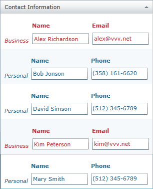

////

|metadata|
{
    "name": "xamgrid-implicitdatatemplates",
    "controlName": ["xamGrid"],
    "tags": ["Data Presentation","Getting Started","Grids","How Do I","Layouts","Styling","Templating"],
    "guid": "0ca8e330-6559-4eb3-8dd1-3cfde2077618",  
    "buildFlags": [],
    "createdOn": "2016-05-25T18:21:56.5911978Z"
}
|metadata|
////

= Applying Different User Interface Depending on the Cell Data Type

== Topic Overview

=== Purpose

This topic demonstrates how implicit data templates can be used to apply different visual representation of data types in cells in a TemplateColumn in the xamGrid™ control.

=== In this topic

This topic contains the following sections:

* <<_Ref320203782, Using Implicit Data Templates on Different Data Types in a TemplateColumn >>
* <<_Ref320203793, Code Examples >>

** <<_Contact,Code Example:  _Contact_  model>>
** <<_PersonalBusiness,Code Example:  _Personal_  and  _Business_  models>>
** <<_ContactDetails,Code Example:  _ContactDetails_  model>>
** <<_ViewModel,Code Example:  _ContactsViewModel_ >>
** <<_PersonalTemplate,Code Example: Personal Implicit Data Template>>
** <<_BusinessTemplate,Code Example: Business Implicit Data Template>>
** <<_AddingGrid,Code Example: Adding the xamGrid Control>>

* <<_Ref320204025, Related Content >>

[[_Ref320203782]]
== Using Implicit Data Templates on Different Data Types in a TemplateColumn

=== Introduction

The implicit data templates are applied on a specific data type. Instead of an x:Key property, a DataType property is set to the data template. This feature  pick:[sl="is introduced in Silverlight 5"]  pick:[sl=","]   pick:[wpf="is available in Windows Presentation Foundation"] .

The procedure demonstrates the xamGrid support for implicit data templates.

The example code represents personal and business contacts with different templates. The personal and business contacts extend  _Contact_   model and are displayed in a  _ContactInfo_   TemplateColumn in the xamGrid control.

The  _ColumnInfo_   TemplateColumn is editable and sortable and implicit data templates are used to differentiate business from personal contacts.

=== Preview

The following screenshot is a preview of the final result.

=== Overview

This topic takes you step-by-step toward applying implicit data templates on different data types in a TemplateColumn. The following is a conceptual overview of the process:

[start=1]
. <<_step1,Creating a Contact model>>
[start=2]
. <<_step2,Creating Personal and Business models>>
[start=3]
. <<_step3,Creating a model with a property of type Contact>>
[start=4]
. <<_step4,Creating a ContactsViewModel view model>>
[start=5]
. <<_step5,Setting the page DataContext property>>
[start=6]
. <<_step6,Creating an implicit template for the Personal contacts>>
[start=7]
. <<_step7,Creating an implicit template for the Business contacts>>
[start=8]
. <<_step8,Adding a xamGrid control to your page>>

=== Steps

The following steps demonstrate how to apply implicit data templates in the TemplateColumn in the xamGrid control.

=== Create a Contact model

The  _Contact_   model is a base model that will be extended by the  _Personal_   and  _Business_   models.

It implements  _INotifyPropertyChanged_   and  _IComparable_   interfaces.

=== Create Personal and Business models

The  _Personal_   and  _Business_   models extend the  _Contact_   model.

* Personal model

_Personal_   contact model has two members – the inherited  _Name_   property and  _Phone_   property.

* Business model

_Business_   contact model has two members – the inherited  _Name_   property and  _Email_   property.

=== Create a model with a property of type Contact

This model has a property of type  _Contact_   to hold contact details. This model class may contain other properties that you want to display in the xamGrid control.

=== Create a ContactsViewModel view model

This class handles loading of the data. For the purposes of our example, the data is hard-coded.

=== Set the page DataContext property

Get the sample data collection and set it to the page DataContext property in the page loaded handler.

*In C#:*

[source,csharp]
----
ContactsViewModel _vm = new ContactsViewModel();
this.DataContext = _vm;
----

*In Visual Basic:*

[source,vb]
----
Dim _vm As New ContactsViewModel()
Me.DataContext = _vm
----

=== Create an implicit data template for the Personal contacts

Create an implicit data template to be applied automatically to the  _Personal_   data type entries.

=== Create an implicit data template for the Business contacts

Create an implicit data template to be applied automatically to the  _Business_   data type entries.

=== Add a xamGrid control to your page

Add the xamGrid on a page with a TemplateColumn to display the contacts details. The data can be edited and sorted.

[[_Ref320203793]]
== Code Examples

=== Overview

The following table lists the code examples included in this topic.

[options="header", cols="a,a"]
|====
|Example|Description

|<<_Contact, _Contact_ model>>
|Base model used in the example

|_<<_PersonalBusiness,Personal and Business models>>_
|These models extend the _Contact_ model

|<<_ContactDetails, _ContactDetails_ model>>
|The data model with a property of type Contact

|_<<_ViewModel,ContactsViewModel>>_
|The sample viewmodel class that deals with the data

|<<_PersonalTemplate,Personal Implicit Data Template>>
|The implicit data template that is applied to the cells of _Personal_ type

|<<_BusinessTemplate,Business Implicit Data Template>>
|The implicit data template that is applied to the cells of _Business_ type

|<<_AddingGrid,Adding the xamGrid Control>>
|This is XAML code that adds editable xamGrid with a TemplateColumn.

|====

[[_Contact]]
== Code Example:  _Contact_   model

=== Description

This class is the base data model. It implements  _INotifyPropertyChanged_   and  _IComparable_   interfaces in order to have editable and sortable data.

[[_Ref320203813]]

=== Code

*In C#:*

[source,csharp]
----
public class Contact : ObservableModel, IComparable<Contact>
{
    private string _name;
    public string Name
    {
        get { return _name; }
        set
        {
            if (_name != value)
            {
                _name = value;
                NotifyPropertyChanged("Name");
            }
        }
    }
    public int CompareTo(Contact other)
    {
        int result = 1;
        if (other != null)
        {
            result = this.Name.CompareTo(other.Name);
        }
        return result;
    }
}
public class ObservableModel : INotifyPropertyChanged
{
    public event PropertyChangedEventHandler PropertyChanged;
    protected void NotifyPropertyChanged(String info)
    {
        if (PropertyChanged != null)
        {
            PropertyChanged(this, new PropertyChangedEventArgs(info));
        }
    }
}
----

*In Visual Basic:*

[source,vb]
----
Public Class Contact
    Inherits ObservableModel
    Implements IComparable
    Private _name As String
    Public Property Name() As String
        Get
            Return _name
        End Get
        Set(value As String)
            If _name <> value Then
                _name = value
                NotifyPropertyChanged("Name")
            End If
        End Set
    End Property
    Function CompareTo(ByVal obj As Object) As Integer 
    Implements IComparable.CompareTo
        Dim contact As Contact = CType(obj, Contact)
        Return String.Compare(Me.Name, contact.Name)
    End Function
End Class 
Public Class ObservableModel
    Implements INotifyPropertyChanged
    Public Event PropertyChanged(ByVal sender As Object, ByVal e As PropertyChangedEventArgs) Implements INotifyPropertyChanged.PropertyChanged
    Protected Overridable Sub NotifyPropertyChanged(ByVal propertyName As String)
        RaiseEvent PropertyChanged(Me, New PropertyChangedEventArgs(propertyName))
    End Sub 
End Class
----

[[_PersonalBusiness]]
== Code Example:  _Personal_   and  _Business_   models

=== Description

These two classes extend the  _Contact_   class.

[[_Ref320347492]]

=== Code

*In C#:*

[source,csharp]
----
public class Personal : Contact
{
    private string _phone;
    public string Phone
    {
        get { return _phone; }
        set
        {
            if (_phone != value)
            {
                _phone = value;
                NotifyPropertyChanged("Phone");
            }
        }
    }
}
public class Business : Contact
{
    private string _email;
    public string Email
    {
        get { return _email; }
        set
        {
            if (_email != value)
            {
                _email = value;
                NotifyPropertyChanged("Email");
            }
        }
    }
}
----

*In Visual Basic:*

[source,vb]
----
Public Class Personal
    Inherits Contact
    Private _phone As String
    Public Property Phone() As String
        Get
            Return _phone
        End Get
        Set(value As String)
            If _phone <> value Then
                _phone = value
                NotifyPropertyChanged("Phone")
            End If
        End Set
    End Property
End Class
Public Class Business
    Inherits Contact
    Private _email As String
    Public Property Email() As String
        Get
            Return _email
        End Get
        Set(value As String)
            If _email <> value Then
                _email = value
                NotifyPropertyChanged("Email")
            End If
        End Set
    End Property
End Class
----

[[_ContactDetails]]
== Code Example:  _ContactDetails_   model

=== Description

This model has a property of type  _Contact_   to hold contact details. This model class may contain other properties that you want to display in the xamGrid control.

[[_Ref320347527]]

=== Code

*In C#:*

[source,csharp]
----
public class ContactDetails : ObservableModel
{
    private Contact _contactInfo;
    public Contact ContactInfo
    {
        get { return _contactInfo; }
        set
        {
            if (_contactInfo != value)
            {
                _contactInfo = value;
                NotifyPropertyChanged("ContactInfo");
            }
        }
    }
}
----

*In Visual Basic:*

[source,vb]
----
Public Class ContactDetails
    Inherits ObservableModel
    Private _contactInfo As Contact
    Public Property ContactInfo() As Contact
        Get
            Return _contactInfo
        End Get
        Set(value As Contact)
            If _contactInfo IsNot value Then
                _contactInfo = value
                NotifyPropertyChanged("ContactInfo")
            End If
        End Set
    End Property
End Class
----

[[_ViewModel]]
== Code Example:  _ContactsViewModel_

=== Description

This is a viewmodel class that loads a hard-coded data.

[[_Ref320203994]]

=== Code

*In C#:*

[source,csharp]
----
public class ContactsViewModel
{
    public ContactsViewModel() 
    {
        // Load sample data
        this.ContactsDetails = LoadContacts(); 
    }
    private ObservableCollection<ContactDetails> _contacts = new ObservableCollection<ContactDetails>();
    public ObservableCollection<ContactDetails> ContactsDetails { get; set; }     
    public ObservableCollection<ContactDetails> LoadContacts()
    {
        ObservableCollection<ContactDetails> collection = new ObservableCollection<ContactDetails>();
        collection.Add(new ContactDetails
        {
            ContactInfo = new Personal 
            {
                Name = "Mary Smith",
                Phone = "(512) 345-6789"
            }
        });
        collection.Add(new ContactDetails
        {
            ContactInfo = new Personal
            {
                Name = "David Simson",
                Phone = "(512) 345-6789"
            }
        });
        collection.Add(new ContactDetails
        {
            ContactInfo = new Personal
            {
                Name = "Bob Jonson",
                Phone = "(358) 161-6620"
            }
        });
        collection.Add(new ContactDetails
        {
            ContactInfo = new Business
            {
                Name = "Kim Peterson",
                Email = "kim@vvv.net"
            }
        });
        collection.Add(new ContactDetails
        {
            ContactInfo = new Business
            {
                Name = "Alex Richardson",
                Email = "alex@vvv.net"
            }
        });
        return collection;
    }
}
----

*In Visual Basic:*

[source,vb]
----
Public Class ContactsViewModel
    Public Sub New()
        ' Load sample data
        Me.ContactsDetails = LoadContacts()
    End Sub
    Private _contacts As New ObservableCollection(Of ContactDetails)()
    Public Property ContactsDetails() As ObservableCollection(Of ContactDetails)
        Get
            Return m_ContactsDetails
        End Get
        Set(value As ObservableCollection(Of ContactDetails))
            m_ContactsDetails = value
        End Set
    End Property
    Private m_ContactsDetails As ObservableCollection(Of ContactDetails)
    Public Function LoadContacts() As ObservableCollection(Of ContactDetails)
        Dim collection As New ObservableCollection(Of ContactDetails)()
        Dim tempCD = New ContactDetails
        Dim tempPerson = New Personal
        tempPerson.Name = "Mary Smith"
        tempPerson.Phone = "(512) 345-6789"
        tempCD.ContactInfo = tempPerson
        collection.Add(tempCD)
        tempCD = New ContactDetails
        tempPerson = New Personal
        tempPerson.Name = "David Simson"
        tempPerson.Phone = "(512) 345-6789"
        tempCD.ContactInfo = tempPerson
        collection.Add(tempCD)
        tempCD = New ContactDetails
        tempPerson = New Personal
        tempPerson.Name = "Bob Jonson"
        tempPerson.Phone = "(358) 161-6620"
        tempCD.ContactInfo = tempPerson
        collection.Add(tempCD)
        tempCD = New ContactDetails
        Dim tempBusiness = New Business
        tempBusiness.Name = "Kim Peterson"
        tempBusiness.Email = "kim@vvv.net"
        tempCD.ContactInfo = tempBusiness
        collection.Add(tempCD)
        tempCD = New ContactDetails
        tempBusiness = New Business
        tempBusiness.Name = "Alex Richardson"
        tempBusiness.Email = "alex@vvv.net"
        tempCD.ContactInfo = tempBusiness
        collection.Add(tempCD)
        Return collection
    End Function
End Class
----

[[_PersonalTemplate]]
== Code Example: Personal Implicit Data Template

=== Description

The following code demonstrates the implicit data template that will be applied to the  _Personal_   data type entries. You should add a namespace reference named  _models_   to the  _Personal_   model and after that use it in the template, as follows:

ifdef::sl[]
* In a Silverlight application, you set `DataType="models:Personal"`

endif::sl[]

ifdef::wpf[]
* In a WPF application, you set `DataType="{x:Type models:Personal}"`

endif::wpf[]

=== Code

*In XAML:*

[source,xaml]
----
<SolidColorBrush Color="#FF216e99" x:Key="ForegroundColor_Friends"/>
<DataTemplate DataType="models:Personal">
    <Grid>
        <Grid.RowDefinitions>
            <RowDefinition Height="30" />
            <RowDefinition Height="30" />
        </Grid.RowDefinitions>
        <Grid.ColumnDefinitions>
            <ColumnDefinition Width="Auto" />
            <ColumnDefinition Width="120" />
            <ColumnDefinition Width="120" />
        </Grid.ColumnDefinitions>
        <TextBlock Text="Personal" 
                   Foreground="{StaticResource ForegroundColor_Friends}"
                   FontStyle="Italic"
                   Margin="3"
                   VerticalAlignment="Bottom"           
                   Grid.RowSpan="2"/>
        <TextBlock Text="Name" Margin="3"
                   Foreground="{StaticResource ForegroundColor_Friends}"
                   FontWeight="Bold"
                   Grid.Column="1" Grid.Row="0"  
                   VerticalAlignment="Bottom" />
        <TextBox Text="{Binding Name, Mode=TwoWay}" 
                 Foreground="{StaticResource ForegroundColor_Friends}"
                 Margin="3"
                 MaxHeight="24"
                 MaxWidth="120"
                 Grid.Row="1" Grid.Column="1"/>
        <TextBlock Text="Phone" 
                   Foreground="{StaticResource ForegroundColor_Friends}"
                   Grid.Column="2" Grid.Row="0" 
                   Margin="3"
                   FontWeight="Bold"
                   VerticalAlignment="Bottom"/>
        <ig:XamMaskedInput Text="{Binding Phone, Mode=TwoWay}" 
                   Foreground="{StaticResource ForegroundColor_Friends}"
                   Margin="3"
                   Mask="(###) ###-####"
                   Grid.Column="2"
                   Grid.Row="1"
                   MaxWidth="120"
                   MaxHeight="24"/>
    </Grid>
</DataTemplate>
----

[[_BusinessTemplate]]
== Code Example: Business Implicit Data Template

=== Description

The following code demonstrates the implicit data template that will be applied to the  _Business_   data type entries. You should add a namespace reference named  _models_   to the  _Business_   mode and after that use it in the template, as follows:

ifdef::sl[]
* In a Silverlight application, you set `DataType="models:``Business``"`

endif::sl[]

ifdef::wpf[]
* In a WPF application, you set `DataType="{x:Type models:``Business``}"`

endif::wpf[]

=== Code

*In XAML:*

[source,xaml]
----
<SolidColorBrush Color="#FFc62d36" x:Key="ForegroundColor_Business"/>
<DataTemplate DataType="models:Business">
    <Grid>
        <Grid.RowDefinitions>
            <RowDefinition Height="30" />
            <RowDefinition Height="30" />
        </Grid.RowDefinitions>
        <Grid.ColumnDefinitions>
            <ColumnDefinition Width="Auto" />
            <ColumnDefinition Width="120" />
            <ColumnDefinition Width="120" />
        </Grid.ColumnDefinitions>
        <TextBlock Text="Business" 
                   Foreground="{StaticResource ForegroundColor_Business}"
                   FontStyle="Italic"
                   Margin="3"
                   VerticalAlignment="Bottom"           
                   Grid.RowSpan="2"/>
        <TextBlock Text="Name"
                   Foreground="{StaticResource ForegroundColor_Business}"
                   Margin="3"
                   VerticalAlignment="Bottom"
                   FontWeight="Bold"
                   Grid.Column="1" Grid.Row="0"/>
        <TextBox Text="{Binding Name, Mode=TwoWay}" 
                 Foreground="{StaticResource ForegroundColor_Business}"
                 Margin="3"
                 MaxHeight="22"
                 MaxWidth="120"
                 Grid.Row="1" Grid.Column="1"/>
        <TextBlock Text="Email" 
                   Foreground="{StaticResource ForegroundColor_Business}"
                   FontWeight="Bold"
                   Grid.Column="2" Grid.Row="0"
                   Margin="3"
                   VerticalAlignment="Bottom"/>
        <TextBox Text="{Binding Email, Mode=TwoWay}" 
                 Foreground="{StaticResource ForegroundColor_Business}"
                 Margin="3"
                 Grid.Column="2"
                 Grid.Row="1"
                 MaxWidth="120"/>
    </Grid>
</DataTemplate>
----

[[_AddingGrid]]
== Code Example: Adding the xamGrid Control

=== Description

The following code adds a xamGrid with a TemplateColumn that holds the contact details. The editing feature is enabled.

=== Code

*In XAML:*

[source,xaml]
----
<ig:XamGrid ItemsSource="{Binding ContactsDetails}"
            AutoGenerateColumns=" >
    <ig:XamGrid.Columns>
        <ig:TemplateColumn Key="ContactInfo"
                           HeaderText="Contact Information" />
    </ig:XamGrid.Columns>
    <ig:XamGrid.EditingSettings>
        <ig:EditingSettings AllowEditing="Cell" 
                            IsMouseActionEditingEnabled="DoubleClick" />
    </ig:XamGrid.EditingSettings>
</ig:XamGrid>
----

[[_Ref320204025]]
== Related Content

=== Topics

The following topics provide additional information related to this topic.

[options="header", cols="a,a"]
|====
|Topic|Purpose

| link:xamgrid-create-a-template-column.html[Create a Template Column]
|This topic demonstrates how to display custom content with a TemplateColumn column.

|====