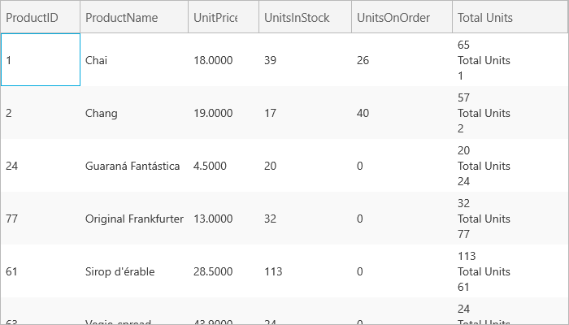

////

|metadata|
{
    "name": "xamgrid-itemtemplate-binding",
    "controlName": ["xamGrid"],
    "tags": ["Data Binding","Grids","Templating"],
    "guid": "778a9fb0-6b7e-486b-a790-a2ee3d28dfba",  
    "buildFlags": [],
    "createdOn": "2016-05-25T18:21:56.3341847Z"
}
|metadata|
////

= ItemTemplate Binding

You can add content to the column by setting the link:{ApiPlatform}controls.grids.xamgrid{ApiVersion}~infragistics.controls.grids.unboundcolumn~itemtemplate.html[ItemTemplate] property to an instance of a data template. The UnboundDataContext object contains the following properties:

* *Value* – this is the value returned from the ValueConverter
* *ColumnKey* – this is the column key of the unbound column
* *RowData* – the data object that the current row represents would represent

The following code demonstrates how to display data in an unbound column using ItemBinding.

*In XAML:*

----
<ig:UnboundColumn Key="Total Units" ValueConverter="{StaticResource TotalUnitsConverter}">
   <ig:UnboundColumn.ItemTemplate>
      <DataTemplate>
         <StackPanel>
            <TextBlock Text="{Binding Value}" />
            <TextBlock Text="{Binding ColumnKey}" />
            <TextBlock Text="{Binding RowData.ProductID}" />
         </StackPanel>
      </DataTemplate>
   </ig:UnboundColumn.ItemTemplate>
</ig:UnboundColumn>
----

ifdef::win-rt[]

endif::win-rt[]

*Related Topics*

link:xamgrid-sorting-unbound-columns.html[Sorting Unbound Columns]

link:xamgrid-unbound-column.html[Unbound Column]

link:xamgrid-editing-unbound-columns.html[Editing Unbound Columns]