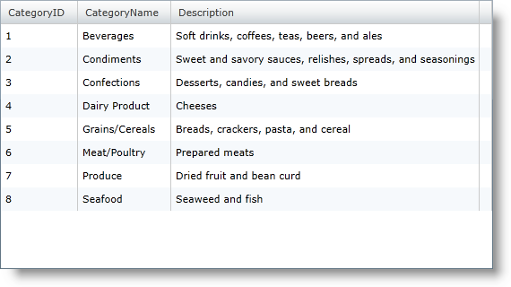
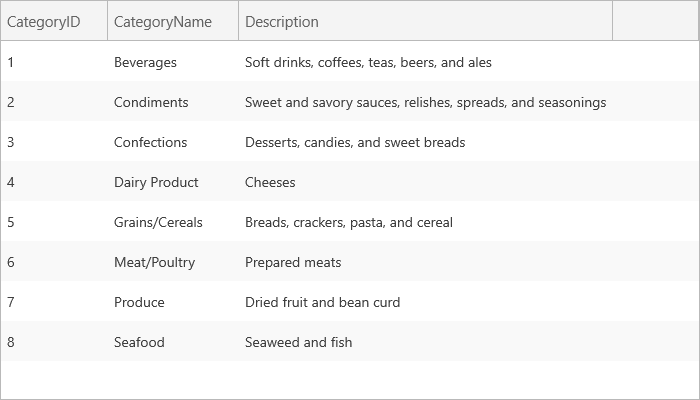

////
|metadata|
{
    "name": "xamgrid-manually-defining-a-basic-column-structure",
    "controlName": ["xamGrid"],
    "tags": ["Grids","How Do I","Layouts"],
    "guid": "b2442224-ae13-4a12-8da1-00fbffa8cf58",
    "buildFlags": [],
    "createdOn": "2016-05-25T18:21:56.2941814Z"
}
|metadata|
////

= Manually Defining a Basic Column Structure

To start taking a little more control over the columns that are displayed in xamGrid, you can define a column structure the control. If you have a simple flat object structure, you can define columns within the control's link:{ApiPlatform}controls.grids.xamgrid.v{ProductVersion}~infragistics.controls.grids.xamgrid~columns.html[Columns] collection.

*In XAML:*

[source,xaml]
----
<ig:XamGrid x:Name="xamGrid1" AutoGenerateColumns="
ItemsSource="{Binding Source={StaticResource categoryData}, Path=CategoriesAndProducts}">
    <ig:XamGrid.Columns>
        <ig:TextColumn Key="CategoryID" />
        <ig:TextColumn Key="CategoryName" />
        <ig:TextColumn Key="Description" />
    </ig:XamGrid.Columns>
</ig:XamGrid>
----

ifdef::sl,wpf[]

endif::sl,wpf[]

ifdef::win-rt[]

endif::win-rt[]

What you've done is define what your own column layout, in this case defining the layout for the root level of xamGrid. Each link:{ApiPlatform}controls.grids.xamgrid.v{ProductVersion}~infragistics.controls.grids.column.html[Column] object in the column layout requires that you provide a key that matches a property exposed by the data source objects.

If a key is defined but a corresponding property is not found on the data objects, the grid will raise an *InvalidColumnKeyException* error.

Also, if you define a collection of columns but do not disable *AutoGenerateColumns* , the grid will not only include the columns you have explicitly defined, but will also automatically generate columns for properties exposed by the data source that have no column explicitly defined.

== Related Topics

link:xamgrid-auto-generate-columns.html[Auto Generate Columns]

link:xamgrid-defining-a-self-related-hierarchical-structure.html[Defining a Self Related Hierarchical Structure]

link:xamgrid-defining-hierarchical-layouts.html[Defining Hierarchical Layouts]

link:xamgrid-defining-unstructured-column-layout-collections.html[Defining Unstructured Column Layout Collections]

link:xamgrid-targettypename-resolution.html[TargetTypeName Resolution]