////

|metadata|
{
    "name": "xamgrid-merged-cells",
    "controlName": ["xamGrid"],
    "tags": ["Data Presentation","Grids","Layouts","Styling"],
    "guid": "218b4e28-3309-44d9-9991-fd25917e95be",  
    "buildFlags": [],
    "createdOn": "2016-05-25T18:21:56.4581999Z"
}
|metadata|
////

= Merged Cells

The cell merging feature provides an alternative view of grouped data: groups are shown as merged cells (Figure 1) as opposed to showing as collapsed group headers, which is the case with the link:xamgrid-groupby.html[GroupBy] feature.

ifdef::sl,wpf[]
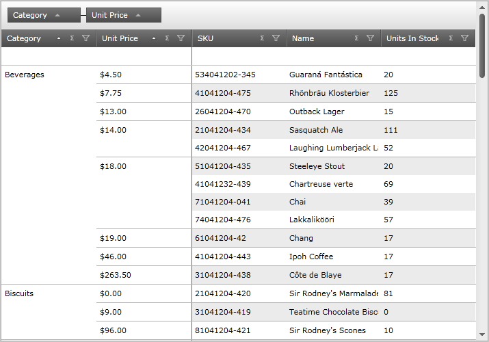
endif::sl,wpf[]

ifdef::win-rt[]
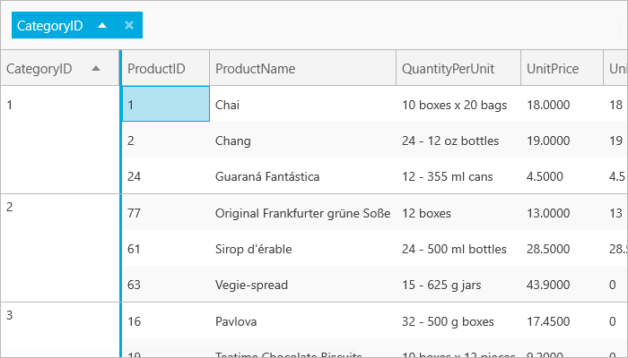
endif::win-rt[]

Figure 1: Columns grouped in a grid by the cell merging feature

*Enabling Cell Merging*

You can enable cell merging on the xamGrid control by setting the link:{ApiPlatform}controls.grids.xamgrid.v{ProductVersion}~infragistics.controls.grids.groupbysettings.html[GroupBySettings] object’s link:{ApiPlatform}controls.grids.xamgrid.v{ProductVersion}~infragistics.controls.grids.groupbysettings~groupbyoperation.html[GroupByOperation] property to link:{ApiPlatform}controls.grids.xamgrid.v{ProductVersion}~infragistics.controls.grids.groupbyoperation.html[MergeCells]. Setting the GroupBySettings object’s link:{ApiPlatform}controls.grids.xamgrid.v{ProductVersion}~infragistics.controls.grids.groupbysettings~allowgroupbyarea.html[AllowGroupByArea] property determines the location on the grid where users can drag columns to group their data.

*In XAML:*

----
<!-- Enable Cell Merging
     Set the GroupBy area on the grid -- > 
<ig:XamGrid.GroupBySettings>
   <ig:GroupBySettings AllowGroupByArea="Top" GroupByOperation="MergeCells" />
</ig:XamGrid.GroupBySettings>
----

*In Visual Basic:*

----
Imports Infragistics.Controls.Grids
' Enable Cell Merging
MyDataGrid.GroupBySettings.GroupByOperation = GroupByOperation.MergeCells
' Set GroupBy area on the grid
MyDataGrid.GroupBySettings.AllowGroupByArea = GroupByAreaLocation.Top
----

*In C#:*

----
using Infragistics.Controls.Grids;
// Enable Cell Merging
MyDataGrid.GroupBySettings.GroupByOperation = GroupByOperation.MergeCells;
// Set GroupBy area on the grid
MyDataGrid.GroupBySettings.AllowGroupByArea = GroupByAreaLocation.Top;
----

*Cell Merging Behavior*

When the grid’s columns are grouped using the cell merging feature, some of the grid’s other features are affected and behave differently.

The sections below describe how each of the grid’s key features are affected due to the cell merging feature. It also explains how certain features interact with cell merging.

.Note:
[NOTE]
====
The cell merging feature does not affect the behavior of the link:xamgrid-filtering.html[filtering] and link:xamgrid-add-new-row.html[Add New Row] features
====

link:xamgrid-activation.html[Activation] While the user is navigating through the merged cells column using the keyboard, they will be able to see the hidden cells. Cells within a merged column are positioned underneath a MergedContentControl control, so when your end user selects the control, the cells hidden underneath become active and visible for that row. (Figure 2)

ifdef::sl,wpf[]
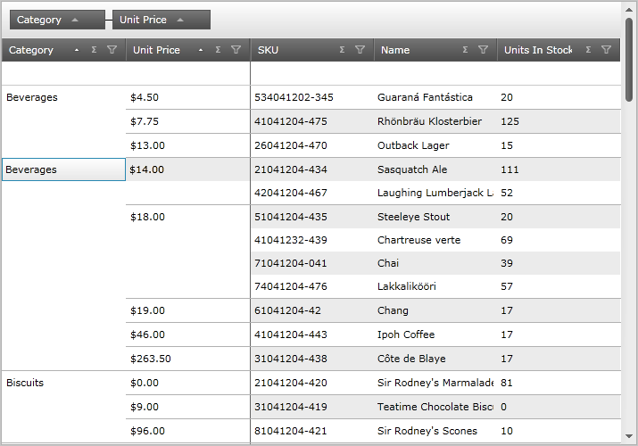
endif::sl,wpf[]

ifdef::win-rt[]
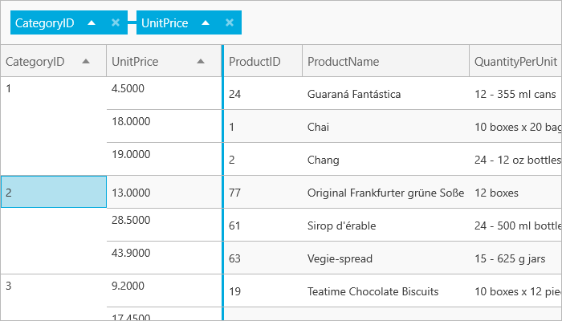
endif::win-rt[]

Figure 2: The xamGrid control with active cells

*Alternate Row Styling*

Alternate row styling is not displayed on the merged columns.

link:xamgrid-column-moving.html[Column Moving]

The user cannot move merged columns either within the merged columns area or the rest of the grid. They cannot also move unmerged columns into the merged columns area.

link:xamgrid-conditional-formatting.html[Conditional Formatting]

The user can implement conditional formatting while the cell merging feature is enabled. However, the merged cells will not display the new styling as conditional formatting appears on the individual cells which are hidden underneath the MergedContentControl control.

link:xamgrid-editing-data.html[Editing Data]

The user can edit cells within merged columns the same way cells in unmerged columns are edited. Once a cell in a merged column is edited, based on the new value, it could appear in a new grouping.

link:xamgrid-fixed-columns.html[Fixed Columns]

Fixed columns appear to the right of the merged columns. (Figure 2) The same FixedBorderIndicator control is used to separate fixed and merged columns from the rest of the columns in the grid. If the grid contains merged and fixed columns, the FixedBorderIndicator control will display once, to the right of the fixed column.

The user cannot fix merged columns: the fixed indicator does not appear on merged columns.

ifdef::sl,wpf[]
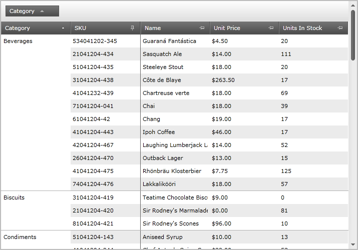
endif::sl,wpf[]

ifdef::win-rt[]
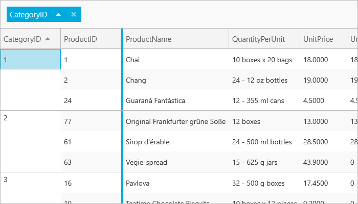
endif::win-rt[]

Figure 3: The xamGrid control with cell merging and fixed columns enabled

link:xamgrid-group-column.html[Group Column]

A column that is of type GroupColumn cannot be merged; however the children of a GroupColumn column can be merged. For example, based on the screenshot below, the user cannot merge the PatientInformation and FullName columns; however, they can merge the First Name and Last Name columns.

Figure 4: The xamGrid control with GroupColumns enabled

When the user merges the children columns of the GroupColumn column, then that particular child column will be removed from the group. When that column is unmerged, then it will return to its original group.

Hovering

When the xamGrid control’s RowHover property is set to Row, as the mouse hovers over the merged column, the data of that the row is displayed. (Figure 3)

ifdef::sl,wpf[]
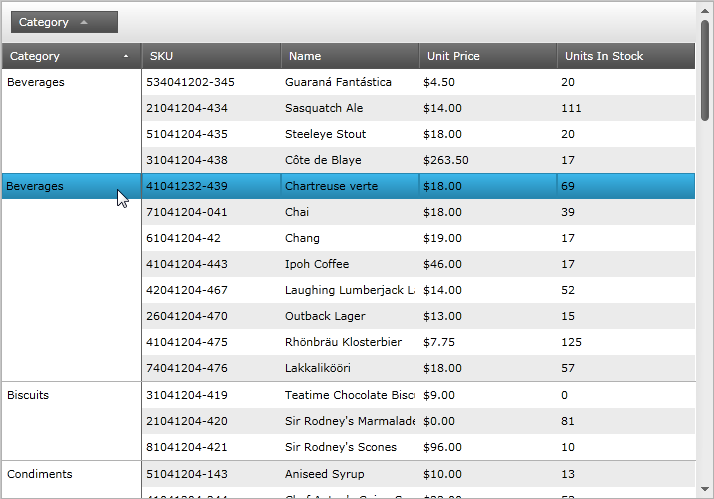
endif::sl,wpf[]

ifdef::win-rt[]
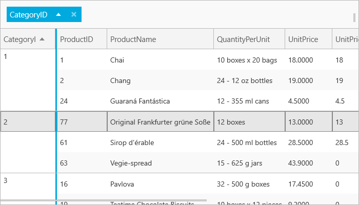
endif::win-rt[]

Figure 5: Hovering over the merged column displays the data of that the row

link:xamgrid-paging.html[Paging]

When the paging and cell merging features are enabled on the xamGrid control, paging will behave as expected. If the paging mechanism breaks a merged column’s information on to the next page, the value of the merged columns’s value will appear on the next page as well.

link:xamgrid-sorting.html[Sorting]

When the sorting and cell merging features are enabled on the xamGrid control, all merged columns will have sorting priority over other sorted columns.

link:xamgrid-summaries.html[Summaries]

When the summary and cell merging features are enabled on the xamGrid control, additional summary rows are displayed for each merged grouping. The summary values are then displayed for each grouping, as shown in Figure 4.

ifdef::sl,wpf[]
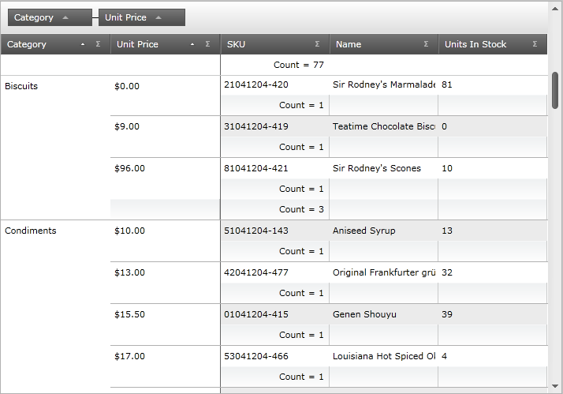
endif::sl,wpf[]

ifdef::win-rt[]
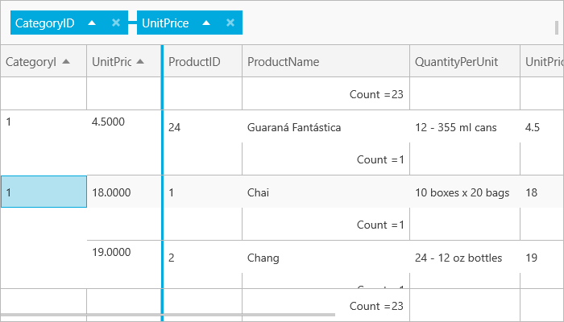
endif::win-rt[]

Figure 6: Displaying summary values for each grouping

*Styling Points*

There are three main controls used for the cell merging feature:

* link:{ApiPlatform}controls.grids.xamgrid.v{ProductVersion}~infragistics.controls.grids.primitives.fixedbordercellcontrol.html[FixedBorderCellControl] – the line that separates the merged columns from the rest of the columns in the xamGrid control
* link:{ApiPlatform}controls.grids.xamgrid.v{ProductVersion}~infragistics.controls.grids.primitives.mergedcontentcontrol.html[MergedContentControl] – the cells that used to display the merging
* link:{ApiPlatform}controls.grids.xamgrid.v{ProductVersion}~infragistics.controls.grids.primitives.mergedsummarycellcontrol.html[MergedSummaryCellControl] – the SummaryRows used for merged cells. This allows you to style these summary rows differently than the normal summary rows

There are no properties available to target these controls. Instead, you can use Implicit styling to style the controls, as demonstrated in the code snippet below. (Figure 5)

ifdef::sl,wpf[]
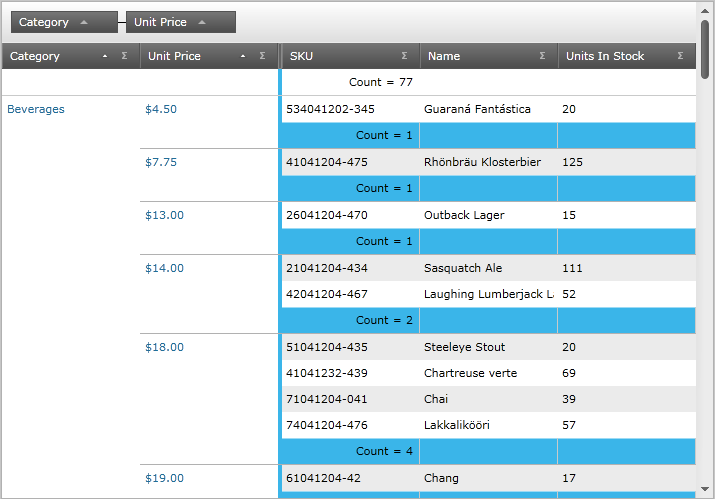
endif::sl,wpf[]

ifdef::win-rt[]
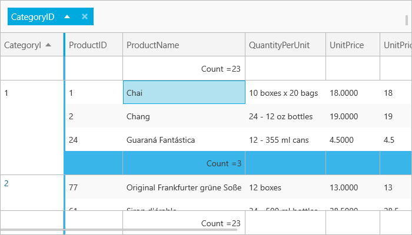
endif::win-rt[]

Figure 7: The styling implemented by the sample code

ifdef::wpf[]

*In XAML:*

----
xmlns:igPrim="http://schemas.infragistics.com/xaml/primitives"
----

endif::wpf[]

*In XAML:*

----

----

== *Related Topics*

link:xamgrid-custom-display-for-merged-cells.html[Custom Display for Merged Cells]

link:xamgrid-custom-merged-cells.html[Custom Merged Cells]