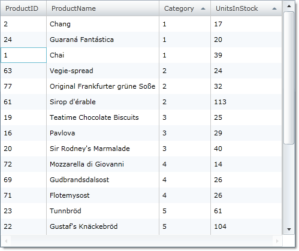

////

|metadata|
{
    "name": "xamgrid-multi-column-sorting",
    "controlName": ["xamGrid"],
    "tags": ["Grids","How Do I","Sorting"],
    "guid": "{6707AB6D-8473-4AC4-95E7-C84232B7BD22}",  
    "buildFlags": [],
    "createdOn": "2016-05-25T18:21:55.6741874Z"
}
|metadata|
////

= Multi-Column Sorting

The xamGrid™ control allows single column sorting or multi column sorting. Single column sorting is enabled by default. Multi-column sorting allows your end users to perform primary, secondary, tertiary (and so on) sorts on columns.

Your end users can use the multi column sorting feature by first performing a sort on a primary column.

ifdef::sl,wpf[]
Then while the end user holds down the Control key, they click and sort a secondary column.
endif::sl,wpf[]

ifdef::win-rt[]
After sorting the primary column, click on the next column header to open the column menu, hold “Control” key and click on the desired sorting order.
endif::win-rt[]

The end user repeats this process until they sort as many columns as needed. An example multi column sorting scenario is when the end user wants to first sort on the Category column. Assuming there are multiple occurrences of each category, the end user then performs a secondary sort on the UnitsInStock column. Now the end user sees each category along with the corresponding units in stock sorted per category.

The following code demonstrates how to enable multi column sorting on your xamGrid.

*In XAML:*

----
<ig:XamGrid.SortingSettings>
   <ig:SortingSettings AllowMultipleColumnSorting="True" />
</ig:XamGrid.SortingSettings>
----

*In Visual Basic:*

----
Me.MyGrid.SortingSettings.AllowMultipleColumnSorting = True
----

*In C#:*

----
this.MyGrid.SortingSettings.AllowMultipleColumnSorting = true;
----

ifdef::sl,wpf[]

endif::sl,wpf[]

== *Related Topics*

link:xamgrid-sorting.html[Sorting]

link:xamgrid-remove-sort-indicator.html[Remove Sort Indicator]

link:xamgrid-disable-sorting-on-certain-columns.html[Disable Sorting on Certain Columns]

link:xamgrid-sorting-events.html[Sorting Events]

link:xamgrid-custom-sort.html[Custom Sort]

pick:[win-rt=" link:bb45cdbe-7149-49bc-a63a-1a77676c6986[Touch Support]"]