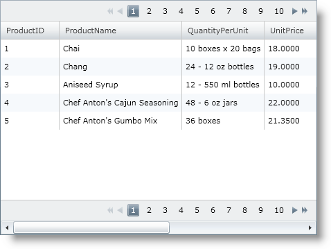
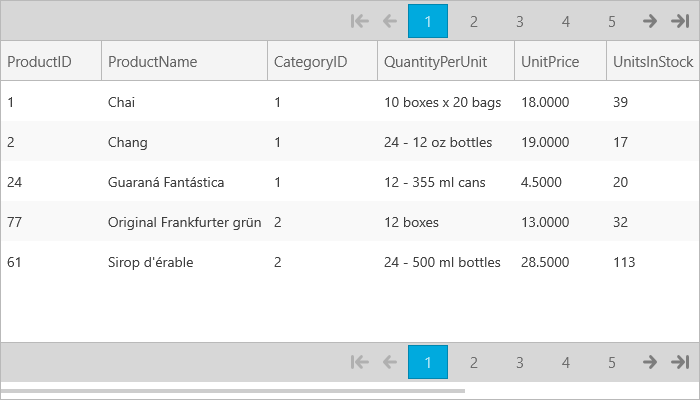

////

|metadata|
{
    "name": "xamgrid-paging",
    "controlName": ["xamGrid"],
    "tags": ["Grids","How Do I","Paging"],
    "guid": "{1120DC02-3413-4112-8B6B-B627B0C1CF1C}",  
    "buildFlags": [],
    "createdOn": "2016-05-25T18:21:55.7041883Z"
}
|metadata|
////

= Paging

The xamGrid™ control’s paging mechanism breaks data into pages. The number of pages is determined by the page size and the total number of records from the data source. The xamGrid control retrieves new data for each page as your end users navigate from page to page.

By default Paging is not enabled on your xamGrid. To enable paging, you can set the following properties on the link:{ApiPlatform}controls.grids.xamgrid.v{ProductVersion}~infragistics.controls.grids.pagersettings.html[PagerSettings] object.

* link:{ApiPlatform}controls.grids.xamgrid.v{ProductVersion}~infragistics.controls.grids.pagersettings~allowpaging.html[AllowPaging] – Setting this property enables paging, and also sets where the pager will appear in relation to your grid.
* link:{ApiPlatform}controls.grids.xamgrid.v{ProductVersion}~infragistics.controls.grids.pagersettings~currentpageindex.html[CurrentPageIndex] – This property sets the current page of the pager you want to navigate to.
* link:{ApiPlatform}controls.grids.xamgrid.v{ProductVersion}~infragistics.controls.grids.pagersettings~pagesize.html[PageSize] – This property sets the number of rows that will appear per page.

The following code demonstrates how to enable paging with the pager appearing on both the top and bottom of the grid, and five rows displayed per page.

*In XAML:*

----
<Grid x:Name="LayoutRoot" Background="White">
   <ig:XamGrid x:Name="MyGrid" AutoGenerateColumns=">
      <ig:XamGrid.PagerSettings>
         <ig:PagerSettings AllowPaging="Both" PageSize="5"/>
      </ig:XamGrid.PagerSettings>
      ...       
   </ig:XamGrid>
</Grid>
----

*In Visual Basic:*

----
Imports Infragistics.Controls.Grids
...
Me.MyGrid.PagerSettings.AllowPaging = PagingLocation.Both
Me.MyGrid.PagerSettings.PageSize = 5
----

*In C#:*

----
using Infragistics.Controls.Grids;
...
this.MyGrid.PagerSettings.AllowPaging = PagingLocation.Both;
this.MyGrid.PagerSettings.PageSize = 5;
----

ifdef::sl,wpf[]

endif::sl,wpf[]

ifdef::win-rt[]

endif::win-rt[]

== *Related Topics*

link:xamgrid-customize-the-pager.html[Customize the Pager]

link:xamgrid-paging-events.html[Paging Events]