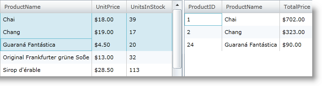
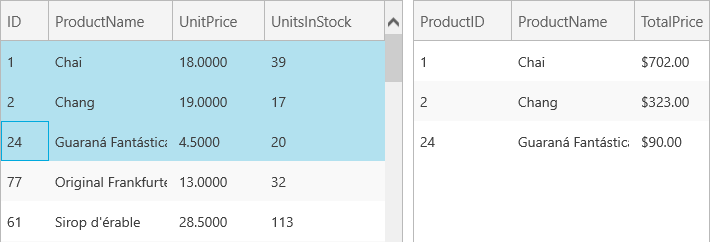

////

|metadata|
{
    "name": "xamgrid-paste-event-and-event-arguments",
    "controlName": ["xamGrid"],
    "tags": ["Events","Grids","How Do I"],
    "guid": "f459a7f9-cd8c-436e-a5c6-af9538ea9b88",  
    "buildFlags": [],
    "createdOn": "2016-05-25T18:21:56.2641793Z"
}
|metadata|
////

= Paste Event and Event Arguments

When paste support is enabled in the xamGrid control and your end user initiates a paste operation, the link:{ApiPlatform}controls.grids.xamgrid{ApiVersion}~infragistics.controls.grids.xamgrid~clipboardpasting_ev.html[ClipboardPasting] event is fired. It is not a cancelable event and occurs just once.

The link:{ApiPlatform}controls.grids.xamgrid{ApiVersion}~infragistics.controls.grids.clipboardpastingeventargs.html[ClipboardPastingEventArgs] has two properties:

* link:{ApiPlatform}controls.grids.xamgrid{ApiVersion}~infragistics.controls.grids.clipboardpastingeventargs~clipboardvalue.html[ClipboardValue] – It contains the original clipboard content to be pasted.
* link:{ApiPlatform}controls.grids.xamgrid{ApiVersion}~infragistics.controls.grids.clipboardpastingeventargs~values.html[Values] – It contains the parsed clipboard string and is a settable property.

The following code demonstrates the usage of the ClipboardPasting event. In this example, selected data will be copied from the first xamGrid control and pasted to a second xamGrid control. Some simple calculations are performed before the data is pasted to the second xamGrid control.

This example uses the link:resources-datautil.html[DataUtil] class provided for you.

1. First, add two xamGrid controls to the Grid container. The second xamGrid control has an additional column that will contain the result of multiplied values of the UnitPrice and UnitsInStock columns from the first xamGrid control. Copy operation for multiple rows is enabled in the source xamGrid control; paste operation is enabled in the second control.

*In XAML:*

----
<Grid x:Name="LayoutRoot">
    <Grid.Resources>
        <data:DataUtil x:Key="DataUtil" />
    </Grid.Resources>
    <Grid.ColumnDefinitions>
        <ColumnDefinition Width="*" />
        <ColumnDefinition Width="*" />
    </Grid.ColumnDefinitions>
    <ig:XamGrid Width="450" Height="300" Grid.Column="0" 
 x:Name="sourceXamGrid" AutoGenerateColumns=" 
 ItemsSource="{Binding Source={StaticResource DataUtil}, Path=Products}">
        <ig:XamGrid.Columns>
            <ig:TextColumn Key="ProductID" />
            <ig:TextColumn Key="ProductName" />
            <ig:TextColumn Key="UnitPrice" />
            <ig:TextColumn Key="UnitsInStock" />
        </ig:XamGrid.Columns>
        <ig:XamGrid.SelectionSettings>
            <ig:SelectionSettings CellClickAction="SelectRow" 
                                  RowSelection="Multiple" />
            </ig:XamGrid.SelectionSettings>
        <ig:XamGrid.ClipboardSettings>
            <ig:ClipboardSettings AllowCopy="True" 
                                  CopyOptions="ExcludeHeaders" />
        </ig:XamGrid.ClipboardSettings>
    </ig:XamGrid>
    <ig:XamGrid Width="400" Height="300" Grid.Column="1" 
                x:Name="targetXamGrid" AutoGenerateColumns="
                ClipboardPasting="targetXamGrid_ClipboardPasting" >
        <ig:XamGrid.Columns>
            <ig:TextColumn Key="ProductID" />
            <ig:TextColumn Key="ProductName" />
            <ig:TextColumn Key="TotalPrice" FormatString="{}{0:C}" />   
        </ig:XamGrid.Columns>
        <ig:XamGrid.ClipboardSettings>
            <ig:ClipboardSettings AllowPaste="True" />
        </ig:XamGrid.ClipboardSettings>
    </ig:XamGrid>
</Grid>
----

2. Extend the Product class used in the example with an additional field:

*In Visual Basic:*

----
Public Class ProductExtended Inherits Product
    Private m_totalPrice As Decimal
    Public Property TotalPrice() As Decimal
        Get
            Return m_totalPrice
        End Get
        Set(ByVal value As Decimal)
            m_TotalPrice = Value
        End Set
    End Property
End Class
----

*In C#:*

----
public class ProductExtended : Product
{
    // This member will contain the multiplied value of the     // UnitPrice and UnitsInStock values.
    public Decimal TotalPrice { get; set; }
}
----

3. Finally, add the implementation to the ClipboardPasting event handler:

*In Visual Basic:*

----
Private Sub targetXamGrid_ClipboardPasting(ByVal sender As Object, ByVal e As Infragistics.Controls.Grids.ClipboardPastingEventArgs)
    Dim collection As New ObservableCollection(Of ProductExtended)()
    For Each row In e.Values
        Dim productData = New ProductExtended()
        productData.ProductID = Convert.ToInt32(row(0))
        productData.ProductName = row(1)
        productData.TotalPrice = 
(Convert.ToDecimal(row(2))) $$*$$ (Convert.ToDecimal(row(3)))
        collection.Add(productData)
    Next
    targetXamGrid.ItemsSource = collection
End Sub
----

*In C#:*

----
void targetXamGrid_ClipboardPasting(object sender, 
Infragistics.Controls.Grids.ClipboardPastingEventArgs e)
{
    ObservableCollection<ProductExtended> collection = 
new ObservableCollection<ProductExtended>()
    foreach (var row in e.Values)
    {
        ProductExtended productData = new ProductExtended();
        productData.ProductID = Convert.ToInt32(row[0]);
        productData.ProductName = row[1];
        productData.TotalPrice = (Convert.ToDecimal(row[2])) $$*$$ (Convert.ToDecimal(row[3]));
        collection.Add(productData);
    }
    targetXamGrid.ItemsSource = collection;
}
----

4. Run your  pick:[sl,wpf="{PlatformName} project"]  pick:[win-rt="Windows Store application"] .

ifdef::sl,wpf[]

endif::sl,wpf[]

ifdef::win-rt[]

endif::win-rt[]