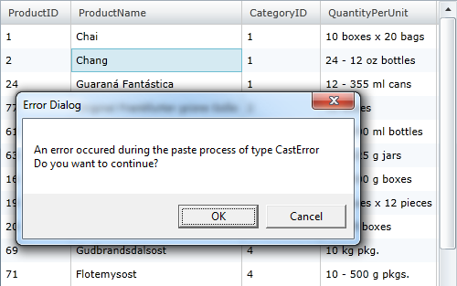
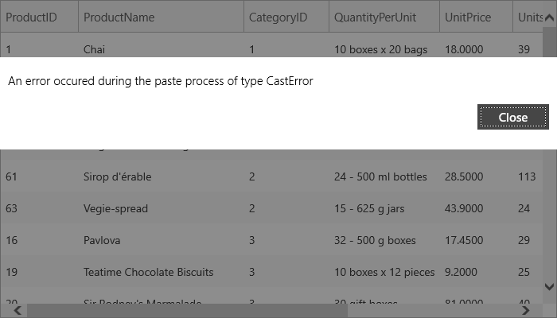

////

|metadata|
{
    "name": "xamgrid-pasting-data-and-handling-paste-errors",
    "controlName": ["xamGrid"],
    "tags": ["Data Presentation","Error Handling","Grids"],
    "guid": "ddf451f4-00c4-4d26-9bac-0a2b289cddb5",  
    "buildFlags": [],
    "createdOn": "2016-05-25T18:21:56.5762065Z"
}
|metadata|
////

= Pasting Data and Handling Pasting Errors

== Topic Overview

=== Purpose

This topic demonstrates how you can paste copied data in the xamGrid™ control and handle errors that may occur when pasting data.

=== Required background

The following table lists the topics required as a prerequisite to understanding this topic.

[options="header", cols="a,a"]
|====
|Topic|Purpose

| link:xamgrid-paste-event-and-event-arguments.html[Paste Event and Event Arguments]
|This topic demonstrates how you can handle the paste event to control the pasting process.

|====

=== In this topic

This topic contains the following sections:

* <<_Ref320026561, Pasting Data and Handling Pasting Errors >>
* <<_Ref320026567, Related Content >>

[[_Ref320026561]]
== Pasting Data and Handling Pasting Errors

=== Introduction

This procedure demonstrates how clipboard data is pasted in the xamGrid control.  pick:[sl,wpf="In case an error occurs, a notification dialog is displayed so the end user can decide how to proceed."]  pick:[win-rt="In case an error occurs, the invalid data is not pasted in xamGrid and a dialog appears to notify the user for the error."]

The example below uses paste helper method link:{ApiPlatform}controls.grids.xamgrid.v{ProductVersion}~infragistics.controls.grids.clipboardpastingeventargs~pasteasexcel.html[PasteAsExcel] and link:{ApiPlatform}controls.grids.xamgrid.v{ProductVersion}~infragistics.controls.grids.xamgrid~clipboardpasteerror_ev.html[ClipboardPasteError] event.

=== Preview

The following screenshot is a preview of the final result.

ifdef::sl,wpf[]

endif::sl,wpf[]

ifdef::win-rt[]

endif::win-rt[]

=== Requirements

To complete the procedure, you need to include the link:resources-datautil.html[DataUtil] class provided for you as a sample data source in your project.

=== Overview

This topic takes you step-by-step toward pasting data and handling pasting errors in the xamGrid. The following is a conceptual overview of the process:

[start=1]
. *<<_ref1,Adding a xamGrid control to your application>>* 
[start=2]
. *<<_ref2,Enabling the copy and paste features>>* 
[start=3]
. *<<_ref3,Enabling the multiple cell selection>>* 
[start=4]
. *<<_ref4,Handling the ClipboardPasting event>>* 
[start=5]
. *<<_ref5,Handling the ClipboardPasteError event>>* 

=== Steps

The following steps demonstrate how to use the paste helper method PasteAsExcel and handle the ClipboardPasteError event.

=== Add a xamGrid control to your application

Add a xamGrid control to your application and bind in to data source.

Add handlers for the `ClipboardPasting` and `ClipboardPasteError` events.

*In XAML:*

[source,xaml]
----
<ig:XamGrid x:Name="dataGrid"
ClipboardPasting="dataGrid_ClipboardPasting"
ClipboardPasteError="dataGrid_ClipboardPasteError">
<!-- Add more code here -->
</ig:XamGrid>
----

=== Enable the copy and paste features

Enable the xamGrid copy and paste features.

*In XAML:*

[source,xaml]
----
<ig:XamGrid.ClipboardSettings>
  <ig:ClipboardSettings AllowCopy="True" 
      CopyOptions="ExcludeHeaders" 
      CopyType="SelectedCells"
      AllowPaste="True"/>
</ig:XamGrid.ClipboardSettings>
----

=== Enable the multiple cell selection

The multiple cell selection is enabled in the xamGrid so the end user can select xamGrid cells to copy within.

*In XAML:*

[source,xaml]
----
<ig:XamGrid.SelectionSettings>
  <ig:SelectionSettings 
      CellClickAction="SelectCell" 
      CellSelection="Multiple" />
</ig:XamGrid.SelectionSettings>
----

=== Handle the ClipboardPasting event

Use the `PasteAsExcel` method to perform the pasting within the xamGrid. You can paste either xamGrid or Excel cells content.

*In C#:*

[source,csharp]
----
private void dataGrid_ClipboardPasting(object sender, Infragistics.Controls.Grids.ClipboardPastingEventArgs e)
{
  // Paste a rectangular selection of cells in the xamGrid
  e.PasteAsExcel();   
}
----

*In Visual Basic:*

[source,vb]
----
Private Sub dataGrid_ClipboardPasting(sender As Object, e As Infragistics.Controls.Grids.ClipboardPastingEventArgs)
  ' Paste a rectangular selection of cells in the xamGrid
  e.PasteAsExcel()
End Sub
----

=== Handle the ClipboardPasteError event

In the `ClipboardPasteError` handler, the error type is checked and if the error is recoverable and the pasting can continue.

ifdef::sl,wpf[]
If the error is recoverable, a confirmation dialog appears and the end user decides if the pasting should continue regardless of the occurred error.
endif::sl,wpf[]

ifdef::wpf[]

*In C#:*

[source,csharp]
----
private void dataGrid_ClipboardPasteError(object sender, Infragistics.Controls.Grids.ClipboardPasteErrorEventArgs e)
{
  // Get the type of the paste error
  string strErrorType = e.ErrorType.ToString();
  // Check if the pasting can continue after the error
  bool isRecoverableError = e.IsRecoverable;
  if (isRecoverableError)
  {
    MessageBoxButton button = MessageBoxButton.OKCancel;
    string errorMsg = string.Format("An error occurred during the paste process of type {0}", strErrorType);
    string questionMsg = "Do you want to continue?";
    MessageBoxResult result = MessageBox.Show(errorMsg + "\n" + questionMsg, "Error Dialog", button);
    switch (result)
    {
      case MessageBoxResult.OK:
        e.AttemptRecover = true;
        break;
      case MessageBoxResult.Cancel:
        e.AttemptRecover = false;
        break;
    }
  }
}
----

endif::wpf[]

ifdef::wpf[]

*In Visual Basic:*

[source,vb]
----
Private Sub dataGrid_ClipboardPasteError(sender As Object, e As Infragistics.Controls.Grids.ClipboardPasteErrorEventArgs)
  ' Get the type of the paste error
  Dim strErrorType As String = e.ErrorType.ToString()
  ' Check if the pasting can continue after the error
  Dim isRecoverableError As Boolean = e.IsRecoverable
  If isRecoverableError Then
    Dim button As MessageBoxButton = MessageBoxButton.OKCancel
    Dim errorMsg As String = String.Format("An error occurred during the paste process of type {0}", strErrorType)
    Dim questionMsg As String = "Do you want to continue?"
    Dim result As MessageBoxResult = MessageBox.Show(errorMsg & vbLf & questionMsg, "Error Dialog", button)
    Select Case result
      Case MessageBoxResult.OK
        e.AttemptRecover = True
        Exit Select
      Case MessageBoxResult.Cancel
        e.AttemptRecover = False
        Exit Select
    End Select
  End If
End Sub
----

endif::wpf[]

[[_Ref320026567]]
== Related Content

=== Topics

The following topics provide additional information related to this topic.

[options="header", cols="a,a"]
|====
|Topic|Purpose

| link:xamgrid-enable-copy-and-paste-support.html[Enable Copy and Paste Support]
|This topic demonstrates how the copy and paste features can be enabled in the xamGrid control.

| link:xamgrid-copy-options.html[Copy Options]
|This topic demonstrates available copy options.

| link:xamgrid-specify-the-content-to-be-copied.html[Specify the Content to be Copied]
|This topic demonstrates how you specify what will be copied – selected cells or rows in the xamGrid control.

| link:xamgrid-copy-events-and-events-arguments.html[Copy Events and Event Arguments]
|This topic demonstrates how you can handle the copy events to control the copy process.

|====