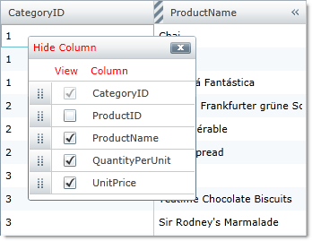

////

|metadata|
{
    "name": "xamgrid-prevent-columns-from-being-hidden",
    "controlName": ["xamGrid"],
    "tags": ["Grids","How Do I"],
    "guid": "af4e0c15-ce3b-41fd-9e2d-4eafedefeb93",  
    "buildFlags": [],
    "createdOn": "2016-05-25T18:21:56.1582115Z"
}
|metadata|
////

= Prevent Columns from Being Hidden

If you enable the column chooser functionality or if you programmatically display the column chooser, your end users will be able to a hide a column using one of the following methods:

ifdef::sl,wpf[]
* Click the column chooser icon on the column’s header.
* From the column chooser dialog window, select the column’s corresponding check box.

endif::sl,wpf[]

ifdef::win-rt[]
* Tap/click on the column header to open the column menu and select the "Column Chooser" item.
* From the column chooser dialog window, select the column’s corresponding check box.

endif::win-rt[]

However, you can prevent your end users from hiding a column altogether by setting the ColumnBase object’s link:{ApiPlatform}controls.grids.xamgrid.v{ProductVersion}~infragistics.controls.grids.columnbase~ishideable.html[IsHideable] to False. By default, this property is set to True. When this property is set to False, the column chooser icon will not appear in that particular column’s header and the checkbox in the column chooser dialog will be disabled.

.Note:
[NOTE]
====
This is strictly a UI limiting property, you can still change the visibility in the code-behind.
====

In the following screenshot, the CategoryID column is disabled.

ifdef::sl,wpf[]

endif::sl,wpf[]

ifdef::win-rt[]
image::images/RT_xamGrid_columnChooser6.png[]
endif::win-rt[]

The following example code demonstrates how to prevent columns from being hidden.

*In XAML:*

----
<ig:TextColumn IsHideable=" Key="CategoryID"/> 
----

*In C#:*

----
this.MyDataGrid.Columns.DataColumns["CategoryID"].IsHideable = false;
----

*In Visual Basic:*

----
Me.MyDataGrid.Columns.DataColumns("CategoryID").IsHideable = True
----

== *Related Topics*

== 

link:xamgrid-enabling-column-chooser.html[Enabling Column Chooser]

link:xamgrid-column-chooser-dialog-window.html[Column Chooser Dialog Window]

link:xamgrid-column-chooser-settings.html[Column Chooser Settings]

pick:[win-rt=" link:xamgrid-touch-support.html[Touch Support]"]