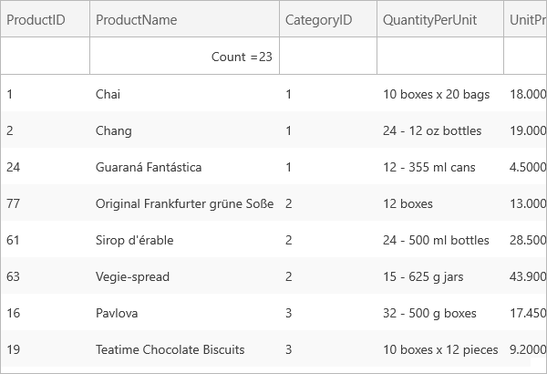

////

|metadata|
{
    "name": "xamgrid-programmatically-add-summaries",
    "controlName": ["xamGrid"],
    "tags": ["Grids","How Do I","Summaries"],
    "guid": "{CE80AD49-2D70-4C85-AED0-B23D9FCD38C1}",  
    "buildFlags": [],
    "createdOn": "2016-05-25T18:21:56.0162056Z"
}
|metadata|
////

= Programmatically Add Summaries

You can display summaries for a column using XAML or procedural code without your end user selecting a summary calculator from the summary selection dialog box.

This can be achieved by setting the individual SummaryOperand’s IsApplied property to True.

*In XAML:*

----
<Grid x:Name="LayoutRoot" Background="White">
    <ig:XamGrid x:Name="MyDataGrid" AutoGenerateColumns=">
        <ig:XamGrid.SummaryRowSettings>
            <ig:SummaryRowSettings AllowSummaryRow="Top" SummaryScope="ColumnLayout">
        </ig:SummaryRowSettings>
    </ig:XamGrid.SummaryRowSettings>
    <ig:XamGrid.Columns>
        <ig:TextColumn Key="ProductID" />
        <ig:TextColumn Key="ProductName">
            <ig:TextColumn.SummaryColumnSettings>
                <ig:SummaryColumnSettings>
                    <ig:SummaryColumnSettings.SummaryOperands>
                        <ig:CountSummaryOperand IsApplied="True" />
                        <ig:MaximumSummaryOperand />                          
                        <ig:MinimumSummaryOperand />
                    </ig:SummaryColumnSettings.SummaryOperands>
               </ig:SummaryColumnSettings>
            </ig:TextColumn.SummaryColumnSettings>
        </ig:TextColumn>
         …
      </ig:XamGrid.Columns>
   </ig:XamGrid>
</Grid>
----

*In Visual Basic:*

----
Imports Infragistics.Controls.Grids
…
Dim DisplaySummary As Column = Me.MyDataGrid.Columns.DataColumns("ProductName")
DisplaySummary.SummaryColumnSettings.SummaryOperands(0).IsApplied = True
----

*In C#:*

----
using Infragistics.Controls.Grids;
…
Column DisplaySummary = this.MyDataGrid.Columns.DataColumns["ProductName"];          
DisplaySummary.SummaryColumnSettings.SummaryOperands[0].IsApplied = true;
----

ifdef::win-rt[]

endif::win-rt[]

== *Related Topics*

link:xamgrid-summaries.html[Summaries]

link:xamgrid-retrieve-the-result-of-a-summary.html[Retrieve the Result of a Summary]

link:xamgrid-create-a-custom-summary.html[Create a Custom Summary]

link:xamgrid-formatting-row-summaries.html[Formatting Row Summaries]

pick:[win-rt=" link:bb45cdbe-7149-49bc-a63a-1a77676c6986[Touch Support]"]