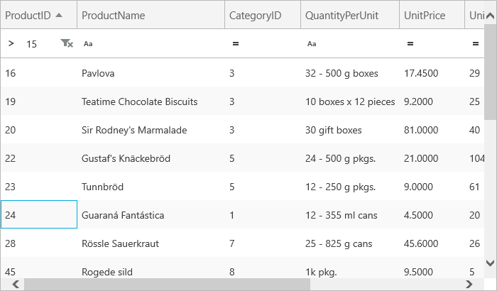

////

|metadata|
{
    "name": "xamgrid-programmatically-create-a-filter",
    "controlName": ["xamGrid"],
    "tags": ["Filtering","Grids","How Do I"],
    "guid": "{97A25F40-8F07-4C97-A068-F9B213A26EDF}",  
    "buildFlags": [],
    "createdOn": "2016-05-25T18:21:55.9992049Z"
}
|metadata|
////

= Programmatically Create a Filter

In certain situations you may want to display filtered information in the xamGrid™ control to your end user. For example an end user may only be interested in seeing the products whose ID is greater than 15.

The following code demonstrates how to create a filter programmatically.

*In Visual Basic:*

----
Imports Infragistics.Controls.Grids
Imports Infragistics
..
'Enable Filtering
MyDataGrid.FilteringSettings.AllowFiltering = FilterUIType.FilterRowTop
MyDataGrid.FilteringSettings.FilteringScope = FilteringScope.ColumnLayout
'Add a filter to the ProductID columns, specifying values must be greater than 15
MyDataGrid.Columns.DataColumns("ProductID").FilterColumnSettings.FilterCellValue = 15
MyDataGrid.Columns.DataColumns("ProductID").FilterColumnSettings.FilteringOperand = New GreaterThanOperand
----

*In C#:*

----
using Infragistics.Controls.Grids;
using Infragistics;
…
//Enable filtering
MyDataGrid.FilteringSettings.AllowFiltering = FilterUIType.FilterRowTop;
MyDataGrid.FilteringSettings.FilteringScope = FilteringScope.ColumnLayout;
//Add a filter to the ProductID columns, specifying values must be greater than 15
MyDataGrid.Columns.DataColumns["ProductID"].FilterColumnSettings.FilterCellValue = 15;
MyDataGrid.Columns.DataColumns["ProductID"].FilterColumnSettings.FilteringOperand=new GreaterThanOperand();
----

ifdef::win-rt[]

endif::win-rt[]

== *Related Topics*

link:xamgrid-filtering.html[Filtering]

link:xamgrid-filtering-events.html[Filtering Events]

link:xamgrid-create-a-custom-filter.html[Create a Custom Filter]

link:xamgrid-filter-operands.html[Filter Operands]