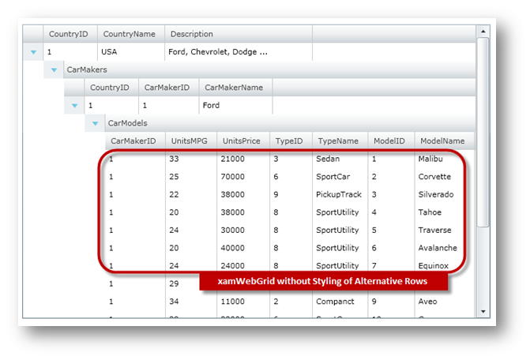
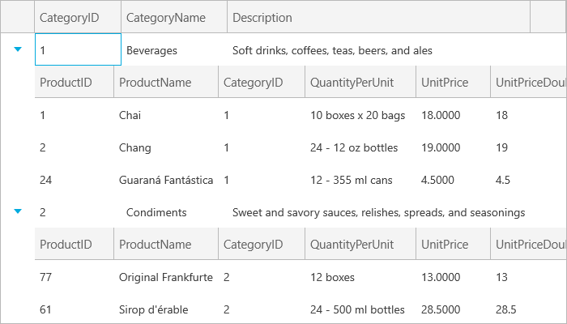

////

|metadata|
{
    "name": "xamgrid-remove-alternative-row-styling",
    "controlName": ["xamGrid"],
    "tags": ["Grids","Styling"],
    "guid": "{54419B35-8119-4E86-8C84-8AEF48CB13BF}",  
    "buildFlags": [],
    "createdOn": "2016-05-25T18:21:56.1172114Z"
}
|metadata|
////

= Remove Alternative Row Styling

The xamGrid™ control provides a simple way of removing styling of alternate rows. This is accomplished by setting the link:{ApiPlatform}controls.grids.xamgrid.v{ProductVersion}~infragistics.controls.grids.xamgrid~isalternaterowsenabled.html[IsAlternateRowsEnabled] property to False. In this configuration, all rows will be rendered using the same style.

The following code shows how to remove styling of alternate rows.

.Note:
[NOTE]
====
This code is using data binding to custom data which is covered more in detail in the Data Binding topic.
====

*In XAML:*

----
<ig:XamGrid x:Name="xamGrid"
            ItemsSource="{Binding Source={StaticResource DataToolCars}, Path=CountryCarMakers}"
            IsAlternateRowsEnabled=" />
----

*In Visual Basic:*

----
Imports Infragistics
Imports Infragistics.Controls.Grids
' ...
Dim xamGrid As New XamGrid()
' remove styling of alternate rows
xamGrid.IsAlternateRowsEnabled = False
xamGrid.ItemsSource = DataTool.CategoriesAndProducts
' add the xamGrid object to control's grid
Me.LayoutRoot.Children.Add(xamGrid)
----

*In C#:*

----
using Infragistics;
using Infragistics.Controls.Grids;
// ...
XamGrid xamGrid = new XamGrid();
xamGrid.IsAlternateRowsEnabled = false;
xamGrid.ItemsSource = DataTool.CategoriesAndProducts;
// add the xamGrid object to control's grid
this.LayoutRoot.Children.Add(xamGrid);
----

The following image shows how the xamGrid control will look without styling of alternative rows:

ifdef::sl,wpf[]

endif::sl,wpf[]

ifdef::win-rt[]

endif::win-rt[]

== Related Topics

link:xamgrid-add-new-row.html[Add New Row]

link:xamgrid-add-row-commands.html[Add Row Commands]

link:xamgrid-auto-expand-data-rows-and-child-bands.html[Auto Expand Data Rows and Child Bands]

link:xamgrid-change-row-hover-type.html[Change Row Hover Type]

link:xamgrid-row-deletion.html[Row Deletion]