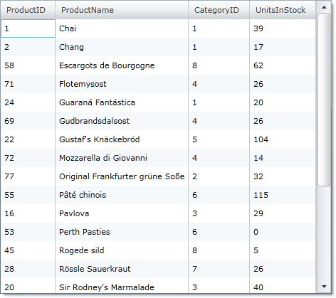
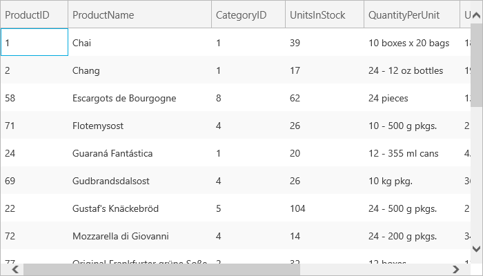

////

|metadata|
{
    "name": "xamgrid-remove-sort-indicator",
    "controlName": ["xamGrid"],
    "tags": ["Grids","How Do I","Sorting"],
    "guid": "{4B83392A-D0D5-410B-BF55-E0EB7C7F5F61}",  
    "buildFlags": [],
    "createdOn": "2016-05-25T18:21:55.6811869Z"
}
|metadata|
////

= Remove Sort Indicator

The xamGrid™ control’s sort indicators indicate the sorting direction on a particular column. In most situations, a sort indicator pointing up indicates a column sorted in ascending order, and a sort indicator pointing down indicates a column sorted in descending order. However, there could be certain situations where you do not want the sort indicator shown on your grid. This can be easily achieved on the xamGrid control.

The following code demonstrates how to remove the sort indicator from sorted columns.

*In XAML:*

----
<ig:XamGrid.SortingSettings>
   <ig:SortingSettings ShowSortIndicator="/>
</ig:XamGrid.SortingSettings>
----

*In Visual Basic:*

----
Me.MyGrid.SortingSettings.ShowSortIndicator = False
----

*In C#:*

----
this.MyGrid.SortingSettings.ShowSortIndicator = false;
----

The following image shows xamGrid sorted on the ProductName column without the sort indicator.

ifdef::sl,wpf[]

endif::sl,wpf[]

ifdef::win-rt[]

endif::win-rt[]

== *Related Topics*

link:xamgrid-sorting.html[Sorting]

link:xamgrid-multi-column-sorting.html[Multi-Column Sorting]

link:xamgrid-disable-sorting-on-certain-columns.html[Disable Sorting on Certain Columns]

link:xamgrid-sorting-events.html[Sorting Events]

link:xamgrid-custom-sort.html[Custom Sort]

pick:[win-rt=" link:bb45cdbe-7149-49bc-a63a-1a77676c6986[Touch Support]"]