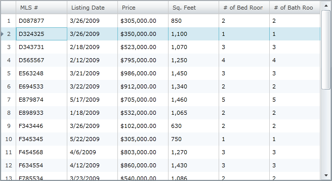
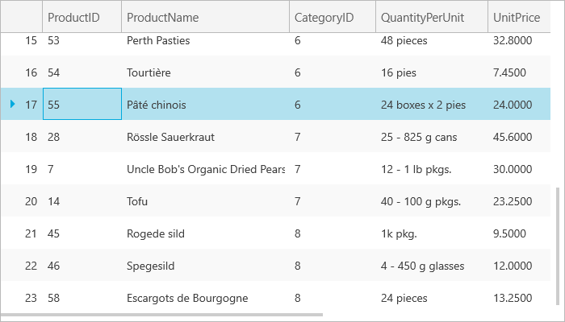

////

|metadata|
{
    "name": "xamgrid-row-selectors",
    "controlName": ["xamGrid"],
    "tags": ["Grids","How Do I","Selection"],
    "guid": "{1ABB13B7-B489-42E3-8E4C-1CE2606AF36B}",  
    "buildFlags": [],
    "createdOn": "2016-05-25T18:21:55.7331897Z"
}
|metadata|
////

= Row Selectors

A row selector is an element that appears in front of each row in xamGrid™. Row selectors are primarily used for selecting or activating rows; however clicking a row selector allows you to perform any custom action on that row by handling the row selector’s event, for more information see the Handle Row Selector Events topics. You can also display row numbers in the row selectors.

To configure row selectors to automatically select rows when clicked, you must enable Row Selection, for more information, see the link:xamgrid-selection.html[Selection] topic.

Clicking on the row selector while activation is enabled activates the first cell in that row, for more information on enabling activation, see the link:xamgrid-activation.html[Activation] topic.

You can enable row selectors on the xamGrid by setting the link:{ApiPlatform}controls.grids.xamgrid{ApiVersion}~infragistics.controls.grids.rowselectorsettings.html[RowSelectorSettings] object’s link:{ApiPlatform}controls.grids.xamgrid{ApiVersion}~infragistics.controls.grids.visualsettingsbase~visibility.html[Visibility] property to Visible as demonstrated in the code below.

*In XAML:*

----
<ig:XamGrid x:Name="MyGrid" AutoGenerateColumns=">
   <ig:XamGrid.RowSelectorSettings>
      <ig:RowSelectorSettings Visibility="Visible"/>
   </ig:XamGrid.RowSelectorSettings>
   …
</ig:XamGrid>
----

*In Visual Basic:*

----
Imports Infragistics.Controls.Grids
...
Me.MyGrid.RowSelectorSettings.Visibility = Visibility.Visible
----

*In C#:*

----
using Infragistics.Controls.Grids;
...
this.MyGrid.RowSelectorSettings.Visibility = Visibility.Visible;
----

The following screen shot displays xamGrid with the default settings for row selector.

ifdef::sl,wpf[]

endif::sl,wpf[]

ifdef::win-rt[]

endif::win-rt[]

== *Related Topics*

link:xamgrid-disable-row-numbering.html[Disable Row Numbering]

link:xamgrid-row-selector-events.html[Row Selector Events]