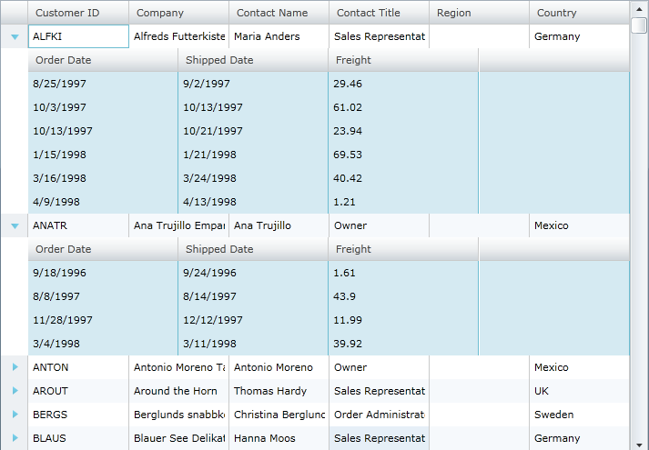

////

|metadata|
{
    "name": "xamgrid-select-all-xamgrid-rows-in-groups-bands-and-at-the-root",
    "controlName": ["xamGrid"],
    "tags": ["Grids","Grouping","How Do I","Selection"],
    "guid": "eec34d1d-2f95-49a8-861e-0c45caad33cf",  
    "buildFlags": [],
    "createdOn": "2016-05-25T18:21:56.4932032Z"
}
|metadata|
////

= Select All xamGrid Rows in Groups, Bands and at the Root

== Topic Overview

== Purpose

This topic describes how to use the link:{ApiPlatform}controls.grids.xamgrid.v{ProductVersion}~infragistics.controls.grids.rowcollection~selectall.html[SelectAll] method which is added the link:{ApiPlatform}controls.grids.xamgrid.v{ProductVersion}~infragistics.controls.grids.rowcollection.html[RowCollection]. The SelectAll method can be used to do the following:

* Select all the rows on the root level of the xamGrid control
* Select all the rows for a particular child band
* Select all the rows for a particular grouping

== Required background

You need to first read the following topics:

* link:xamgrid-adding-xamgrid-to-your-page.html[Adding xamGrid to Your Page]
* link:xamgrid-selection.html[Selection]
* link:xamgrid-groupby.html[GroupBy]

== Selecting Rows in the Grid

== Introduction

This procedure explains how to select the rows in the xamGrid control. The method is added to the RowsCollection and can be used to:

* Select all rows on the root level of xamGrid
* Select all rows for a particular child band
* Select all rows for a particular grouping

Calling the SelectAll method raises the link:{ApiPlatform}controls.grids.xamgrid.v{ProductVersion}~infragistics.controls.grids.xamgrid~selectedrowscollectionchanged_ev.html[SelectedRowsCollectionChanged] event.

== Preview

Following is a preview of the final result.

The screenshot below displays the xamGrid control with all the rows on the root level selected.

ifdef::sl,wpf[]

endif::sl,wpf[]

ifdef::win-rt[]

endif::win-rt[]

The following screenshot displays the xamGrid with the rows for a particular child band selected.

ifdef::sl,wpf[]

endif::sl,wpf[]

ifdef::win-rt[]

endif::win-rt[]

The following screenshot displays the xamGrid with the rows for a particular grouping selected.

ifdef::sl,wpf[]

endif::sl,wpf[]

ifdef::win-rt[]

endif::win-rt[]

== Requirements

To complete the procedure, you need the following:

* A xamGrid control bound to hierarchical data
* GroupBy enabled

== Overview

Following is a conceptual overview of the process:

* Select All Rows on the Root Level of the xamGrid Control
* Select All Rows for a Particular Child Band
* Select All Rows for a Particular Grouping

== Steps

*Select all rows on the root level of the xamGrid Control.*

This is done by calling the SelectAll method on the link:{ApiPlatform}controls.grids.xamgrid.v{ProductVersion}~infragistics.controls.grids.xamgrid~rows.html[Rows] of xamGrid.

*In C#:*

----
dataGrid.Rows.SelectAll();
----

*In Visual Basic:*

----
dataGrid.Rows.SelectAll()
----

*Select all rows for a particular child band.*

This is done by calling the SelectAll method on the link:{ApiPlatform}controls.grids.xamgrid.v{ProductVersion}~infragistics.controls.grids.childbandrowsmanager~rows.html[Rows] of a particular child band.

.Note
[NOTE]
====
The link:{ApiPlatform}controls.grids.xamgrid.v{ProductVersion}~infragistics.controls.grids.row~childbands.html[ChildBands] property is not supported for a `GroupByRow` object. This collection property returns `null` in this particular case.
====

*In C#:*

----
dataGrid.Rows[0].ChildBands[0].Rows.SelectAll();
----

*In Visual Basic:*

----
dataGrid.Rows(0).ChildBands(0).Rows.SelectAll()
----

*Select all rows for a particular grouping*

This is done by calling the SelectAll method on the Rows of a particular grouping.

*In C#:*

----
((GroupByRow)dataGrid.Rows[0]).Rows.SelectAll();
----

*In Visual Basic:*

----
CType(dataGrid.Rows(0),GroupByRow).Rows.SelectAll()
----

== *Related Topics*

Following are some other topics you may find useful.

link:xamgrid-selection.html[Selection]

link:xamgrid-adding-xamgrid-to-your-page.html[Adding xamGrid to Your Page]

link:xamgrid-groupby.html[GroupBy]