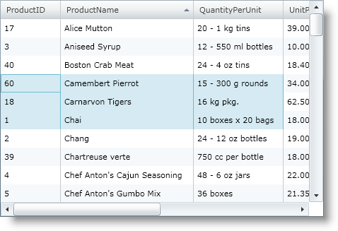
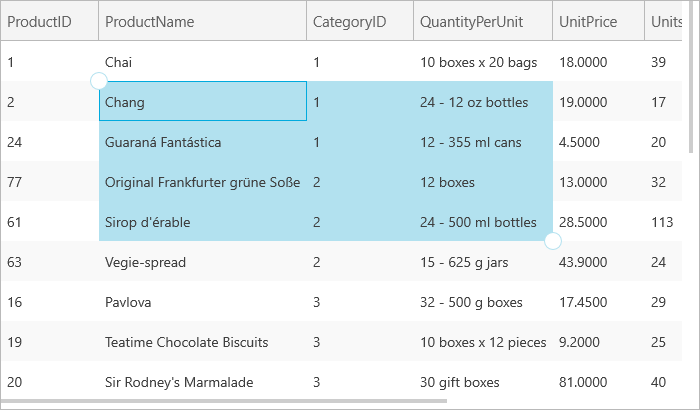

////

|metadata|
{
    "name": "xamgrid-selection",
    "controlName": ["xamGrid"],
    "tags": ["Grids","How Do I","Selection"],
    "guid": "{E5BE5DCF-9546-4BD4-82B3-CCA91F64D3AF}",  
    "buildFlags": [],
    "createdOn": "2016-05-25T18:21:55.7511515Z"
}
|metadata|
////

= Selection

The selection feature enables the selection of rows, cells, and columns of xamGrid™. Once selection is enabled, you must set various properties to configure the type of selection you want. Your end user can select cells in a continuous block or range as well as a non-continuous block.

.Note:
[NOTE]
====
If the SelectionSettings object’s CellClickAction property is set to SelectCell and RowSelection is enabled, the only way to select rows is by using the row selector. For more information see the Row Selector topic.
====

By default, selection is not enabled on the xamGrid control. To enable selection for cells, rows and columns you can set the following properties on the link:{ApiPlatform}controls.grids.xamgrid{ApiVersion}~infragistics.controls.grids.selectionsettings.html[SelectionSettings] object to a value of the link:{ApiPlatform}controls.grids.xamgrid{ApiVersion}~infragistics.controls.grids.selectiontype.html[SelectionType] enumeration:

* CellSelection – Enables cell selection on xamGrid.
* ColumnSelection – Enables column selection on xamGrid.
* Row Selection – Enables row selection on xamGrid.

With single selection enabled, your end user can only select one cell, column or row at a time.

With multiple selection enabled, your end users can select multiple cells, columns or rows in the following way:

* Click a column’s header to select it.
* Click and drag for multiple, continuous selection.
* SHIFT+Click for multiple, continuous selection.
* CTRL+Click for multiple, discontinuous selection.

ifdef::win-rt[]
For more information about the selection using touch gestures, see the link:xamgrid-touch-support.html[Touch support] topic.
endif::win-rt[]

The SelectionSettings object’s link:{ApiPlatform}controls.grids.xamgrid{ApiVersion}~infragistics.controls.grids.selectionsettings~cellclickaction.html[CellClickAction] property determines if a row or cell will be selected when a click action occurs. By default this is set to SelectCell.

The following code demonstrates how to enable cell, column and row selection on your xamGrid control.

*In XAML:*

----
<ig:XamGrid x:Name="MyGrid" AutoGenerateColumns=">
   <ig:XamGrid.SelectionSettings>
      <ig:SelectionSettings CellSelection="Multiple" 
         ColumnSelection="Multiple" RowSelection="Multiple"/>
   </ig:XamGrid.SelectionSettings>
…     
</ig:XamGrid>
----

*In Visual Basic:*

----
Imports Infragistics.Controls.Grids
...
Me.MyGrid.SelectionSettings.CellSelection = SelectionType.Multiple
Me.MyGrid.SelectionSettings.ColumnSelection = SelectionType.Multiple
Me.MyGrid.SelectionSettings.RowSelection = SelectionType.Multiple
----

*In C#:*

----
using Infragistics.Controls.Grids;
...
this.MyGrid.SelectionSettings.CellSelection = SelectionType.Multiple;
this.MyGrid.SelectionSettings.ColumnSelection = SelectionType.Multiple;
this.MyGrid.SelectionSettings.RowSelection = SelectionType.Multiple;
----

== The following screen shot displays a grid with selection enabled.

ifdef::sl,wpf[]

endif::sl,wpf[]

ifdef::win-rt[]

endif::win-rt[]

== *Related Topics*

link:xamgrid-selection-events.html[Selection Events]

link:xamgrid-setting-selection-programmatically.html[Setting Selection Programmatically]

link:xamgrid-select-all-xamgrid-rows-in-groups-bands-and-at-the-root.html[Select All xamGrid Rows in Groups, Bands and at the Root]

pick:[win-rt=" link:xamgrid-touch-support.html[Touch Support]"]