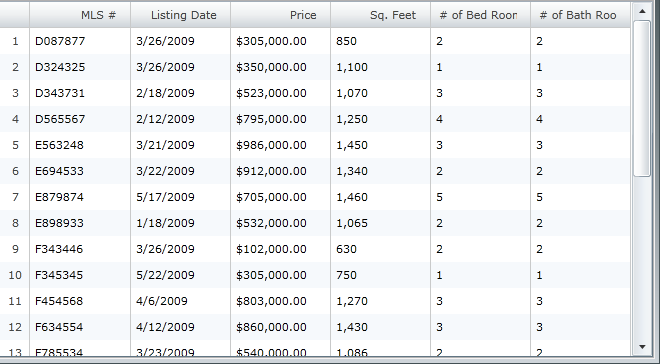
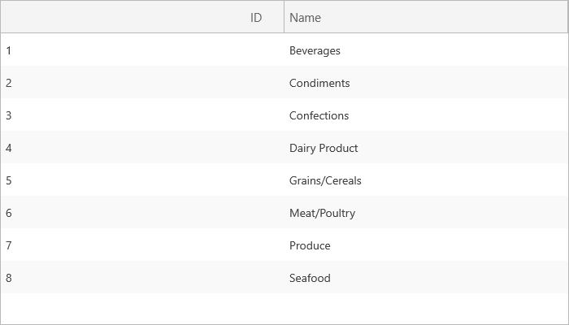

////

|metadata|
{
    "name": "xamgrid-set-the-text-alignment-on-column-headers",
    "controlName": ["xamGrid"],
    "tags": ["Grids","Styling"],
    "guid": "9745d893-9f8d-4559-8b6f-e4191f03dd0f",  
    "buildFlags": [],
    "createdOn": "2016-05-25T18:21:56.1632139Z"
}
|metadata|
////

= Set the Text Alignment on Column Headers

You can set the alignment of the Column header’s text by setting the link:{ApiPlatform}controls.grids.xamgrid.v{ProductVersion}~infragistics.controls.grids.column~headertexthorizontalalignment.html[HeaderTextHorizontalAlignment] and link:{ApiPlatform}controls.grids.xamgrid.v{ProductVersion}~infragistics.controls.grids.column~headertextverticalalignment.html[HeaderTextVerticalAlignment] properties. You can set these properties on the xamGrid control, the Column, or the ColumnLayout.

Setting the property on the Column takes precedence over setting the property on the ColumnLayout.

Setting the property on the ColumnLayout takes precedence over setting the property on xamGrid.

The Column and the ColumnLayout have two additional properties:

* link:{ApiPlatform}controls.grids.xamgrid.v{ProductVersion}~infragistics.controls.grids.column~headertexthorizontalalignmentresolved.html[HeaderTextHorizontalAlignmentResolved]
* link:{ApiPlatform}controls.grids.xamgrid.v{ProductVersion}~infragistics.controls.grids.column~headertextverticalalignmentresolved.html[HeaderTextVerticalAlignmentResolved]

These two read-only properties are used to validate the actual value for a particular ColumnLayout or Column.

.Note:
[NOTE]
====
The ColumnLayout and Column’s HeaderTextHorizontalAlignment and HeaderTextVerticalAlignment are nullable enums, therefore there will not be any intellisense for them in XAML. However, xamGrid’s HeaderTextHorizontalAlignment and HeaderTextVerticalAlignment properties are not nullable and will therefore have intellisense.
====

*In XAML:*

----
<ig:XamGrid x:Name="MyDataGrid"             ItemsSource="{Binding Source={StaticResource DataUtil}, Path=CategoriesAndProducts}" 
            AutoGenerateColumns=" HeaderTextHorizontalAlignment="Right">
   <ig:XamGrid.Columns>
      <ig:TextColumn Key="CategoryID"/>
      <ig:TextColumn Key="CategoryName" HeaderTextHorizontalAlignment="Left" />
   </ig:XamGrid.Columns>
</ig:XamGrid>
----

*In Visual Basic:*

----
MyDataGrid.HeaderTextHorizontalAlignment = HorizontalAlignment.Right
MyDataGrid.Columns.DataColumns("CategoryName").HeaderTextHorizontalAlignment = HorizontalAlignment.Left
----

*In C#:*

----
MyDataGrid.HeaderTextHorizontalAlignment = HorizontalAlignment.Right;
MyDataGrid.Columns.DataColumns["CategoryName"].HeaderTextHorizontalAlignment = HorizontalAlignment.Left;
----

ifdef::sl,wpf[]

endif::sl,wpf[]

ifdef::win-rt[]

endif::win-rt[]