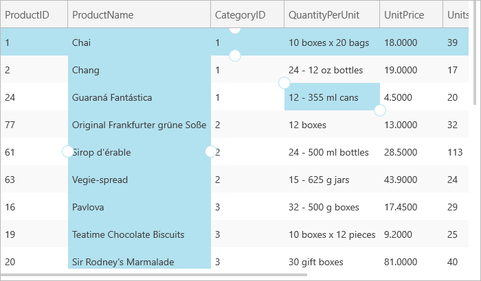

////

|metadata|
{
    "name": "xamgrid-setting-selection-programmatically",
    "controlName": ["xamGrid"],
    "tags": ["Grids","How Do I","Selection"],
    "guid": "{E7ED0E54-DA61-4F92-8853-6332A6F1DD1A}",  
    "buildFlags": [],
    "createdOn": "2016-05-25T18:21:55.76219Z"
}
|metadata|
////

= Setting Selection Programmatically

Your end user can select cells, columns or rows on xamGrid™ using either the mouse or the keyboard. However, you can also set the selected cells, columns or rows in code to be displayed to your end user.

To select cells, columns or rows in code, you can add the required cells, columns or rows to their selected collection. You can also unselect a cell, column or row by removing it from their corresponding selected collection.

The following code demonstrates how to achieve this.

*In Visual Basic:*

----
Imports Infragistics.Controls.Grids
...
'Add a cell to the selected cells collection
Dim SelectedCell As Cell = CType(Me.MyGrid.Rows(2).Cells(3), Cell)
Me.MyGrid.SelectionSettings.SelectedCells.Add(SelectedCell)
'Remove a cell from the selected cells collection
'Me.MyGrid.SelectionSettings.SelectedCells.Remove(SelectedCell)
'Add a column to the selected columns collection
Dim SelectedColumn As Column = Me.MyGrid.Columns.DataColumns("ProductName")
Me.MyGrid.SelectionSettings.SelectedColumns.Add(SelectedColumn)
'Remove a column from the selected columns collection
'Me.MyGrid.SelectionSettings.SelectedColumns.Remove(SelectedColumn)
'Add a row to the selected rows collection
Dim SelectedRow = Me.MyGrid.Rows(0)
Me.MyGrid.SelectionSettings.SelectedRows.Add(SelectedRow)
'Remove a row from the selected rows collection
'Me.MyGrid.SelectionSettings.SelectedRows.Remove(SelectedRow)
----

*In C#:*

----
using Infragistics.Controls.Grids;
...
//Add a cell to the selected cells collection
Cell SelectedCell = (Cell)this.MyGrid.Rows[2].Cells[3];
this.MyGrid.SelectionSettings.SelectedCells.Add(SelectedCell);
//Remove a cell from the selected cells collection
//this.MyGrid.SelectionSettings.SelectedCells.Remove(SelectedCell);
//Add a column to the selected columns collection
Column SelectedColumn = this.MyGrid.Columns.DataColumns["ProductName"];
this.MyGrid.SelectionSettings.SelectedColumns.Add(SelectedColumn);
//Remove a column from the selected columns collection
//this.MyGrid.SelectionSettings.SelectedColumns.Remove(SelectedColumn);
//Add a row to the selected rows collection
Row SelectedRow = this.MyGrid.Rows[0];
this.MyGrid.SelectionSettings.SelectedRows.Add(SelectedRow);
//Remove a row from the selected rows collection
//this.MyGrid.SelectionSettings.SelectedRows.Remove(SelectedRow);
----

ifdef::win-rt[]

endif::win-rt[]

You can use the IsSelected property to set selection. The link:{ApiPlatform}controls.grids.xamgrid{ApiVersion}~infragistics.controls.grids.column~isselected.html[IsSelected] property of the Cell, Column and Row objects determines if the object is selected.

The following code demonstrates how to set a selected row using the IsSelected property.

*In Visual Basic:*

----
Me.MyGrid.Rows(0).IsSelected = True
Me.MyGrid.Columns.DataColumns(0).IsSelected = True
Me.MyGrid.Rows(0).Cells(1).IsSelected = True
----

*In C#:*

----
this.MyGrid.Rows[0].IsSelected = true;
this.MyGrid.Columns.DataColumns[0].IsSelected = true;
this.MyGrid.Rows[0].Cells[1].IsSelected = true; 
----

== *Related Topics*

link:xamgrid-selection.html[Selection]

link:xamgrid-selection-events.html[Selection Events]