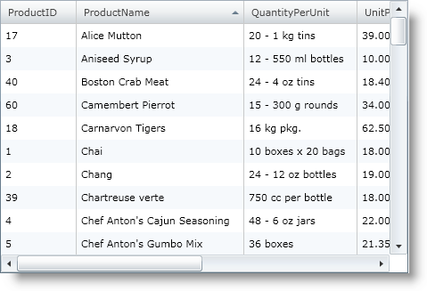
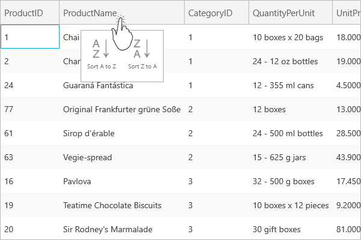

////

|metadata|
{
    "name": "xamgrid-sorting",
    "controlName": ["xamGrid"],
    "tags": ["Grids","How Do I","Sorting"],
    "guid": "{5D2C6A95-3471-478B-918C-D51F6213E111}",  
    "buildFlags": [],
    "createdOn": "2016-05-25T18:21:55.668184Z"
}
|metadata|
////

= Sorting

Sorting is an important functionality provided by xamGrid™. The xamGrid control automatically displays and handles the sorting for you.

ifdef::sl,wpf[]
Your end users can sort columns by clicking the column headers, allowing them to view the grid data in the order that they want.
endif::sl,wpf[]

ifdef::win-rt[]
Your end users can sort columns by tapping/clicking on the column header to open a column menu and selecting sorting order. For more information about columns sorting using touch gestures, see the link:xamgrid-touch-support.html[Touch support] topic.
endif::win-rt[]

By default, sorting is enabled on xamGrid. However, you can disable sorting on your xamGrid, as the following code demonstrates.

*In XAML:*

----
<ig:XamGrid.SortingSettings>
    <ig:SortingSettings AllowSorting="/>
</ig:XamGrid.SortingSettings>
----

*In Visual Basic:*

----
Me.MyGrid.SortingSettings.AllowSorting = False
----

*In C#:*

----
this.MyGrid.SortingSettings.AllowSorting = false;
----

ifdef::sl,wpf[]

endif::sl,wpf[]

ifdef::win-rt[]

endif::win-rt[]

== *Related Topics*

link:xamgrid-multi-column-sorting.html[Multi-Column Sorting]

link:xamgrid-remove-sort-indicator.html[Remove Sort Indicator]

link:xamgrid-disable-sorting-on-certain-columns.html[Disable Sorting on Certain Columns]

link:xamgrid-sorting-events.html[Sorting Events]

link:xamgrid-custom-sort.html[Custom Sort]

pick:[win-rt=" link:xamgrid-touch-support.html[Touch Support]"]