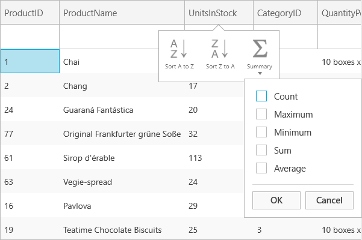

////

|metadata|
{
    "name": "xamgrid-summaries",
    "controlName": ["xamGrid"],
    "tags": ["Grids","Summaries"],
    "guid": "{701DFE6A-556D-4C97-B805-32D14C73DD81}",  
    "buildFlags": [],
    "createdOn": "2016-05-25T18:21:56.0102037Z"
}
|metadata|
////

= Summaries

In some cases, your end users may be overwhelmed by the amount of data displayed in the xamGrid control, and often they may be just looking for a summary of the data. Your end users may also want to derive additional information from the data of a specific column. Row summaries help your end users achieve this.

You can enable row summaries for a column in xamGrid by setting the link:{ApiPlatform}controls.grids.xamgrid.v{ProductVersion}~infragistics.controls.grids.summaryrowsettings.html[SummaryRowSettings] object’s link:{ApiPlatform}controls.grids.xamgrid.v{ProductVersion}~infragistics.controls.grids.summaryrowsettings~allowsummaryrow.html[AllowSummaryRow] to one of the following values of the RowSummaryLocation, which will determine where the summaries will be displayed, enumeration:

* link:{ApiPlatform}controls.grids.xamgrid.v{ProductVersion}~infragistics.controls.grids.summaryrowlocation.html[None] – The summary row will not be displayed.
* link:{ApiPlatform}controls.grids.xamgrid.v{ProductVersion}~infragistics.controls.grids.summaryrowlocation.html[Top] – The summary row will be displayed at the top of the row island.
* link:{ApiPlatform}controls.grids.xamgrid.v{ProductVersion}~infragistics.controls.grids.summaryrowlocation.html[Bottom] – The summary row will be displayed at the bottom of the row island.
* link:{ApiPlatform}controls.grids.xamgrid.v{ProductVersion}~infragistics.controls.grids.summaryrowlocation.html[Both] – The summary row will be displayed at the top and the bottom of the row island.

ifdef::sl,wpf[]
When you set the AllowSummaryRow property, xamGrid will display a summary button in the column header. Your end users can click/tap the summary button to display a summary selection dialog box. In the summary selection dialog box, they can select the row summaries they want to see.
endif::sl,wpf[]

ifdef::win-rt[]
When you set the AllowSummaryRow property, clicking/tapping on a column header will display a column menu with a summary button. Your end users can click/tap the summary button to display a drop down list with available summary operations. For more information about summary feature using touch gestures, see the link:xamgrid-touch-support.html[Touch support] topic.
endif::win-rt[]

When you are enabling summaries, there are different link:{ApiPlatform}controls.grids.xamgrid.v{ProductVersion}~infragistics.controls.grids.summaryrowsettings~summarydefinitioncollection.html[SummaryDefinitionCollection] collections available, for example the column layout or the child band collections. The one that is used depends on the value of the SummaryRowSettings/SummaryRowSettingsOverride object’s link:{ApiPlatform}controls.grids.xamgrid.v{ProductVersion}~infragistics.controls.grids.summaryrowsettings~summaryscope.html[SummaryScope] property. You can set this property to one of the following SummaryScope enumeration:

* link:{ApiPlatform}controls.grids.xamgrid.v{ProductVersion}~infragistics.controls.grids.summaryscope.html[ChildBand] – Each child band of data will be summed independently.
* link:{ApiPlatform}controls.grids.xamgrid.v{ProductVersion}~infragistics.controls.grids.summaryscope.html[ColumnLayout] – All rows that share a ColumnLayout will be summed together.

For more information on column layouts, see the link:xamgrid-define-column-layout.html[Define Column Layout] topic.

You can also manually add summaries for a row using XAML or procedural code, for more information see link:xamgrid-programmatically-add-summaries.html[Programmatically Add Summaries].

The following code demonstrates how to enable row summaries.

*In XAML:*

----
<ig:XamGrid x:Name="MyGrid" AutoGenerateColumns=">
    <ig:XamGrid.SummaryRowSettings>
        <ig:SummaryRowSettings AllowSummaryRow="Top" SummaryScope="ColumnLayout"/>               
    </ig:XamGrid.SummaryRowSettings>
</ig:XamGrid>
----

*In Visual Basic:*

----
Imports Infragistics.Controls.Grids
..
Me.MyGrid.SummaryRowSettings.AllowSummaryRow = SummaryRowLocation.Top
Me.MyGrid.SummaryRowSettings.SummaryScope = SummaryScope.ColumnLayout
----

*In C#:*

----
using Infragistics.Controls.Grids;
…
this.MyGrid.SummaryRowSettings.AllowSummaryRow = SummaryRowLocation.Top;
this.MyGrid.SummaryRowSettings.SummaryScope = SummaryScope.ColumnLayout;
----

ifdef::sl,wpf[]
image::images/xamGrid_Whats_New_Summaries_01.png[]
endif::sl,wpf[]

ifdef::win-rt[]

endif::win-rt[]

ifdef::win-rt[]

endif::win-rt[]

== *Related Topics*

link:xamgrid-programmatically-add-summaries.html[Programmatically Add Summaries]

link:xamgrid-retrieve-the-result-of-a-summary.html[Retrieve the Result of a Summary]

link:xamgrid-create-a-custom-summary.html[Create a Custom Summary]

link:xamgrid-formatting-row-summaries.html[Formatting Row Summaries]

link:xamgrid-display-summary-row-in-xamgrid-groupby-headers.html[Display Summary Row in xamGrid GroupBy Headers]

pick:[win-rt=" link:xamgrid-touch-support.html[Touch Support]"]