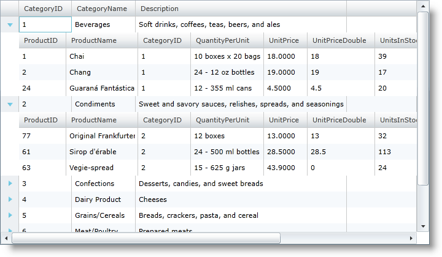
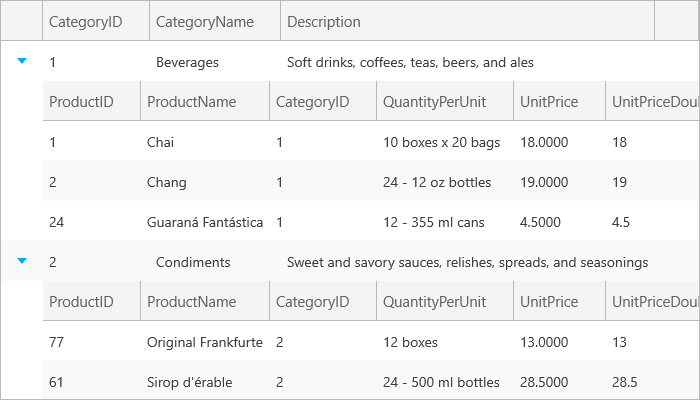

////
|metadata|
{
    "name": "xamgrid-targettypename-resolution",
    "controlName": ["xamGrid"],
    "tags": ["Data Binding","Data Presentation","Grids","How Do I"],
    "guid": "34f30d79-a510-46eb-bb03-4c69357eb0f9",
    "buildFlags": [],
    "createdOn": "2016-05-25T18:21:56.312187Z"
}
|metadata|
////

= TargetTypeName Resolution

So far all of the examples for defining column layouts require a key that corresponds to a specific property name within the bound data source. But there may be times where you won’t know the specific property name, or possibly multiple properties return the same object type and you want to make sure that both use the same column layout. In these scenarios you can consider mapping a ColumnLayout object to a data source property using the link:{ApiPlatform}controls.grids.xamgrid{ApiVersion}~infragistics.controls.grids.columnlayout~targettypename.html[TargetTypeName] property.

The TargetTypeName property allows you to specify a mapping between a ColumnLayout object and a data source property by telling xamGrid to match the TargetTypeName value to the object Type name contained in the collection exposed by a data source property.

Now, rather than looking for a property called Products, xamGrid will instead look for any property that exposes a collection of Product objects.

*In XAML:*

[source,xaml]
----
<ig:XamGrid x:Name="xamGrid1" AutoGenerateColumns="False
ItemsSource="{Binding Source={StaticResource categoryData}, Path=CategoriesAndProducts}">
 <ig:XamGrid.Columns>
        <ig:TextColumn Key="CategoryID" />
        <ig:TextColumn Key="CategoryName" />
        <ig:TextColumn Key="Description" />
    </ig:XamGrid.Columns>
    <ig:XamGrid.ColumnLayouts >
        <ig:ColumnLayout TargetTypeName="Product" Key="Layout1">
            <ig:ColumnLayout.Columns>
                <ig:TextColumn Key="ProductID" />
                <ig:TextColumn Key="ProductName" />
                <ig:TextColumn Key="UnitPrice"/>
            </ig:ColumnLayout.Columns>
        </ig:ColumnLayout>
    </ig:XamGrid.ColumnLayouts>
</ig:XamGrid>
----

Running this sample you get the same hierarchical display you would expect.

ifdef::sl,wpf[]

endif::sl,wpf[]

ifdef::win-rt[]

endif::win-rt[]

Using the TargetTypeName property still requires you also provide a value for the Key property, but now the Key can be any string. It no longer has to map to a data source property.

== Related Topics

link:xamgrid-auto-generate-columns.html[Auto Generate Columns]

link:xamgrid-defining-a-self-related-hierarchical-structure.html[Defining a Self Related Hierarchical Structure]

link:xamgrid-defining-hierarchical-layouts.html[Defining Hierarchical Layouts]

link:xamgrid-defining-unstructured-column-layout-collections.html[Defining Unstructured Column Layout Collections]

link:xamgrid-manually-defining-a-basic-column-structure.html[Manually Defining a Basic Column Structure]