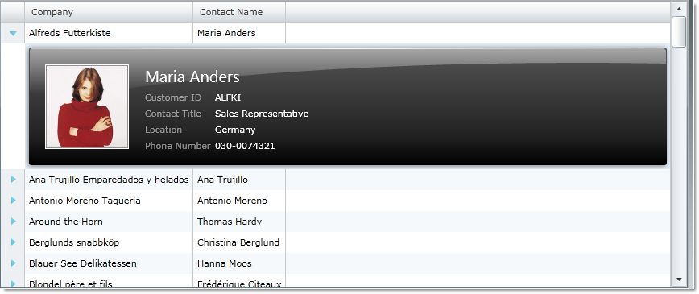
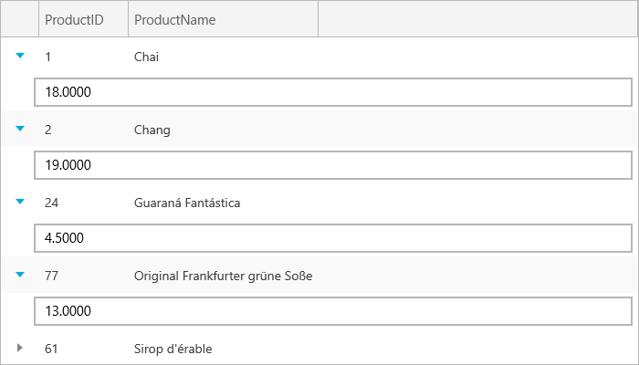

////

|metadata|
{
    "name": "xamgrid-template-column-layout",
    "controlName": ["xamGrid"],
    "tags": ["Grids","How Do I","Layouts"],
    "guid": "{0DE914B0-002D-403D-9D9B-0D6A924EE990}",  
    "buildFlags": [],
    "createdOn": "2016-05-25T18:21:56.0882081Z"
}
|metadata|
////

= Template Column Layout

In certain cases, your xamGrid control may have to visualize large data structures containing lots of information. Most of the time your end users will require only a summary view. Other times, your end users will also need to drill into the details of the specific item.

The Template Column Layout is a feature in the xamGrid control that allows you to add row data detail view to the control. This feature allows you to define the layout in a custom manner through the use of a template.

When a template column layout is included in a column layout, an expansion indicator will appear for each row.  pick:[win-rt="Tapping/"] Clicking on the expansion indicator expands the row to make the template visible;  pick:[win-rt="tapping/"] clicking on it again collapses the template.

For example, if you have a grid that contains a column with a person’s name, you may not want to display that person’s information as separate columns in the grid, but still want all your end users to see the information if required. You can achieve this by creating a Column Template Layout that contains this information. When your end user  pick:[win-rt="taps/"] clicks on the expansion indicator, the additional information will be displayed.

The following code demonstrates how to add a template column layout to xamGrid.

*In XAML:*

----
<ig:XamGrid Grid.Row="0" x:Name="MyDataGrid" AutoGenerateColumns=">
   <ig:XamGrid.Columns>
      <ig:TextColumn Key="ProductID"/>
      <ig:TextColumn Key="ProductName"/>
      <ig:TemplateColumnLayout Key="UnitPrice">
         <ig:TemplateColumnLayout.Template>
            <DataTemplate>
               <Grid>
                  <TextBox Text="{Binding UnitPrice}"/>
               </Grid>
            </DataTemplate>
         </ig:TemplateColumnLayout.Template>
      </ig:TemplateColumnLayout>
   </ig:XamGrid.Columns>
</ig:XamGrid>
----

ifdef::sl,wpf[]

endif::sl,wpf[]

ifdef::win-rt[]

endif::win-rt[]