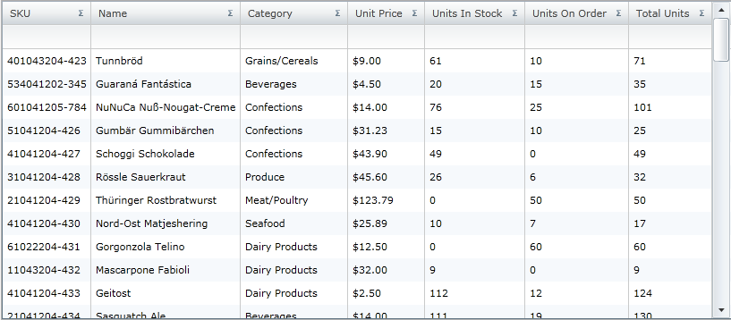
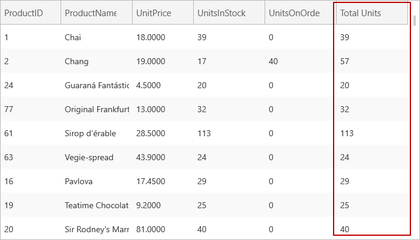

////

|metadata|
{
    "name": "xamgrid-unbound-column",
    "controlName": ["xamGrid"],
    "tags": ["Data Presentation","Getting Started","Grids","How Do I","Layouts"],
    "guid": "{28BE8D77-5EA6-4AA5-A885-7A5515475A93}",  
    "buildFlags": [],
    "createdOn": "2016-05-25T18:21:56.0752109Z"
}
|metadata|
////

= Unbound Column

Unbound columns allow you to add columns to the xamGrid™ control that are not bound to any specific data, but instead utilize a ValueConverter to display calculated values.

*Create an Unbound Column*

You can add an unbound column to xamGrid by using the UnboundColumn type. You must assign a link:{ApiPlatform}controls.grids.xamgrid{ApiVersion}~infragistics.controls.grids.columnbase~key.html[Key] property to the column that is unique to the band / ColumnLayout. To display data in the column, you must implement a ValueConverter.

The following code demonstrates how to create an unbound column where the ValueConverter property is set to your ValueConverter.

*In XAML:*

----
<!-- Add a namespace declaration for the ValueConverter to the opening UserControl tag -- >
<!-- Add a resource for the converter -->
<UserControl.Resources>
   <helper:TotalUnitsConverter x:Key="TotalUnitsConverter"/>
</UserControl.Resources>
<Grid x:Name="LayoutRoot" Background="White">
   <ig:XamGrid Grid.Row="0" x:Name="MyDataGrid"                AutoGenerateColumns=" ColumnWidth="*">
      <ig:XamGrid.Columns>
         <ig:TextColumn Key="ProductID"/>
         <ig:TextColumn Key="ProductName"/>
         <ig:TextColumn Key="UnitPrice"/>
         <ig:TextColumn Key="UnitsInStock"/>
         <ig:TextColumn Key="UnitsOnOrder"/>
         <!--Create an unbound column, hooking it up to the ValueConverter -->
         <ig:UnboundColumn Key="Total Units" ValueConverter="{StaticResource TotalUnitsConverter}"/>
      </ig:XamGrid.Columns>
   </ig:XamGrid>
</Grid>
----

*In Visual Basic:*

----
Dim MyColumn As New UnboundColumn()
MyColumn.Key = "Total Units"
MyColumn.ValueConverter = New TotalUnitsConverter()
Me.MyDataGrid.Columns.Add(MyColumn)
----

*In C#:*

----
this.MyDataGrid.Columns.Add(new UnboundColumn() {Key = "Total Units", ValueConverter = new TotalUnitsConverter()});
----

The following code is the ValueConverter that is used in the above example. This converter displays the total units by adding the UnitsInStock and UnitsOnOrder columns.

ifdef::wpf[]

*In Visual Basic:*

----
Public Class TotalUnitsConverter
    Implements IValueConverter
    Public Function Convert(ByVal value As Object, ByVal targetType As Type, ByVal parameter As Object, ByVal culture As System.Globalization.CultureInfo) As Object
        Dim p As Product = CType(value, Product)
        If (Not (p) Is Nothing) Then
            Return (p.UnitsInStock + p.UnitsOnOrder)
        End If
        Return Nothing
    End Function
    Public Function ConvertBack(ByVal value As Object, ByVal targetType As Type, ByVal parameter As Object, ByVal culture As System.Globalization.CultureInfo) As Object
        Throw New NotImplementedException
    End Function
End Class
----

endif::wpf[]

ifdef::wpf[]

*In C#:*

----
public class TotalUnitsConverter : IValueConverter
{
   public object Convert(object value, Type targetType, object parameter, System.Globalization.CultureInfo culture)
   {
      Product p = value as Product;
      if (p != null)
      {
         return p.UnitsInStock + p.UnitsOnOrder;
      }
      return null;
   }
   public object ConvertBack(object value, Type targetType, object parameter, System.Globalization.CultureInfo culture)
   {
      throw new NotImplementedException();
   }
}
----

endif::wpf[]

ifdef::sl,wpf[]

endif::sl,wpf[]

ifdef::win-rt[]

endif::win-rt[]

*Moving, Resizing and Fixing Unbound Columns*

All the basic xamGrid column features such as column moving, column resizing and column fixing work for unbound columns without any additional manipulation. For more information on these features see the link:xamgrid-column-moving.html[Column Moving], link:xamgrid-column-resizing.html[Column Resizing] and link:xamgrid-fixed-columns.html[Fixed Columns] topics.

*Filtering and Summarizing Unbound Columns*

By default the link:{ApiPlatform}controls.grids.xamgrid{ApiVersion}~infragistics.controls.grids.column~isfilterable.html[IsFilterable] and link:{ApiPlatform}controls.grids.xamgrid{ApiVersion}~infragistics.controls.grids.column~issummable.html[IsSummable] properties are set to False on an unbound column. This is because custom filters and summaries must be written for unbound columns. To enable filtering and summaries on an unbound column, you must set the column’s IsFilterable and IsSummable properties to True and write a custom filter or summary. For more information see the link:xamgrid-create-a-custom-filter.html[Create a Custom Filter] and link:xamgrid-create-a-custom-summary.html[Create a Custom Summary] topics.

.Note
[NOTE]
====
Filtering through the xamGrid Filter Menu is disabled for UnboundColumn.

==== Related Topics

link:xamgrid-sorting-unbound-columns.html[Sorting Unbound Columns]

link:xamgrid-itemtemplate-binding.html[ItemTemplate Binding]

link:xamgrid-editing-unbound-columns.html[Editing Unbound Columns]