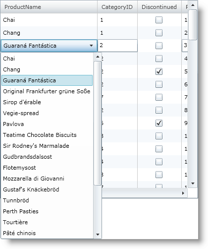

////
|metadata|
{
    "name": "xamgrid-using-editing-events-to-create-a-custom-editor",
    "controlName": ["xamGrid"],
    "tags": ["Editing","Events"],
    "guid": "{B7E07871-7409-4F61-84B4-FC43D19D4355}",
    "buildFlags": [],
    "createdOn": "2016-05-25T18:21:56.0692072Z"
}
|metadata|
////

= Using Editing Events to Create a Custom Editor

== Before You Begin

This topic will walk you through how to use the link:{ApiPlatform}controls.grids.xamgrid.v{ProductVersion}~infragistics.controls.grids.xamgrid~cellenterededitmode_ev.html[CellEnteredEditMode] and link:{ApiPlatform}controls.grids.xamgrid.v{ProductVersion}~infragistics.controls.grids.xamgrid~cellexitingeditmode_ev.html[CellExitingEditMode] events to create a custom editor on a template column.

Assumptions:

This topic assumes the following:

* You already have a xamGrid™ control bound to data on your page. For more information see the link:xamgrid-data-binding.html[Data Binding] topic.
* You have Editing enabled. For more information, see the link:xamgrid-editing-data.html[Editing Data] topic.

== What You Will Accomplish

You will create a custom combo box that will be used as an editor for the Product Name column on your grid. When the grid enters editing mode, a combo box populated with all the product names will appear, the current product name will be highlighted in the drop down.

== Follow these Steps

[start=1]
. Create a link:{ApiPlatform}controls.grids.xamgrid.v{ProductVersion}~infragistics.controls.grids.templatecolumn.html[TemplateColumn], set the link:{ApiPlatform}controls.grids.xamgrid.v{ProductVersion}~infragistics.controls.grids.columnbase~key.html[Key] to ProductName.
+
*In XAML:*
+
[source,xaml]
----
<ig:XamGrid x:Name="MyDataGrid" ItemsSource="{Binding Source={StaticResource DataUtil}, Path=Products}">
    <ig:XamGrid.EditingSettings>
        <ig:EditingSettings AllowEditing="Row"/>
    </ig:XamGrid.EditingSettings>
    <ig:XamGrid.Columns>
        <ig:TemplateColumn Key="ProductName">
            <!-- TODO: Add ItemTemplate -->
            <!-- TODO: Add EditorTemplate -->    
         </ig:TemplateColumn>
    </ig:XamGrid.Columns>
</ig:XamGrid>
----

[start=2]
. Create an link:{ApiPlatform}controls.grids.xamgrid.v{ProductVersion}~infragistics.controls.grids.templatecolumn~itemtemplate.html[ItemTemplate].
+
Create a DataTemplate.
+
Add a TextBlock to the DataTemplate and bind it to the ProductName column.
+
*In XAML:*
+
[source,xaml]
----
<ig:TemplateColumn.ItemTemplate>
   <DataTemplate>
      <TextBlock Text="{Binding ProductName}"/>          
   </DataTemplate>
</ig:TemplateColumn.ItemTemplate>
----

[start=3]
. Create an link:{ApiPlatform}controls.grids.xamgrid.v{ProductVersion}~infragistics.controls.grids.templatecolumn~editortemplate.html[EditorTemplate].
+
Create a DataTemplate.
+
Add a ComboBox.
+
Create an ItemTemplate for the combo box.
+
Create a DataTemplate.
+
Add a TextBlock to the DataTemplate and bind it to the product name.
+
*In XAML:*
+
[source,xaml]
----
<ig:TemplateColumn.EditorTemplate>
   <DataTemplate>
      <ComboBox>
         <ComboBox.ItemTemplate>
            <DataTemplate>
               <TextBlock Text="{Binding ProductName}"/>
            </DataTemplate>
         </ComboBox.ItemTemplate>
      </ComboBox>
   </DataTemplate>
</ig:TemplateColumn.EditorTemplate>
----

[start=4]
. Add the CellEnteredEditMode and CellExitingEditMode events to the xamGrid control.
+
*In XAML:*
+
[source,xaml]
----
<ig:XamGrid x:Name="MyDataGrid" …
    CellEnteredEditMode="MyDataGrid_CellEnteredEditMode" 
    CellExitingEditMode="MyDataGrid_CellExitingEditMode">
    …
</ig:XamGrid>
----

[start=5]
. Handle the CellEnteredEditMode and CellExitingEditMode events.
+
*In Visual Basic:*
+
[source,vb]
----
Private Sub MyDataGrid_CellEnteredEditMode(ByVal sender As Object, ByVal e As EditingCellEventArgs)
    ' Ensure correct cell
    If (e.Cell.Column.Key = "ProductName") Then
        Dim box As ComboBox = CType(e.Editor, ComboBox)
        box.ItemsSource = DataUtil.Products
        ' Set selected index to the index of the grid cell
        box.SelectedIndex = e.Cell.Row.Index
    End If
End Sub
Private Sub MyDataGrid_CellExitingEditMode(ByVal sender As Object, ByVal e As ExitEditingCellEventArgs)
    ' Ensure using correct cell and editing has not been cancelled
    If ((e.Cell.Column.Key = "ProductName") _
        AndAlso Not e.EditingCanceled) Then
        Dim box As ComboBox = CType(e.Editor, ComboBox)
        If (Not (box.SelectedItem) Is Nothing) Then
            ' New value is value of selected item in combo box
            e.NewValue = CType(box.SelectedItem, Product).ProductName
            box.ItemsSource = Nothing
            box.SelectedItem = Nothing
        End If
    End If
End Sub
----
+
*In C#:*
+
[source,csharp]
----
private void MyDataGrid_CellEnteredEditMode(object sender, EditingCellEventArgs e)
{
    // Ensure correct cell
    if (e.Cell.Column.Key == "ProductName") {
        ComboBox box = e.Editor as ComboBox;
        box.ItemsSource = DataUtil.Products;
        // Set selected index to the index of the grid cell
        box.SelectedIndex = e.Cell.Row.Index;
    }
}
private void MyDataGrid_CellExitingEditMode(object sender, ExitEditingCellEventArgs e)
{
    // Ensure using correct cell and editing has not been cancelled
    if (e.Cell.Column.Key == "ProductName" && !e.EditingCanceled) {
        ComboBox box = e.Editor as ComboBox;
        if (box.SelectedItem !=null){
            // New value is value of selected item in combo box
            e.NewValue = ((Product)box.SelectedItem).ProductName;
            box.ItemsSource = null;
            box.SelectedItem = null;
        }
    }
}
----

[start=6]
. Save and run your application. When the ProductName column enters editing mode, you should see a combo box appear populated with the existing product names. The current product name should be selected.
+

== Related Topics

link:xamgrid-editing-data-in-a-template-column.html[Editing Data in a Template Column]

link:xamgrid-changing-cell-values-in-code-behind.html[Changing Cell Values in Code Behind]

link:xamgrid-validating-data.html[Validating Data]

