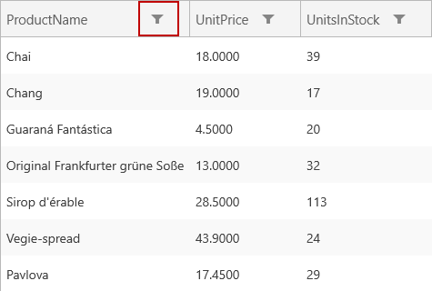

////

|metadata|
{
    "name": "xamgrid-using-the-custom-filter-dialog",
    "controlName": ["xamGrid"],
    "tags": ["Filtering","Grids"],
    "guid": "9a784b79-eddb-4ed4-9330-e4d05d8d34f0",  
    "buildFlags": [],
    "createdOn": "2016-05-25T18:21:56.5842021Z"
}
|metadata|
////

= Using the Custom Filter Dialog

== Topic Overview

=== Purpose

This topic explains the Custom Filter Dialog feature in the xamGrid™ and how the dialog interface can be used by the end user to create complex filters on data in a column.

=== Required background

The following table lists the topics required as a prerequisite to understanding this topic.

[options="header", cols="a,a"]
|====
|Topic|Purpose

| link:xamgrid-filtering.html[Filtering]
|This topic explains how the end user can filter the data that is contained within the xamGrid control.

|====

=== In this topic

This topic contains the following sections:

* <<_Ref319878370, Control Configuration Summary >>
* <<_Ref319878380, Enabling Custom Filter Dialog >>
* <<_Ref319878389, User Interaction and Usability >>
* <<_Ref319878405, Related Content >>

[[_Ref319878370]]
== Control Configuration Summary

=== Control configuration overview

The following table lists the configurable aspects of the filtering and enabling the Custom Filter Dialog in the xamGrid control. Additional details are available after the summary table.

[options="header", cols="a,a,a"]
|====
|Configurable aspects|Details|Properties

|Enabling the Custom Filter Dialog
|Filtering has to be enabled through a FilterMenu so the end user can access the Custom Filter Dialog.
| link:{ApiPlatform}controls.grids.xamgrid.v{ProductVersion}~infragistics.controls.grids.filteringsettings~allowfiltering.html[AllowFiltering]

|====

[[_Ref319878380]]
== Enabling Custom Filter Dialog

=== Overview

The Custom Filter Dialog can be accessed by the end user if you enable the filtering and filter menu in the xamGrid control.

=== Property settings

The following table maps the desired configuration to the property setting.

[options="header", cols="a,a,a"]
|====
|In order to:|Use this property:|And set it to:

|Enable the Custom Filter Dialog
| link:{ApiPlatform}controls.grids.xamgrid.v{ProductVersion}~infragistics.controls.grids.filteringsettings~allowfiltering.html[AllowFiltering]
| _FilterMenu_ 

|====

=== Example

The following screenshots demonstrate how the filter menu and custom filter dialog looks as a result of enabling the filtering with the following setting:

[options="header", cols="a,a"]
|====
|Property|Value

| link:{ApiPlatform}controls.grids.xamgrid.v{ProductVersion}~infragistics.controls.grids.filteringsettings~allowfiltering.html[AllowFiltering]
| _FilterMenu_ 

|====

ifdef::sl,wpf[]

endif::sl,wpf[]

ifdef::win-rt[]

endif::win-rt[]

Figure 1 FilterMenu Icon

ifdef::sl,wpf[]

endif::sl,wpf[]

ifdef::win-rt[]

endif::win-rt[]

Figure 2 Opening the filter menu

ifdef::sl,wpf[]

endif::sl,wpf[]

ifdef::win-rt[]

endif::win-rt[]

Figure 3 Custom Filter Menu

[[_Ref319878389]]
== User Interaction and Usability

=== User interactions summary

The following table summarizes the user interaction capabilities of the Custom Filter Dialog in the xamGrid control. Additional details are available after the table.

[options="header", cols="a,a,a,a"]
|====
|The user can…|Using…|Details|Configurable?

|add a new filtering condition
|the _Add Condition_ button
|Clicking pick:[win-rt="/tapping"] on the button creates a new entry in the filtering conditions grid.
|image::images/xamGrid-Using_the_Custom_Filter_Dialog_4.png[]

|edit the filter operand
|the combo box in the filter operand field
|The Filter operand field contains an editable combo box that lists all operands applicable for the data type of the filtered column.
|image::images/xamGrid-Using_the_Custom_Filter_Dialog_4.png[]

|edit the filter value
|the editor in the filter value field
|The Filter value field contains a specific editor for the data type of the filtered column.
|image::images/xamGrid-Using_the_Custom_Filter_Dialog_4.png[]

|delete the selected conditions
|the _Remove Condition(s)_ button
|Clicking pick:[win-rt="/tapping"] the button deletes the selected condition(s).
|image::images/xamGrid-Using_the_Custom_Filter_Dialog_4.png[]

|combine two or more selected conditions in an And group
|the And Group button
|Clicking pick:[win-rt="/tapping"] the button combines two or more selected conditions with AND operator and surrounds the group with brackets.
|image::images/xamGrid-Using_the_Custom_Filter_Dialog_4.png[]

|combine two or more selected conditions in an Or group
|the *Or Group* button
|Clicking pick:[win-rt="/tapping"] the button combines two or more selected conditions with an OR operator and surrounds the group with brackets.
|image::images/xamGrid-Using_the_Custom_Filter_Dialog_4.png[]

|switch between logical operators AND and OR
|the Toggle button
|Clicking pick:[win-rt="/tapping"] the button switches the logical operator between selected conditions
|image::images/xamGrid-Using_the_Custom_Filter_Dialog_4.png[]

|accept and apply the newly created complex filter
|the Accept button
|Clicking pick:[win-rt="/tapping"] the button applies the newly created complex filter to the column data.
|image::images/xamGrid-Using_the_Custom_Filter_Dialog_4.png[]

|close the dialog without applying the created filter
|the Cancel button
|Clicking pick:[win-rt="/tapping"] the button closes the dialog without applying the created filter to the column data.
|image::images/xamGrid-Using_the_Custom_Filter_Dialog_4.png[]

|====

[[_Ref319878405]]
== Related Content

=== Topics

The following topics provide additional information related to this topic.

[options="header", cols="a,a"]
|====
|Topic|Purpose

| link:xamgrid-filtering-events.html[Filtering Events]
|This topic describes the filtering events in the xamGrid control.

| link:xamgrid-programmatically-create-a-filter.html[Programmatically Create a Filter]
|This topic demonstrates how to create a filter programmatically.

| link:xamgrid-create-a-custom-filter.html[Create a Custom Filter]
|This topic demonstrates how to add custom filters in the xamGrid control.

| link:xamgrid-filter-operands.html[Filter Operands]
|This topic demonstrates how to change or remove certain filter operands from the filter row.

ifdef::win-rt[]
| link:xamgrid-touch-support.html[Touch Support]
|This topic describes the available touch user interactions using the xamGrid™ control.
endif::win-rt[]

|====