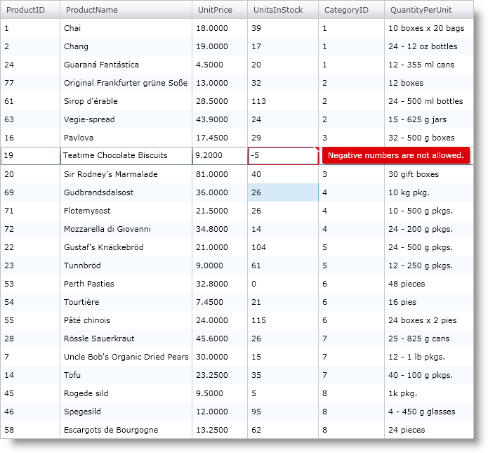

////

|metadata|
{
    "name": "xamgrid-validating-data",
    "controlName": ["xamGrid"],
    "tags": ["Grids","Validation"],
    "guid": "{AD1D5DEC-3AF9-4465-A518-99F6BC5EFE48}",  
    "buildFlags": [],
    "createdOn": "2016-05-25T18:21:55.9411994Z"
}
|metadata|
////

= Validating Data

The xamGrid™ control supports data validation; anytime your end user sets a value that causes an exception and tries to exit edit mode, the control displays the exception and keeps the user in edit mode. The user must enter a valid value or hit Escape to reject changes before exiting edit mode. This is how the control behaves by default; however, every link:{ApiPlatform}controls.grids.xamgrid{ApiVersion}~infragistics.controls.grids.editablecolumn.html[EditableColumn] object has an link:{ApiPlatform}controls.grids.xamgrid{ApiVersion}~infragistics.controls.grids.editablecolumn~alloweditingvalidation.html[AllowEditingValidation] property that you can set to enable/disable validation.

The following code restricts end users from entering negative values into the UnitPrice and UnitsInStock fields of xamGrid by throwing an exception when the end user tries to set the values to a negative number. You can set allow validation for any columns. In the case of a template column, you have to provide an editor with the appropriate bindings, as shown in the example below. The example uses the Products class which throws an exception when its UnitPrice or UnitsInStock properties are set to a negative number. The full link:resources-datautil.html[DataUtil] class is provided for you.

*In XAML:*

----
<ig:XamGrid x:Name="xamGrid1" ItemsSource="{Binding Source={StaticResource DataUtil}, Path=Products}">
    <ig:XamGrid.EditingSettings>
        <ig:EditingSettings AllowEditing="Row" />
    </ig:XamGrid.EditingSettings>
    <ig:XamGrid.Columns>
        <ig:TextColumn Key="ProductID" />
        <ig:TextColumn Key="ProductName" />
        <ig:TextColumn Key="UnitPrice" />
        <ig:TemplateColumn Key="UnitsInStock">
            <ig:TemplateColumn.ItemTemplate>
                <DataTemplate>
                    <TextBlock Text="{Binding UnitsInStock}" />
                </DataTemplate>
            </ig:TemplateColumn.ItemTemplate>
            <!--Set editor for template column -->
            <ig:TemplateColumn.EditorTemplate>
                <DataTemplate>
                    <!-- Set UpdateSourceTrigger to Explicit so that grid has control over when update to source occurs -->
                    <!-- Set textbox validation options for textbox to validate data and notify -->
                    <TextBox Text="{Binding UnitsInStock, Mode=TwoWay, ValidatesOnExceptions=True, NotifyOnValidationError=True, UpdateSourceTrigger=Explicit}" />
                </DataTemplate>
            </ig:TemplateColumn.EditorTemplate>
        </ig:TemplateColumn>
    </ig:XamGrid.Columns>
</ig:XamGrid>
----

*In Visual Basic:*

----
Public Class Product
Implements INotifyPropertyChanged
...
        Public Property UnitPrice() As Decimal
            Get
                Return Me.m_unitPrice
            End Get
            Set(ByVal value As Decimal)
                If value < 0 Then
                    Throw New Exception("Negative numbers are not allowed")
                End If
                Me.m_unitPrice = value
                OnPropertyChanged("UnitPrice")
            End Set
        End Property
        Public Property UnitsInStock() As Integer
            Get
                Return Me.m_unitsInStock
            End Get
            Set(ByVal value As Integer)
                If value < 0 Then
                    Throw New Exception("Negative numbers are not allowed")
                End If
                Me.m_unitsInStock = value
                OnPropertyChanged("UnitsInStock")
            End Set
        End Property
...
End Class
----

*In C#:*

----
public class Product : INotifyPropertyChanged
{
...
    public decimal UnitPrice
    {
        get
        {
            return this.unitPrice;
        }
        set
        {
            if (value < 0)
                throw new Exception("Negative numbers are not allowed.");
            this.unitPrice = value;
            OnPropertyChanged("UnitPrice");
        }
    }
    public int UnitsInStock
    {
        get
        {
            return this.unitsInStock;
        }
        set
        {
            if (value < 0)
                throw new Exception("Negative numbers are not allowed.");
                this.unitsInStock = value;
                OnPropertyChanged("UnitsInStock");
        }
    }
...
}
----

== Related Topic

link:xamgrid-editing-data-in-a-template-column.html[Editing Data in a Template Column]

link:xamgrid-editing-data.html[Editing Data]

link:xamgrid-changing-cell-values-in-code-behind.html[Changing Cell Values in Code Behind]