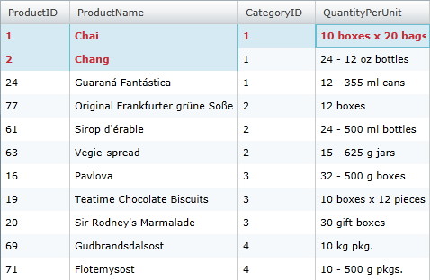
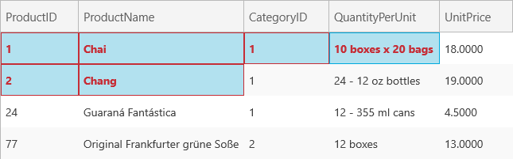

////
|metadata|
{
    "name": "xamgrid-verifying-rectangular-cell-selection-when-copying-data",
    "controlName": ["xamGrid"],
    "tags": ["Data Presentation","Events","Exporting","Grids","How Do I","Layouts","Selection"],
    "guid": "6b7854af-c228-4e40-96aa-737cdd9725e5",
    "buildFlags": [],
    "createdOn": "2016-05-25T18:21:56.5692062Z"
}
|metadata|
////

= Verifying a Rectangular Cell Selection When Copying Data

== Topic Overview

=== Purpose

This topic demonstrates how you can verify that the end-user cell selection can be pasted correctly in a Microsoft® Excel® worksheet. Only a rectangular cells selection is accepted as a valid region.

=== Required background

The following table lists the topics required as a prerequisite to understanding this topic.

[options="header", cols="a,a"]
|====
|Topic|Purpose

| link:xamgrid-copy-events-and-events-arguments.html[Copy Events and Event Arguments]
|This topic demonstrates how you can handle the copy events to control the copy process .

|====

=== In this topic

This topic contains the following sections:

* <<_Ref319963865, Verifying a Rectangular Cell Selection in the xamGrid >>
* <<_Ref319963871, Related Content >>

[[_Ref319963865]]
== Verifying a Rectangular Cell Selection in the xamGrid

=== Introduction

In an Excel document, if you select multiple data cells that do not form a rectangular region and try to copy them, a message will be displayed that this is not possible. A rectangular selection in the only valid cell selection for copying.

In the xamGrid control you can check the cell selection that will be copied and pasted. To do this, use the link:{ApiPlatform}controls.grids.xamgrid.v{ProductVersion}~infragistics.controls.grids.clipboardcopyingeventargs_members.html[ClipboardCopyingEventArgs] object’s link:{ApiPlatform}controls.grids.xamgrid.v{ProductVersion}~infragistics.controls.grids.clipboardcopyingeventargs~validateselectedrectangle.html[ValidateSelectedRectangle] method.

The following procedure demonstrates how you can check the cell selection. If the cell selection is not valid, the selected cells are marked in red. A message is displayed that the region is not a rectangle and further copy actions are cancelled.

=== Preview

The following screenshot is a preview of the final result.

ifdef::sl,wpf[]

endif::sl,wpf[]

ifdef::win-rt[]

endif::win-rt[]

=== Requirements

To complete the procedure, you need to include the link:resources-datautil.html[DataUtil] class provided for you as a sample data source in your project.

=== Overview

This topic takes you step-by-step toward verifying a rectangular cell selection in the xamGrid control. The following is a conceptual overview of the process:

[start=1]
. <<_Ref1, Adding a xamGrid control to your application >>
[start=2]
. <<_Ref2, Enabling the copy feature >>
[start=3]
. <<_Ref3, Enabling the multiple cell selection >>
[start=4]
. <<_Ref4, Creating a Style that marks the cells in the invalid region and add it as a LayoutRoot Grid resource >>
[start=5]
. <<_Ref5, Handling the ClipboardCopying event >>

=== Steps

The following steps demonstrate how to implement the verification of the rectangular region.

=== Add a xamGrid control to your application

Add a xamGrid control to your application and bind in to data source. The verification for a rectangular cell selection is performed in the ClipboardCopying event handler.

*In XAML:*

[source,xaml]
----
<ig:XamGrid x:Name="dataGrid"
    ClipboardCopying="dataGrid_ClipboardCopying">
<!-- Add more code here -->
</ig:XamGrid>
----

=== Enable the copy feature

Enable the xamGrid copy feature for selected cells so the end user can copy muliple cells content.

*In XAML:*

[source,xaml]
----
<ig:XamGrid.ClipboardSettings>
  <ig:ClipboardSettings AllowCopy="True" 
      CopyOptions="ExcludeHeaders" 
      CopyType="SelectedCells"
      AllowPaste="True"/>
</ig:XamGrid.ClipboardSettings>
----

=== Enable the multiple cell selection

The multiple cell selection is enabled in the xamGrid so the end user can select cells to copy.

*In XAML:*

[source,xaml]
----
<ig:XamGrid.SelectionSettings>
    <ig:SelectionSettings 
        CellClickAction="SelectCell" 
        CellSelection="Multiple" />
</ig:XamGrid.SelectionSettings>
----

=== Create a Style that marks the cells in the invalid region and add it as a LayoutRoot Grid resource

The created Style colors the cell foreground and border in red and sets bolded font weight to the cell text. This way the end user is notified which cells are included in the invalid selection.

*In XAML:*

[source,xaml]
----

----

=== Handle the ClipboardCopying event

A check is performed if the cell selection is valid. If the selection is not rectangular, the selected cells are marked in red. Further copy events are cancelled.

*In C#:*

[source,csharp]
----
private void dataGrid_ClipboardCopying(object sender, ClipboardCopyingEventArgs e)
{
  // Check if the selected region of cells is valid for pasting
  bool isValidSelection = e.ValidateSelectedRectangle();
  if (!isValidSelection)
  {
    foreach (CellBase cell in e.SelectedItems)
    {
      // Set the new style to the cells that will be copied
      cell.Style = this.LayoutRoot.Resources["InvalidSelectionCellStyle"] as Style;
    }
    // Cancel the copying event if the selected region of cells is not rectangular 
    e.Cancel = true;
  } 
}
----

*In Visual Basic:*

[source,vb]
----
Private Sub dataGrid_ClipboardCopying(sender As System.Object, e As Infragistics.Controls.Grids.ClipboardCopyingEventArgs)
  ' Check if the selected region of cells is valid for pasting
  Dim isValidSelection As Boolean = e.ValidateSelectedRectangle()
  If Not isValidSelection Then
    For Each cell As CellBase In e.SelectedItems
      ' Set the new style to the cells that will be copied
      cell.Style = TryCast(Me.LayoutRoot.Resources("InvalidSelectionCellStyle"), Style)
    Next
    ' Cancel the copying event if the selected region of cells is not rectangular 
    e.Cancel = True
  End If
 End Sub
----

[[_Ref319963871]]
== Related Content

=== Topics

The following topics provide additional information related to this topic.

[options="header", cols="a,a"]
|====
|Topic|Purpose

| link:xamgrid-enable-copy-and-paste-support.html[Enable Copy and Paste Support]
|This topic demonstrates how the copy and paste features can be enabled in the xamGrid control.

| link:xamgrid-copy-options.html[Copy Options]
|This topic demonstrates available copy options.

| link:xamgrid-specify-the-content-to-be-copied.html[Specify the Content to be Copied]
|This topic demonstrates how you specify what will be copied – selected cells or rows in the xamGrid control.

| link:xamgrid-paste-event-and-event-arguments.html[Paste Event and Event Arguments]
|This topic demonstrates how you can handle the paste event to control the pasting process.

|====