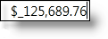
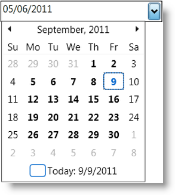
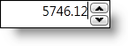

////
|metadata|
{
    "name": "xaminputs-about",
    "controlName": ["xamInputs"],
    "tags": ["Editing","Getting Started"],
    "guid": "edb6bde2-e57b-45c4-88aa-f53063751a59",
    "buildFlags": [],
    "createdOn": "2016-05-25T18:21:56.8882161Z"
}
|metadata|
////

= About xamInputs

== Topic Overview

=== Purpose

This topic will introduce you to the controls in the xamInputs group.

=== In this topic

* Controls overview
* xamCurrencyInput™
* xamDateTimeInput™
* xamNumericInput™
* xamMaskedInput™

== Controls overview

The controls in the xamInputs group are meant to guide the users during data entry and give you an opportunity to check if the entered data meets some predefined criteria. The input controls can be used as standalone textboxes or in combination with other controls, for example as cells in a xamGrid control.

Below you can find a brief description of the controls in the xamInputs group.

[cols="a,a"]
|====
|*Control*
|*Description*

| link:xamcurrencyinput.html[xamCurrencyInput]
| image::images/xamInputs_xamCurrencyInput_About.png[] 
A simple text box control that uses a mask to assist end users in entering currency values in the correct format.

| link:xamdatetimeinput.html[xamDateTimeInput]
| image::images/xamInputs_xamDateTimeInput_About.png[] 
A simple text box control that uses a mask to assist end users in entering dates and/or time values in the correct format.

| link:xamnumericinput.html[xamNumericInput]
| image::images/xamInputs_xamNumericInput_About.png[] 
A simple text box control that uses a mask to assist end users in entering numeric values in the correct format.

| link:xammaskedinput.html[xamMaskedInput]
| image::images/xamInputs_xamMaskedInput_About.png[] 
A simple text box control that uses a mask to assist end users in data input.

|====

== xamCurrencyInput

The xamCurrencyInput is a text box control that facilitates currency data input and editing for end users by giving them a pattern for their input. In addition, if no mask is specified, the control uses the system’s currency format settings to display the data it contains.

==== Related Topics

* link:xamcurrencyinput-about.html[About xamCurrencyInput]
* link:xamcurrencyinput-using.html[Using xamCurrencyInput]

== xamDateTimeInput

The xamDateTimeInput is a text box control that assists users in entering and editing DateTime data. The control exposes a mask property that enables you to specify the format of the value entered or edited. The xamDateTimeInput also provides a calendar dropdown from which your users can directly pick a date rather than having to explicitly type the date value in the text box.

==== Related Topics

* link:xamdatetimeinput-about.html[About xamDateTimeInput]
* link:xamdatetimeinput-using.html[Using xamDateTimeInput]

== xamNumericInput

The xamNumericInput is a text box control that uses a mask to assist users in entering and editing numeric values. Using the control’s properties you can define validation rules for the control.

==== Related Topics

link:xamnumericinput-about.html[About xamNumericInput]

link:xamnumericinput-using.html[Using xamNumericInput]

== xamMaskedInput

The xamMaskedInput is the base control from which the other xamInputs are derived therefore it has the widest application. You can configure the mask, value type and other properties that enable you to set restrictions on the data.

image::images/xamInputs_xamMaskedInput_About.png[]

==== Related Topics

* link:xammaskedinput-about.html[About xamMaskedInput]
* link:xammaskedinput-using.html[Using xamMaskedInput]

== Related Topics

Following are some other topics you may find useful.

* link:xaminputs-masks.html[Masks]
* link:xaminputs-overview-of-the-valueinput-class.html[Overview of the ValueInput Class]
* link:xaminputs-using-xaminput-controls-in-xamgrid-cells-for-data-editing.html[Using xamInput Controls in xamGrid Cells for Data Editing]
