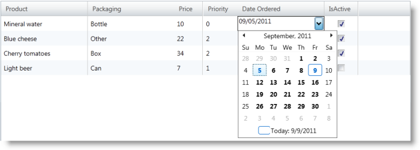
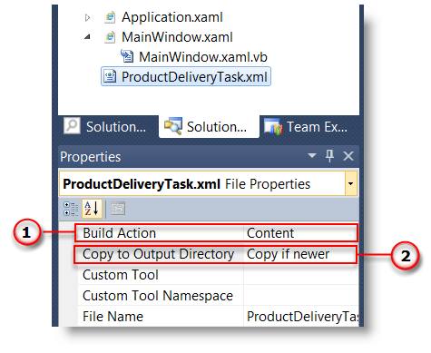

////
|metadata|
{
    "name": "xaminputs-using-xaminput-controls-in-xamgrid-cells-for-data-editing",
    "controlName": ["xamInputs"],
    "tags": ["Editing","Grids","How Do I"],
    "guid": "c83b3b39-4be2-4800-a28b-559dfb9291bb",
    "buildFlags": [],
    "createdOn": "2016-05-25T18:21:56.9152169Z"
}
|metadata|
////

= Using xamInput Controls in xamGrid Cells for Data Editing

== Purpose

This topic explains how you can take advantage of the editing capabilities of the various xamInput™ controls when editing the values of xamGrid™ cells.

== In this topic

This document contains the following sections:

* Required background
* Introduction
* Overview
* Steps

== Required background

You need to first read the following topics:

* link:xamgrid-about-xamgrid.html[About xamGrid]
* link:xamgrid-adding-xamgrid-to-your-page.html[Adding xamGrid to Your Page]
* link:xamgrid-create-a-template-column.html[Create a Template Column]
* link:xamgrid-editing-data-in-a-template-column.html[Editing Data in a Template Column]
* link:xammaskedinput-using.html[Using xamMaskedInput]

== Using xamInputs as cells in xamGrid control

== Introduction

An important feature of the xamInput controls is their ability to be used in combination with the xamGrid control. This feature allows users to take advantage of the input controls’ full potential while modifying a cell's value and at the same time allows you to check if the entered data meets adheres to predefined criteria.

This topic describes how to create an application where the xamGrid control to works together with the xamInput controls. The main focus is to give you an understanding of how to use the xamInputs with the grid’s template columns.

== Preview

Following is a preview of the final result where the xamDateTimeInput control is used in the xamGrid to provide a date picker for the Date Ordered field.

== Overview

Following is a conceptual overview of the process:

[start=1]
. link:xaminputs-using-xaminput-controls-in-xamgrid-cells-for-data-editing.html#CreateProject[Create project and add the required references]
[start=2]
. link:xaminputs-using-xaminput-controls-in-xamgrid-cells-for-data-editing.html#AddDataSource[Add data source]
[start=3]
. link:xaminputs-using-xaminput-controls-in-xamgrid-cells-for-data-editing.html#AddNamespace[Add XAML Infragistics namespace]
[start=4]
. link:xaminputs-using-xaminput-controls-in-xamgrid-cells-for-data-editing.html#AddXamGrid[Add an instance of the xamGrid control]
[start=5]
. link:xaminputs-using-xaminput-controls-in-xamgrid-cells-for-data-editing.html#EableEditing[Enable editing]
[start=6]
. link:xaminputs-using-xaminput-controls-in-xamgrid-cells-for-data-editing.html#CreateColumns[Create Template columns]
[start=7]
. link:xaminputs-using-xaminput-controls-in-xamgrid-cells-for-data-editing.html#CreateColumns[Set the xamGrid’s ItemsSource]
[start=8]
. link:xaminputs-using-xaminput-controls-in-xamgrid-cells-for-data-editing.html#Build[Build and run your project]

== Steps

[[CreateProject]]
[start=1]
. *Create project*
+
Create a {PlatformName} project. Next, add to your project references to the following assemblies:

** {ApiPlatform}Controls.Editors.XamDateTimeInput{ApiVersion}.dll
** {ApiPlatform}Controls.Editors.XamMaskedInput{ApiVersion}.dll
** {ApiPlatform}Controls.Editors.XamCalendar{ApiVersion}.dll
** {ApiPlatform}Controls.Grids.XamGrid{ApiVersion}.dll
** {ApiPlatform}Controls.Menus.XamMenu{ApiVersion}.dll
** {ApiPlatform}{ApiVersion}dll

[[AddDataSource]]
[start=2]
. *Add data source.*

.. *Add the data source class*
+
In the MainWindow.xaml.cs file add the class definition from link:xaminputs-using-xaminput-controls-in-xamgrid-cells-for-data-editing.html#Listing1[Listing 1].

.. *Add the XML contents file*
+
--
... Download the link:resources-productdeliverytask.html[ProductDeliveryTask.xml] file and copy it to the directory of your {PlatformName} project.
... In the Solution Explorer of Visual Studio right-click your project and select Add>Existing Item.
... In the window locate the link:resources-productdeliverytask.html[ProductDeliveryTask.xml] file and press Add. This file contains sample data for the xamGrid.
... Open its properties and set its Build Action to Content (1).
... Set the Copy to OutputDirectory property to Copy if newer (2).
--
+

[[AddNamespace]]
[start=3]
. *Add XAML Infragistics namespace*
+
Open MainWindow.xaml and add the following namespace to the Window tag:
+
*In XAML:*
+
[source,xaml]
----
xmlns:ig="http://schemas.infragistics.com/xaml"
xmlns:editors="http://schemas.infragistics.com/xaml"
----

[[AddXamGrid]]
[start=4]
. *Add an instance of the xamGrid control*
+
Inside the main layout Grid control insert a xamGrid and give it a value for x:Name for later reference. Your grid declaration should now look like this:
+
*In XAML:*
+
[source,xaml]
----
<ig:XamGrid x:Name="myGrid"> <ig:XamGrid/>
----

[[EnableEditing]]
[start=5]
. *Enable editing*
+
By default the xamGrid’s contents cannot be edited. To change this

.. Declare tags for the EditingSettings property of the xamGrid
.. Add an EditingSettings object inside the tags.
.. Set the AllowEditing property of the EditingSettings object to a value other than None.

[[CreateColumns]]
[start=6]
. *Create Template columns*
+
Next, you create template columns according to the data source that you specified

.. *Declare tags for the Columns property of the xamGrid*
.. *Add the TemplateColumn for the Product name to the columns collection.*
+
TemplateColumns expose the ItemTemplate and EditorTemplate properties that enable you to specify how/what cell contents are displayed and edited by setting them to an instance of a data template. The data context of the item and editor templates is the data object that the current row represents.
+
... Set the Key property.
+
The Key of a TemplateColumn has to match the name of a public property of the datasource objects. In the case with the ProductDeliveryTask objects the Key of the first template column would be “Name”. Optionally you can set the HeaderText property of the TemplateColumn as well. If you omit it, the Key is used as header of the column.
+
... Set the TemplateColumn.ItemTemplate
+
The data template set as item template of the column is used to display the data. One approach you can choose is to use a xamInput control inside the item template and the other is to use a xamInput control in the EditorTemplate. In the example below the second approach is shown. Therefore for displaying the data you can use a text box whose Text property is bound to the Name property of the data context object.
+
... Set the TemplateColumn.EditorTemplate
+
This is the most important step of the configuration process. To use a xamInput control for editing a cell value you need to add it in the data template that is set as editor template of the corresponding column. The xamInput control that you would use depends on the type of data that will be edited. The most suitable xamInput control for the Product column is the xamMaskedInput, because the product name is a text property. After adding a xamMaskedInput in the editor template of the column you need to bind its value property to the corresponding property of the data source object, in this case – Name. This ensures that when users edit the contents of a cell in this column, they will use the xamMaskedEditor. Additionally you can configure the xamMaskedInput control to suit your needs accordingly e.g. normally you would at least set the mask property.
+
This is the Product column declaration:
+
*In XAML:*
+
[source,xaml]
----
<ig:TemplateColumn HeaderText="Product" Key="Name">
    <ig:TemplateColumn.ItemTemplate>
        <DataTemplate>
            <TextBlock Text="{Binding Name}" />
        </DataTemplate>
    </ig:TemplateColumn.ItemTemplate>
    <ig:TemplateColumn.EditorTemplate>
        <DataTemplate>
            <editors:XamMaskedInput 
                Value="{Binding Name, Mode=TwoWay}"  
                Mask="CCCCCCCCCCCCCCCCCCCCCC" />
        </DataTemplate>
    </ig:TemplateColumn.EditorTemplate>
</ig:TemplateColumn>
----

.. *Add the remaining TemplateColumns.*
+
Using the process described in the previous step add template columns for the PriorityLevel, Package, Price and DateOrdered properties of the ProductDeliveryTask objects. For the complete XAML code refer to link:xaminputs-using-xaminput-controls-in-xamgrid-cells-for-data-editing.html#Listing2[Listing 2].

[[SetItemsSource]]
[start=7]
. *Set the xamGrid's ItemsSource*
+
Next, set ProductDeliveryTask objects and set them as the xamGrid’s ItemsSource. link:xaminputs-using-xaminput-controls-in-xamgrid-cells-for-data-editing.html#Listing3[Listing 3] demonstrates how to populate the grid with data from the ProductDeliveryTask.xml file using LINQ to XML.
[[Build]]
[start=8]
. *Build and run your project*

== Code Examples

=== Examples overview

The following table lists the code examples provided below.

[options="header", cols="a,a"]
|====
|Example|Description

| link:xaminputs-using-xaminput-controls-in-xamgrid-cells-for-data-editing.html#Listing1[Data source class declaration]
|The code for the class used as data source for the xamGrid.

| link:xaminputs-using-xaminput-controls-in-xamgrid-cells-for-data-editing.html#Listing2[Create Template columns]
|The code used to create Template columns in the xamGrid.

| link:xaminputs-using-xaminput-controls-in-xamgrid-cells-for-data-editing.html#Listing3[Setting the xamGrid’s ItemsSource]
|The code to create a list of ProductDeliveryTask objects using the data from the ProductDeliveryTask.xml file.

|====

Listing 1: Data source class definition

[[Listing1]]

*In VB:*
[source,vb]
----
Public Class ProductDeliveryTask
        Public Property Name() As String
                Get
                        Return m_Name
                End Get
                Set(value As String)
                        m_Name = Value
                End Set
        End Property
        Private m_Name As String
        Public Property PriorityLevel() As Integer
                Get
                        Return m_PriorityLevel
                End Get
                Set(value As Integer)
                        m_PriorityLevel = Value
                End Set
        End Property
        Private m_PriorityLevel As Integer
        Public Property Package() As String
                Get
                        Return m_Package
                End Get
                Set(value As String)
                        m_Package = Value
                End Set
        End Property
        Private m_Package As String
        Public Property Price() As Decimal
                Get
                        Return m_Price
                End Get
                Set(value As Decimal)
                        m_Price = Value
                End Set
        End Property
        Private m_Price As Decimal
        Public Property DateOrdered() As System.Nullable(Of DateTime)
                Get
                        Return m_DateOrdered
                End Get
                Set(value As System.Nullable(Of DateTime))
                        m_DateOrdered = Value
                End Set
        End Property
        Private m_DateOrdered As System.Nullable(Of DateTime)
        Public Property IsActive() As Boolean
                Get
                        Return m_IsActive
                End Get
                Set(value As Boolean)
                        m_IsActive = Value
                End Set
        End Property
        Private m_IsActive As Boolean
End Class
----

*In C#:*
[source,csharp]
----
public class ProductDeliveryTask
{
    public string Name { get; set; }
    public int PriorityLevel { get; set; }
    public string Package { get; set; }
    public decimal Price { get; set; }
    public DateTime? DateOrdered { get; set; }
    public bool IsActive { get; set; }
}
----

Listing 2: Create template columns

[[Listing2]]

*In XAML:*
[source,xaml]
----
<ig:XamGrid ItemsSource="{Binding}">
    <ig:XamGrid.EditingSettings>
        <ig:EditingSettings AllowEditing="Hover"/>
    </ig:XamGrid.EditingSettings>
    <ig:XamGrid.Columns>
        <ig:TemplateColumn HeaderText="Product" Key="Name">
            <ig:TemplateColumn.ItemTemplate>
                <DataTemplate>
                    <TextBlock Text="{Binding Name}"/>
                </DataTemplate>
            </ig:TemplateColumn.ItemTemplate>
            <ig:TemplateColumn.EditorTemplate>
                <DataTemplate>
                    <editors:XamMaskedInput                         
                        Mask="CCCCCCCCCCCCCCCCCCCCCC"                      
                        Value="{Binding Name, Mode=TwoWay}" />
                  </DataTemplate>
              </ig:TemplateColumn.EditorTemplate>
          </ig:TemplateColumn>
          <ig:TemplateColumn HeaderText="Packaging" Key="Package" >
              <ig:TemplateColumn.ItemTemplate>
                  <DataTemplate>
                      <TextBlock Text="{Binding Package}"/>
                  </DataTemplate>
              </ig:TemplateColumn.ItemTemplate>
              <ig:TemplateColumn.EditorTemplate>
                  <DataTemplate>
                      <editors:XamMaskedInput                         
                          Mask="CCCCCC"
                          Value="{Binding Package, Mode=TwoWay}" />
                  </DataTemplate>
              </ig:TemplateColumn.EditorTemplate>
          </ig:TemplateColumn>
          <ig:TemplateColumn HeaderText="Price" Key="Price">
              <ig:TemplateColumn.ItemTemplate>
                  <DataTemplate>
                       <TextBlock Text="{Binding Price}"/>
                   </DataTemplate>
               </ig:TemplateColumn.ItemTemplate>
               <ig:TemplateColumn.EditorTemplate>
                  <DataTemplate>
                      <editors:XamCurrencyInput                       
                          Mask="{}{currency:3.2}"
                          Value="{Binding Price, Mode=TwoWay}" />
                  </DataTemplate>
               </ig:TemplateColumn.EditorTemplate>
          </ig:TemplateColumn>
          <ig:TemplateColumn HeaderText="Priority" Key="ProrityLevel" >
              <ig:TemplateColumn.ItemTemplate>
                  <DataTemplate>
                      <TextBlock Text="{Binding PriorityLevel}"/>
                  </DataTemplate>
              </ig:TemplateColumn.ItemTemplate>
              <ig:TemplateColumn.EditorTemplate>
                  <DataTemplate>
                      <editors:XamNumericInput                        
                          Mask="{}{number:0-4}"
                          Value="{Binding PriorityLevel, Mode=TwoWay}" />
                  </DataTemplate>
              </ig:TemplateColumn.EditorTemplate>
          </ig:TemplateColumn>
          <ig:TemplateColumn HeaderText="DateOrdered" Key="DateOrdered">
              <ig:TemplateColumn.ItemTemplate>
                  <DataTemplate>
                      <TextBlock Text="{Binding DateOrdered}"/>
                  </DataTemplate>
              </ig:TemplateColumn.ItemTemplate>
              <ig:TemplateColumn.EditorTemplate>
                  <DataTemplate>
                      <editors:XamDateTimeInput                       
                          DropDownButtonDisplayMode="Always"
                          Value="{Binding DateOrdered, Mode=TwoWay}" />
                  </DataTemplate>
              </ig:TemplateColumn.EditorTemplate>
          </ig:TemplateColumn>
      </ig:XamGrid.Columns>
</ig:XamGrid>               
----

Listing 3: Setting the xamGrid control’s ItemSource

[[Listing3]]

*In Visual Basic:*
[source,vb]
----
Imports System.Linq
Imports System.Xml.Linq
...
Public Sub MainWindow_Loaded(sender As Object, e As RoutedEventArgs)
        Dim doc As XDocument = XDocument.Load("ProductDeliveryTask.xml")
        Dim datasource = (From d In doc.Descendants("ProductDeliveryTask")
                          Select New ProductDeliveryTask() With { _
      .Name = d.Element("Name").Value, _
      .Package = d.Element("Package").Value, _
      .PriorityLevel = Integer.Parse(d.Element("PriorityLevel").Value), _
      .Price = Decimal.Parse(d.Element("Price").Value), _
      .DateOrdered = DateTime.Parse(d.Element("DateOrdered").Value), _
      .IsActive = Boolean.Parse(d.Element("IsActive").Value) _
       })
        Me.myGrid.ItemsSource = datasource.ToList()
End Sub
----

*In C#:*
[source,csharp]
----
using System;
using System.Linq;
using System.Xml.Linq;
...
void MainWindow_Loaded(object sender, RoutedEventArgs e)
{
    XDocument doc = XDocument.Load("ProductDeliveryTask.xml");
    var datasource = (from d in doc.Descendants("ProductDeliveryTask")
                      select new ProductDeliveryTask
                      {
                        Name = d.Element("Name").Value,
                        Package = d.Element("Package").Value,
                        PriorityLevel = int.Parse(d.Element("PriorityLevel").Value),
                        Price = decimal.Parse(d.Element("Price").Value),
                        DateOrdered = DateTime.Parse(d.Element("DateOrdered").Value),
                        IsActive = bool.Parse(d.Element("IsActive").Value)
                      });
    this.myGrid.ItemsSource = datasource.ToList();
}
----

== Related Topics

Following are some other topics you may find useful.

* link:xamgrid-about-xamgrid.html[About xamGrid]
* link:xamgrid-adding-xamgrid-to-your-page.html[Adding xamGrid to Your Page]
* link:xamgrid-create-a-template-column.html[Create a Template Column]
* link:xamgrid-editing-data-in-a-template-column.html[Editing Data in a Template Column]
* link:xammaskedinput-using.html[Using xamMaskedInput]