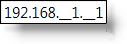
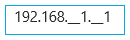

////

|metadata|
{
    "name": "xammaskedinput-about",
    "controlName": ["xamInputs"],
    "tags": ["Editing"],
    "guid": "b37992c7-7854-41c9-a1da-f09621c751c8",  
    "buildFlags": [],
    "createdOn": "2016-05-25T18:21:56.9312172Z"
}
|metadata|
////

= About xamMaskedInput

The xamMaskedInput™ control is a simple text box control that uses a mask to assist users in data input. Using a mask you can restrict user's input to predefined text formats. You can use the xamMaskedInput control  pick:[sl,wpf,win-rt="either"]  link:xammaskedinput-using.html[as a stand-alone editor]  pick:[sl,wpf,win-rt="or"]   pick:[sl,wpf,win-rt=" link:xaminputs-using-xaminput-controls-in-xamgrid-cells-for-data-editing.html[in a cell in the xamGrid™ control]"] .

ifdef::sl,wpf,win-phone[]

endif::sl,wpf,win-phone[]

ifdef::win-rt[]

endif::win-rt[]

== Related Topics

Following are some other topics you may find useful.

* link:xammaskedinput-using.html[Using xamMaskedInput]
* link:xaminputs-masks.html[Masks]
* link:xaminputs-overview-of-the-valueinput-class.html[Overview of the ValueInput Class]

ifdef::sl,wpf,win-rt[]
* link:xaminputs-using-xaminput-controls-in-xamgrid-cells-for-data-editing.html[Using xamInput Controls in xamGrid Cells for Data Editing]

endif::sl,wpf,win-rt[]