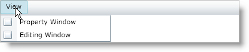

////

|metadata|
{
    "name": "xammenu-adding-check-boxes-to-xammenuitems",
    "controlName": ["xamMenu"],
    "tags": ["Getting Started","How Do I"],
    "guid": "2e589c89-4fcd-4eec-8e00-e25046bc9532",  
    "buildFlags": [],
    "createdOn": "2016-05-25T18:21:57.3962439Z"
}
|metadata|
////

= Adding Check Boxes to XamMenuItems

You can display check boxes for each of xamMenu's items. This require setting the link:{ApiPlatform}controls.menus.xammenu.v{ProductVersion}~infragistics.controls.menus.xammenuitem~ischeckable.html[IsCheckable] property to true on the XamMenuItem object. Each XamMenuItem object has a Checked event that you can handle to provide custom functionality when the end user checks an item. Further, each item has an link:{ApiPlatform}controls.menus.xammenu.v{ProductVersion}~infragistics.controls.menus.xammenuitem~ischecked.html[IsChecked] property you can use to determine its check state or to set its check state in code.

The following code shows you how to display check boxes for items in xamMenu.

*In XAML:*

----
<ig:XamMenu x:Name="xamMenu1" Height="25" MenuOrientation="Horizontal">
   <!-- TODO: Add menu items-->
   <ig:XamMenuItem Header="View">
       <ig:XamMenuItem Header="Property Window" IsCheckable="True" />
       <ig:XamMenuItem Header="Editing Window" IsCheckable="True" />
   </ig:XamMenuItem>
</ig:XamMenu>
----

*In Visual Basic:*

----
' Create menu
Dim menu1 As New XamMenu()
Me.LayoutRoot.Children.Add(menu1)
menu1.Height = 25
' Create Shop menu item
Dim parentItem As New XamMenuItem()
parentItem.Header = "View"
menu1.Items.Add(parentItem)
' Create child menu item
Dim childItem As New XamMenuItem()
childItem.Header = "Property Window"
childItem.IsCheckable = True
parentItem.Items.Add(childItem)
' Create child menu item
childItem = New XamMenuItem()
childItem.Header = "Editing Window"
childItem.IsCheckable = True
parentItem.Items.Add(childItem)
----

*In C#:*

----
// Create menu
XamMenu menu1 = new XamMenu();
this.LayoutRoot.Children.Add(menu1);
menu1.Height = 25;
// Create Shop menu item
XamMenuItem parentItem = new XamMenuItem();
parentItem.Header = "View";
menu1.Items.Add(parentItem);
// Create child menu item
XamMenuItem childItem = new XamMenuItem();
childItem.Header = "Property Window";
childItem.IsCheckable = true;
parentItem.Items.Add(childItem);
// Create child menu item
childItem = new XamMenuItem();
childItem.Header = "Editing Window";
childItem.IsCheckable = true;
parentItem.Items.Add(childItem);
----

== Related Topics

link:xammenu-binding-to-data.html[Binding to Data]

link:xammenu-layout-settings.html[Layout Settings]

link:xammenu-navigating-pages-using-xammenu.html[Navigating Pages Using xamMenu]

link:xammenu-adding-and-removing-items.html[Adding and Removing Items]

link:xammenu-adding-separators-between-xammenuitems.html[Adding Separators between XamMenuItems]

link:xammenu-adding-icons-to-xammenuitems.html[Adding Icons to XamMenuItems]