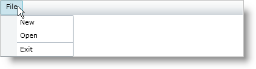

////

|metadata|
{
    "name": "xammenu-adding-separators-between-xammenuitems",
    "controlName": ["xamMenu"],
    "tags": ["Getting Started","How Do I","Layouts"],
    "guid": "b61f310f-ef3c-40c4-8a60-b49fe78b64a0",  
    "buildFlags": [],
    "createdOn": "2016-05-25T18:21:57.3842428Z"
}
|metadata|
////

= Adding Separators between XamMenuItems

Separator lines help to distinguish the different options in your xamMenu or xamContextMenu control. Adding a separator requires creating a link:{ApiPlatform}controls.menus.xammenu{ApiVersion}~infragistics.controls.menus.xammenuseparator.html[xamMenuSeparator] object and adding it to the items collection.

The following code shows you how to add separators between items in xamMenu.

*In XAML:*

----
<ig:XamMenu x:Name="xamMenu1" Height="25">
   <ig:XamMenuItem Header="File">
       <ig:XamMenuItem Header="New" />
       <ig:XamMenuItem Header="Open" />
       <!-- Separator line-->
       <ig:XamMenuSeparator />
       <ig:XamMenuItem Header="Exit" />
   </ig:XamMenuItem>
</ig:XamMenu>
----

*In Visual Basic:*

----
' Add separator
Dim separator1 As New XamMenuSeparator()
parentMenuItem.Items.Add(separator1)
----

*In C#:*

----
// Add separator
XamMenuSeparator separator1 = new XamMenuSeparator();
parentMenuItem.Items.Add(separator1);
----

== Related Topics

link:xammenu-binding-to-data.html[Binding to Data]

link:xammenu-layout-settings.html[Layout Settings]

link:xammenu-navigating-pages-using-xammenu.html[Navigating Pages Using xamMenu]

link:xammenu-adding-and-removing-items.html[Adding and Removing Items]

link:xammenu-adding-icons-to-xammenuitems.html[Adding Icons to XamMenuItems]

link:xammenu-adding-check-boxes-to-xammenuitems.html[Adding Check Boxes to XamMenuItems]