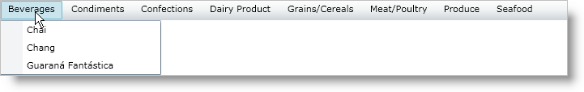

////

|metadata|
{
    "name": "xammenu-binding-to-data",
    "controlName": ["xamMenu"],
    "tags": ["Data Binding","Getting Started","How Do I"],
    "guid": "{209C7064-EC88-436D-90D4-C3E5DCCEE334}",  
    "buildFlags": [],
    "createdOn": "2016-05-25T18:21:57.365248Z"
}
|metadata|
////

= Binding to Data

== Before you begin

The link:{ApiPlatform}controls.menus.xammenu{ApiVersion}~infragistics.controls.menus.xammenu.html[xamMenu™] and xamContextMenu™ controls support hierarchical data binding. To accomplish this, you need a hierarchical data template, which is provided to help make hierarchical data binding a quick and easy task. The link:{RootAssembly}{ApiVersion}~infragistics.controls.hierarchicaldatatemplate.html[HierarchicalDataTemplate] object behaves just like a DataTemplate object along with the addition of a second template for nested data.

To display two levels of data, simply set the HierarchicalDataTemplate object's ItemsSource property to a publicly exposed IEnumerable property from the control's data source; then set up a DataTemplate object for the top level data to display, and set up the ItemTemplate object to display a public property from the child collection. Additional levels of data require additional templates.

== What you will accomplish

You will learn how to bind xamMenu to hierarchical data sources. Even though the example code uses a xamMenu control, you can apply the same principles to the xamContextMenu control. You can find the sample data collections in the link:resources-datautil.html[DataUtil] class file.

== Follow these Steps

[start=1]
. Create a new {PlatformName}™ application in Microsoft® Visual Studio®.
[start=2]
. Add references to the following assemblies.

** {ApiPlatform}{ApiVersion}dll
** {ApiPlatform}Controls.Menus.XamMenu{ApiVersion}.dll

[start=3]
. Add the following namespace declarations inside the opening UserControl tag.

*In XAML:*

----
xmlns:ig="http://schemas.infragistics.com/xaml"
xmlns:local="clr-namespace:IGDocumentation"
----

[start=4]
. Add the DataUtil object as a user control resource.

*In XAML:*

----
<UserControl.Resources>
   <local:DataUtil x:Key="DataUtil" />
</UserControl.Resources>
----

[start=5]
. Add xamMenu to the application and bind its link:https://msdn.microsoft.com/en-us/library/system.windows.controls.itemscontrol.itemssource(v=vs.110).aspx[ItemsSource] property to the CategoriesAndProducts property of the DataUtil object, which returns the Categories collection with nested Products collection.

*In XAML:*

----
<ig:XamMenu x:Name="xamMenu1" Height="25" ItemsSource="{Binding Source={StaticResource DataUtil}, Path=CategoriesAndProducts}">
   <!-- TODO: Add hierarchical data template and bind to child collection -->
</ig:XamMenu>
----

[start=6]
. Set up the hierarchical data template.

** Bind the ItemSource property to the Products collection of each Category object in the data source.
** Define a TextBlock control to display the category name of the parent data collection.
** Use the ItemTemplate property to display the product name of the child data collection.

*In XAML:*

----
<ig:XamMenu.HierarchicalItemTemplate>
   <!-- Hierarchical template binds to Products collection for each Category object -->
   <ig:HierarchicalDataTemplate ItemsSource="{Binding Products}">
      <!-- Data template displays CategoryName property of top level data -->
      <DataTemplate>
         <TextBlock Text="{Binding CategoryName}" />
      </DataTemplate>
      <!-- Item template displays child product name information -->
      <ig:HierarchicalDataTemplate.ItemTemplate>
         <DataTemplate>
            <TextBlock Text="{Binding ProductName}" />
         </DataTemplate>
      </ig:HierarchicalDataTemplate.ItemTemplate>
   </ig:HierarchicalDataTemplate>
</ig:XamMenu.HierarchicalItemTemplate>
----

[start=7]
. Run the application. The xamMenu control displays two levels of options: the main menu level contains Categories data and the submenu level contains the Products data.

== Related Topics

link:xammenu-layout-settings.html[Layout Settings]

link:xammenu-navigating-pages-using-xammenu.html[Navigating Pages Using xamMenu]

link:xammenu-adding-and-removing-items.html[Adding and Removing Items]

link:xammenu-adding-separators-between-xammenuitems.html[Adding Separators between XamMenuItems]

link:xammenu-adding-icons-to-xammenuitems.html[Adding Icons to XamMenuItems]

link:xammenu-adding-check-boxes-to-xammenuitems.html[Adding Check Boxes to XamMenuItems]