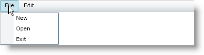

////

|metadata|
{
    "name": "xammenu-getting-started-with-xammenu",
    "controlName": ["xamMenu"],
    "tags": ["Getting Started","How Do I"],
    "guid": "{C4509E90-D8D3-40AF-BF41-2FAB4C86CB0E}",  
    "buildFlags": [],
    "createdOn": "2016-05-25T18:21:57.3402421Z"
}
|metadata|
////

= Adding xamMenu to Your Page

== Before You Begin

You can use the xamMenu™ control to easily set up a menu layout in your application. Menu items represent the different options in the menu to your end users. You can quickly add these items manually or bind them to a IEnumerable collection.

== What You Will Accomplish

You will learn how to add a xamMenu control to your page and set up menu items using XAML and code behind.

== Follow these Steps:

[start=1]
. Create a new {PlatformName}™ application in Microsoft® Visual Studio®.
[start=2]
. Add references to the following assemblies.

** {ApiPlatform}{DllVersion}dll
** {ApiPlatform}Controls.Menus.XamMenu {DllVersion}dll

[start=3]
. Add a namespace declaration for the xamMenu control.

*In XAML:*

----
xmlns:ig=http://schemas.infragistics.com/xaml
----

*In Visual Basic:*

----
Imports Infragistics.Controls.Menus
----

*In C#:*

----
using Infragistics.Controls.Menus;
----

[start=4]
. Add the xamMenu control your user control. For code behind, handle the user control's loaded event.

*In XAML:*

----
<ig:XamMenu x:Name="xamMenu1" Height="25">
   <!-- TODO: Add menu items-->
</ig:XamMenu>
----

*In Visual Basic:*

----
' Create menu
Dim menu1 As New XamMenu()
Me.LayoutRoot.Children.Add(menu1)
menu1.Height = 25
' TODO: add menu items
----

*In C#:*

----
// Create menu
XamMenu menu1 = new XamMenu();
this.LayoutRoot.Children.Add(menu1);
menu1.Height = 25;
// TODO: add menu items
----

[start=5]
. Add menu items to represent the different options in the menu.

*In XAML:*

----
<ig:XamMenuItem Header="File">
   <ig:XamMenuItem Header="New" />
   <ig:XamMenuItem Header="Open" />
   <ig:XamMenuItem Header="Exit" />
</ig:XamMenuItem>
<ig:XamMenuItem Header="Edit">
   <ig:XamMenuItem Header="Cut" />
   <ig:XamMenuItem Header="Copy" />
   <ig:XamMenuItem Header="Paste" />
</ig:XamMenuItem>
----

*In Visual Basic:*

----
' Create File menu item
Dim parentMenuItem As New XamMenuItem()
parentMenuItem.Header = "File"
menu1.Items.Add(parentMenuItem)
' Add child items to File menu item
Dim childMenuItem As New XamMenuItem()
childMenuItem.Header = "New"
parentMenuItem.Items.Add(childMenuItem)
childMenuItem = New XamMenuItem()
childMenuItem.Header = "Open"
parentMenuItem.Items.Add(childMenuItem)
childMenuItem = New XamMenuItem()
childMenuItem.Header = "Exit"
parentMenuItem.Items.Add(childMenuItem)
' Create Edit menu item
parentMenuItem = New XamMenuItem()
parentMenuItem.Header = "Edit"
menu1.Items.Add(parentMenuItem)
' Add child items to Edit menu item
childMenuItem = New XamMenuItem()
childMenuItem.Header = "Cut"
parentMenuItem.Items.Add(childMenuItem)
childMenuItem = New XamMenuItem()
childMenuItem.Header = "Copy"
parentMenuItem.Items.Add(childMenuItem)
childMenuItem = New XamMenuItem()
childMenuItem.Header = "Paste"
parentMenuItem.Items.Add(childMenuItem)
----

*In C#:*

----
// Create File menu item
XamMenuItem parentMenuItem = new XamMenuItem();
parentMenuItem.Header = "File";
menu1.Items.Add(parentMenuItem);
// Add child items to File menu item
XamMenuItem childMenuItem = new XamMenuItem();
childMenuItem.Header = "New";
parentMenuItem.Items.Add(childMenuItem);
childMenuItem = new XamMenuItem();
childMenuItem.Header = "Open";
parentMenuItem.Items.Add(childMenuItem);
childMenuItem = new XamMenuItem();
childMenuItem.Header = "Exit";
parentMenuItem.Items.Add(childMenuItem);
// Create Edit menu item
parentMenuItem = new XamMenuItem();
parentMenuItem.Header = "Edit";
menu1.Items.Add(parentMenuItem);
// Add child items to Edit menu item
childMenuItem = new XamMenuItem();
childMenuItem.Header = "Cut";
parentMenuItem.Items.Add(childMenuItem);
childMenuItem = new XamMenuItem();
childMenuItem.Header = "Copy";
parentMenuItem.Items.Add(childMenuItem);
childMenuItem = new XamMenuItem();
childMenuItem.Header = "Paste";
parentMenuItem.Items.Add(childMenuItem);
----

[start=6]
. Run the application. You have a menu with File and Edit options. Handle the click event of these items to add functionality to the control. 

== Related Topics

link:xammenu-understanding-xammenu.html[About xamMenu]

link:xammenu-using-xammenu.html[Using xamMenu]