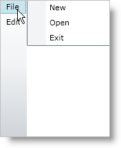

////

|metadata|
{
    "name": "xammenu-layout-settings",
    "controlName": ["xamMenu"],
    "tags": ["Getting Started","How Do I","Layouts"],
    "guid": "{9C16CB3C-2ECD-4505-9CD5-133F3D148D68}",  
    "buildFlags": [],
    "createdOn": "2016-05-25T18:21:57.3582549Z"
}
|metadata|
////

= Layout Settings

The xamMenu™ control allows different layout options for its items; menu items can have vertical or horizontal orientation. This layout is controlled by the link:{ApiPlatform}controls.menus.xammenu.v{ProductVersion}~infragistics.controls.menus.xammenu~menuorientation.html[MenuOrientation] property which exists on the menu as well as for each menu item.

You can also specify the position in which sub menu items appear. Each XamMenuItem object's link:{ApiPlatform}controls.menus.xammenu.v{ProductVersion}~infragistics.controls.menus.xammenuitem~submenupreferredlocation.html[SubmenuPreferredLocation] property controls the position of its child items. You can set it to Auto, Bottom, Left, Right, or Top.

Further, you can control the way in which sub menu items display. By default, a menu item's child items display when you click the item, you can change it so that child items display on hover by setting the link:{ApiPlatform}controls.menus.xammenu.v{ProductVersion}~infragistics.controls.menus.xammenu~expandonhover.html[ExpandOnHover] property to True on xamMenu. Also, when your end user clicks a menu item within a submenu, the submenu closes. You can override this default behavior, keeping the menu items open, by setting a XamMenuItem object's link:{ApiPlatform}controls.menus.xammenu.v{ProductVersion}~infragistics.controls.menus.xammenuitem~staysopenonclick.html[StaysOpenOnClick] property to True.

.Note:
[NOTE]
====
If you set a custom ItemsPanelTempate object on the xamMenu to something other than a StackPanel, the MenuOrientation property will be ignored.
====

The following code shows you how to set the menu’s orientation, expansion option, and menu item position.

*In XAML:*

----
<ig:XamMenu x:Name="xamMenu1" Height="200" Width="40" MenuOrientation="Vertical" ExpandOnHover="True">
   <!-- TODO: Add menu items-->
   <ig:XamMenuItem Header="File" SubmenuPreferredLocation="Right">
      <ig:XamMenuItem Header="New" StaysOpenOnClick="True"/>
      <ig:XamMenuItem Header="Open" />
      <ig:XamMenuItem Header="Exit" />
   </ig:XamMenuItem>
   <ig:XamMenuItem Header="Edit" SubmenuPreferredLocation="Right">
      <ig:XamMenuItem Header="Cut" />
      <ig:XamMenuItem Header="Copy" />
      <ig:XamMenuItem Header="Paste" />
   </ig:XamMenuItem>
</ig:XamMenu>
----

*In Visual Basic:*

----
Private Sub UserControl_Loaded(ByVal sender As System.Object, ByVal e As System.Windows.RoutedEventArgs)
   ' Create menu
   Dim menu1 As New XamMenu()
   Me.LayoutRoot.Children.Add(menu1)
   ' Set layout options for menu
   menu1.Height = 200
   menu1.Width = 40
   menu1.MenuOrientation = Orientation.Vertical
   menu1.ExpandOnHover = True
   ' TODO: add menu items
   ' Create File menu item
   Dim parentMenuItem As New XamMenuItem()
   parentMenuItem.Header = "File"
   ' Layout setting for single item
   parentMenuItem.SubmenuPreferredLocation = MenuItemPosition.Right
   menu1.Items.Add(parentMenuItem)
   ' Add child items to File menu item
   Dim childMenuItem As New XamMenuItem()
   childMenuItem.Header = "New"
   ' Layout setting for single item
   childMenuItem.StaysOpenOnClick = True
   parentMenuItem.Items.Add(childMenuItem)
   childMenuItem = New XamMenuItem()
   childMenuItem.Header = "Open"
   parentMenuItem.Items.Add(childMenuItem)
   childMenuItem = New XamMenuItem()
   childMenuItem.Header = "Exit"
   parentMenuItem.Items.Add(childMenuItem)
   ' Create Edit menu item
   parentMenuItem = New XamMenuItem()
   parentMenuItem.Header = "Edit"
   ' Layout setting for single item
   parentMenuItem.SubmenuPreferredLocation = MenuItemPosition.Right
   menu1.Items.Add(parentMenuItem)
   ' Add child items to Edit menu item
   childMenuItem = New XamMenuItem()
   childMenuItem.Header = "Cut"
   parentMenuItem.Items.Add(childMenuItem)
   childMenuItem = New XamMenuItem()
   childMenuItem.Header = "Copy"
   parentMenuItem.Items.Add(childMenuItem)
   childMenuItem = New XamMenuItem()
   childMenuItem.Header = "Paste"
   parentMenuItem.Items.Add(childMenuItem)
End Sub
----

*In C#:*

----
private void UserControl_Loaded(object sender, RoutedEventArgs e)
{
   // Create menu
   XamMenu menu1 = new XamMenu();
   this.LayoutRoot.Children.Add(menu1);
   // Set layout options for menu
   menu1.Height = 200;
   menu1.Width = 40;
   menu1.MenuOrientation = Orientation.Vertical;
   menu1.ExpandOnHover = true;
   // TODO: add menu items
   // Create File menu item
   XamMenuItem parentMenuItem = new XamMenuItem();
   parentMenuItem.Header = "File";
   // Layout setting for single item
   parentMenuItem.SubmenuPreferredLocation = MenuItemPosition.Right;
   menu1.Items.Add(parentMenuItem);
   // Add child items to File menu item
   XamMenuItem childMenuItem = new XamMenuItem();
   childMenuItem.Header = "New";
   // Layout setting for single item
   childMenuItem.StaysOpenOnClick = true;
   parentMenuItem.Items.Add(childMenuItem);
   childMenuItem = new XamMenuItem();
   childMenuItem.Header = "Open";
   parentMenuItem.Items.Add(childMenuItem);
   childMenuItem = new XamMenuItem();
   childMenuItem.Header = "Exit";
   parentMenuItem.Items.Add(childMenuItem);
   // Create Edit menu item
   parentMenuItem = new XamMenuItem();
   parentMenuItem.Header = "Edit";
   // Layout setting for single item
   parentMenuItem.SubmenuPreferredLocation = MenuItemPosition.Right;
   menu1.Items.Add(parentMenuItem);
   // Add child items to Edit menu item
   childMenuItem = new XamMenuItem();
   childMenuItem.Header = "Cut";
   parentMenuItem.Items.Add(childMenuItem);
   childMenuItem = new XamMenuItem();
   childMenuItem.Header = "Copy";
   parentMenuItem.Items.Add(childMenuItem);
   childMenuItem = new XamMenuItem();
   childMenuItem.Header = "Paste";
   parentMenuItem.Items.Add(childMenuItem);
}
----

== Related Topics

link:xammenu-binding-to-data.html[Binding to Data]

link:xammenu-navigating-pages-using-xammenu.html[Navigating Pages Using xamMenu]

link:xammenu-adding-and-removing-items.html[Adding and Removing Items]

link:xammenu-adding-separators-between-xammenuitems.html[Adding Separators between XamMenuItems]

link:xammenu-adding-icons-to-xammenuitems.html[Adding Icons to XamMenuItems]

link:xammenu-adding-check-boxes-to-xammenuitems.html[Adding Check Boxes to XamMenuItems]