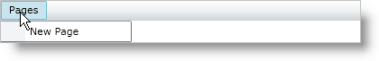
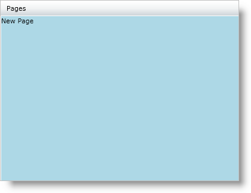

////

|metadata|
{
    "name": "xammenu-navigating-pages-using-xammenu",
    "controlName": ["xamMenu"],
    "tags": ["Getting Started","How Do I","Navigation"],
    "guid": "{032BC8D9-A246-4909-822B-A538DA10F492}",  
    "buildFlags": [],
    "createdOn": "2016-05-25T18:21:57.3712479Z"
}
|metadata|
////

= Navigating Pages Using xamMenu

== Before You Begin

ifdef::sl[]
Microsoft® Silverlight™ introduces the Navigation Framework which allows for navigation to different XAML pages within the same Silverlight application, much like navigation in web pages. The framework introduces two controls to Silverlight: Page and Frame. A Page control contains the contents of your application. A Frame control specifies the location in which to display page.
endif::sl[]

The xamMenu™ control takes advantage of {PlatformName} navigation feature by providing the link:{ApiPlatform}controls.menus.xammenu{ApiVersion}~infragistics.controls.menus.xammenuitem~navigationuri.html[NavigationUri] and link:{ApiPlatform}controls.menus.xammenu{ApiVersion}~infragistics.controls.menus.xammenuitem~navigationelement.html[NavigationElement] properties. If you would like to navigate to different pages in your application, set the XamMenuItem object's NavigationUri to the location of a page and the NavigationElement as a Frame control.

== What You Will Accomplish

You will learn how to navigate to a new XAML page using the xamMenu control.

== Follow these Steps

[start=1]
. Create a new {PlatformName} application in Microsoft® Visual Studio®.
[start=2]
. Add references to the following assemblies.

** {ApiPlatform}{DllVersion}dll
** {ApiPlatform}Controls.Menus.XamMenu.{DllVersion}dll
** System.Windows.Controls.Navigation

[start=3]
. Add the following namespace declarations inside the opening UserControl tag.

*In XAML:*

----
xmlns:ig="http://schemas.infragistics.com/xaml" 
xmlns:navigation="clr-namespace:System.Windows.Controls;assembly=System.Windows.Controls.Navigation"
----

[start=4]
. Add the xamMenu control to the User Control.
[start=5]
. Add a menu item and call it Pages.

*In XAML:*

----
<ig:XamMenu x:Name="xamMenu1" Height="23">
   <ig:XamMenuItem Header="Pages">
       <!-- TODO: add nested menu item that links to a XAML page -->
   </ig:XamMenuItem>
</ig:XamMenu>
----

[start=6]
. Add a Frame control under the xamMenu control to display the new page.

*In XAML:*

----
<navigation:Frame Grid.Row="1" x:Name="menuFrame"></navigation:Frame>
----

[start=7]
. Create a new Page control in your application.

.. Right-click the current project in the Solution Explorer and highlight Add.
.. Select New Item in the submenu. An Add New Item dialog appears.
.. Select {PlatformName} Page.
.. Name the page NavigationPage.xaml and click Add.

[start=8]
. Make the background light blue and add a TextBlock control with the text "New Page" to NavigationPage.xaml.

*In XAML:*

----
<Grid x:Name="LayoutRoot" Background="LightBlue">
   <TextBlock Text="New Page" />
</Grid>
----

[start=9]
. Add the nested menu item that links to the page created above using the Frame control.

.. Set the NavigationUri property to the relative path of the page.
.. Set the NavigationElement property to the Frame control.
.. Set the link:{ApiPlatform}controls.menus.xammenu{ApiVersion}~infragistics.controls.menus.xammenuitem~navigationonclick.html[NavigationOnClick] property to True.

*In XAML:*

----
<ig:XamMenuItem Header="New Page" NavigationOnClick="True" NavigationElement="{Binding ElementName=menuFrame}" NavigationUri="/NavigationPage.xaml"/>
----

[start=10]
. Run your application. Highlight the Pages menu item and click on the New Page item. The new page displays under the menu.

== Related Topics

link:xammenu-layout-settings.html[Layout Settings]

link:xammenu-binding-to-data.html[Binding to Data]

link:xammenu-adding-and-removing-items.html[Adding and Removing Items]

link:xammenu-adding-separators-between-xammenuitems.html[Adding Separators between XamMenuItems]

link:xammenu-adding-icons-to-xammenuitems.html[Adding Icons to XamMenuItems]

link:xammenu-adding-check-boxes-to-xammenuitems.html[Adding Check Boxes to XamMenuItems]