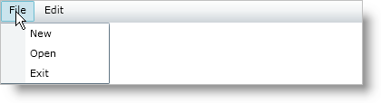

////

|metadata|
{
    "name": "xammenu-understanding-xammenu",
    "controlName": ["xamMenu"],
    "tags": ["Getting Started"],
    "guid": "{48D954FD-C6BF-4FC1-8E08-EFBC79BEFDB5}",  
    "buildFlags": [],
    "createdOn": "2016-05-25T18:21:57.3332399Z"
}
|metadata|
////

= About xamMenu

The xamMenu™ control displays a list of items that represent application-specific commands or tasks. Typically, clicking an item on a menu opens a submenu or executes application logic.

Some of the important features for this control are listed below.

* *Icons* - Add icons to help illustrate the purpose of each menu item.
* *Templates* - Extensive templating capabilities lead to deep customization options and an enjoyable user experience.
* *Checkboxes* - Add checkboxes to allow end users to select multiple items.
* *Menu Orientation* - Customize the orientation and position as well as how menu items display themselves.
* *Hierarchical Data* - Add or bind to data to quickly display menu items any number of levels deep.
* *Smooth Sliding* - Smooth animation allows for a graceful look and feel.

== Related Topics

link:xammenu-getting-started-with-xammenu.html[Adding xamMenu to Your Page]

link:xammenu-using-xammenu.html[Using xamMenu]