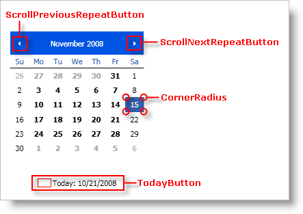

////

|metadata|
{
    "name": "xammonthcalendar-about-styling-xammonthcalendar",
    "controlName": ["xamMonthCalendar"],
    "tags": ["Styling"],
    "guid": "{307D907A-2746-4BC1-A159-E66881BB47D6}",  
    "buildFlags": [],
    "createdOn": "2012-01-30T19:39:53.9771485Z"
}
|metadata|
////

= About Styling xamMonthCalendar

You can restyle xamMonthCalendar™ using Styles and ControlTemplates just like any control in Microsoft® Windows® Presentation Foundation. However, the various classes that make up xamMonthCalendar make styling easier by exposing a static property that you can use as the Key property of a Style or ControlTemplate. If the xamMonthCalendar finds a Style or ControlTemplate that is using a predefined key, the xamMonthCalendar control will automatically use the Style or ControlTemplate you created.

The tables below list the static properties that you can use as keys when creating your Styles and ControlTemplates. The heading for each section is the class that exposes the property. If the property name ends with "TemplateKey", you have to create a ControlTemplate to style that element. If the property name ends with "StyleKey", you have to create a Style to style that element. For example, if you want to style the Button control labeled "Today", you will first find the class and property name using the tables below. Once you find the property, create a ControlTemplate or a Style based on the name of the property. Set the Key property of the ControlTemplate or Style to the property using a markup extension.

*In XAML:*

----
<!-- Create a style since the property name ends with "StyleKey".
Set the Key property of the control template to the static property exposed by the XamMonthCalendar class.
Set the TargetType property of the control template to Button.-->

----

== link:{ApiPlatform}editors{ApiVersion}~infragistics.windows.editors.xammonthcalendar.html[XamMonthCalendar] Class (Style and Control Template Keys)

[options="header", cols="a,a"]
|====
|Property Name|Target Type

| link:{ApiPlatform}editors{ApiVersion}~infragistics.windows.editors.xammonthcalendar~scrollpreviousrepeatbuttonstylekey.html[ScrollPreviousRepeatButtonStyleKey]
|RepeatButton

| link:{ApiPlatform}editors{ApiVersion}~infragistics.windows.editors.xammonthcalendar~scrollnextrepeatbuttonstylekey.html[ScrollNextRepeatButtonStyleKey]
|RepeatButton

| link:{ApiPlatform}editors{ApiVersion}~infragistics.windows.editors.xammonthcalendar~todaybuttonstylekey.html[TodayButtonStyleKey]
|Button

|====

== CalendarItem Class (Object Keys)

The CalendarItem class exposes a key that you can use to modify the corner radius of the current date and selected dates. In order to modify the corner radius, you do not need to create a Style or a ControlTemplate, you only need to add a CornerRadius object to your resource dictionary and set its Key property to the static CornerRadiusKey property.

[options="header", cols="a,a"]
|====
|Property Name|Object Type

| link:{ApiPlatform}editors{ApiVersion}~infragistics.windows.editors.calendaritem~cornerradiuskey.html[CornerRadiusKey]
|CornerRadius

|====