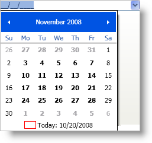
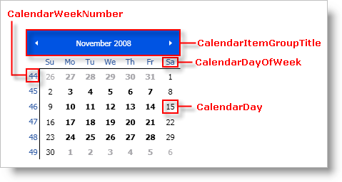
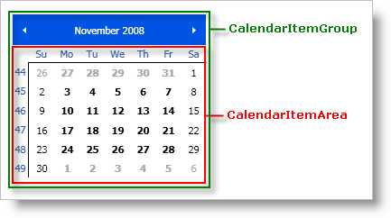
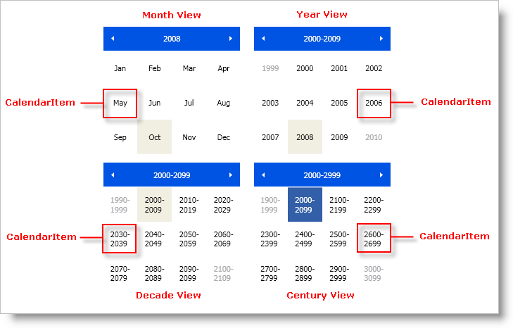

////

|metadata|
{
    "name": "xammonthcalendar-about-xammonthcalendar",
    "controlName": ["xamMonthCalendar"],
    "tags": ["Getting Started"],
    "guid": "{FED00DDE-6619-4281-AB0E-DCD26BB70D2D}",  
    "buildFlags": [],
    "createdOn": "2012-01-30T19:39:53.9801491Z"
}
|metadata|
////

= About xamMonthCalendar

The xamMonthCalendar™ control displays a month or several months at one time. The xamMonthCalendar control has the following features:

* *Different Views* - The xamMonthCalendar control starts by displaying days within months. End users can zoom out to view months within years, years within decades, decades within centuries, or centuries within millennia.
* *Single/Multiple Date Selection* - The xamMonthCalendar control supports single date selection as well as multiple date selection.
* *Drop-down Editing for xamDateTimeEditor™* - The xamDateTimeEditor control can display the xamMonthCalendar control when end users click the drop-down arrow, so they can select a date using xamMonthCalendar's month view.

== Drop-Down Calendar in xamDateTimeEditor

== Related Topics

link:xammonthcalendar-getting-started-with-xammonthcalendar.html[Adding xamMonthCalendar to Your Page]

link:xammonthcalendar-using-xammonthcalendar.html[Using xamMonthCalendar]