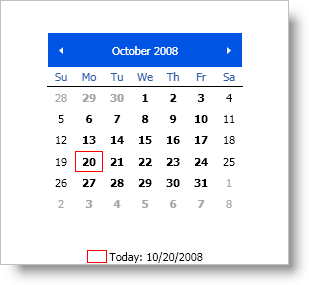

////

|metadata|
{
    "name": "xammonthcalendar-getting-started-with-xammonthcalendar",
    "controlName": ["xamMonthCalendar"],
    "tags": ["Getting Started"],
    "guid": "{5A9F23E0-CD53-4A9D-818B-FCEE8633A3CF}",  
    "buildFlags": [],
    "createdOn": "2012-01-30T19:39:53.9851501Z"
}
|metadata|
////

= Adding xamMonthCalendar to Your Page

== Before You Begin

You can add xamMonthCalendar™ to a Window using the same pattern as any control found in Microsoft® Windows® Presentation Foundation. This pattern involves using a layout container as the main content of the Window and then adding the control to the Children collection of the layout container. It is important to name the layout container in XAML so that you can reference it from the code-behind.

== What You Will Accomplish

You will add xamMonthCalendar to your page.

== Follow these Steps

[start=1]
. Create a Microsoft® Windows® Presentation Foundation Window project.
[start=2]
. In the Solution Explorer, add the following references:

** {ApiPlatform}{ApiVersion}dll
** {ApiPlatform}Editors{ApiVersion}.dll

[start=3]
. Name the default Grid layout panel in the Window so that you can reference it in the code-behind.

*In XAML:*

----
<Grid Name="layoutRoot"> 
</Grid>
----

[start=4]
. Attach an event handler to the Window's Loaded event if you are going to add the xamMonthCalendar using code-behind.

*In XAML:*

----
<Window ... Loaded="Window_Loaded">
----

[start=5]
. Place using/Imports directives so you don't have to type out a member's fully qualified name.

*In XAML:*

----
xmlns:igEditors="http://infragistics.com/Editors"
----

*In Visual Basic:*

----
Imports Infragistics.Windows.Editors
----

*In C#:*

----
using Infragistics.Windows.Editors;
----

[start=6]
. Create a xamMonthCalendar control and add it to the main grid.

*In XAML:*

----
<igEditors:XamMonthCalendar Name="xamMonthCalendar1"> 
</igEditors:XamMonthCalendar>
----

*In Visual Basic:*

----
Private Sub Window_Loaded(ByVal sender As Object, ByVal e As RoutedEventArgs) 
    Private xamMonthCalendar1 As XamMonthCalendar    
    xamMonthCalendar1 = New XamMonthCalendar()
    Me.layoutRoot.Children.Add(xamMonthCalendar1)
End Sub
----

*In C#:*

----
private void Window_Loaded(object sender, RoutedEventArgs e) 
{
    private XamMonthCalendar xamMonthCalendar1;
    xamMonthCalendar1 = new XamMonthCalendar();
    this.layoutRoot.Children.Add(xamMonthCalendar1);
}
----

[start=7]
. Run the project.

You should see a Window that looks similar to the screen shot below.

== Related Topics

link:xammonthcalendar-about-xammonthcalendar.html[About xamMonthCalendar]

link:xammonthcalendar-using-xammonthcalendar.html[Using xamMonthCalendar]