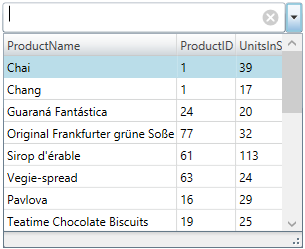

////
|metadata|
{
    "name": "xammulticce-configuring-data-binding-visualization",
    "tags": ["Data Binding","Getting Started","How Do I"],
    "controlName": ["xamMultiColumnComboEditor"],
    "guid": "e96c4ab8-c0ac-4b04-a09d-226ec953aa75",
    "buildFlags": [],
    "createdOn": "2016-05-25T18:21:57.5892543Z"
}
|metadata|
////

= Configuring Data Binding and Visualization (xamMultiColumnComboEditor)

== Topic Overview

=== Purpose

This topic explains how to bind the  _xamMultiColumnComboEditor_™ control to data and configure the items layout in the control’s drop-down list.

=== Required background

The following topic is a prerequisite to understanding this topic:

[options="header", cols="a,a"]
|====
|Topic|Purpose

| link:xammulticce-adding.html[Adding xamMultiColumnComboEditor to Your Page]
|This topic describes how to add a _xamMultiColumnComboEditor_ control to an application and use some of its properties.

|====

=== In this topic

This topic contains the following sections:

* <<_Ref382568526,Data Binding and Visualization Configuration Summary>>
* <<_Ref382561097,Binding to Data Source>>
* <<_Ref382568577,Configuring Columns Auto Generation>>
* <<_Ref382570209,Configuring Visible Columns>>
* <<_Ref382577195,Related Content>>

** <<_Ref382577201,Topics>>
** <<_Ref382577206,Samples>>

[[_Ref382568526]]
== Data Binding and Visualization Configuration Summary

=== Data binding and visualization configuration summary chart

The following table briefly explains the configurable aspects of the  _xamMultiColumnComboEditor_   control and maps them to the properties that configure them. Further details are available after the table.

[options="header", cols="a,a,a"]
|====
|Configurable aspect|Details|Properties

|<<_Ref382561097,Binding to Data Source>>
|To populate the _xamMultiColumnComboEditor_ with data, set its `ItemsSource` property to a data source. 

Use any `IEnumerable` collection of data objects.
| link:{ApiPlatform}controls.editors.xamcomboeditor.v{ProductVersion}~infragistics.controls.editors.comboeditorbase`2~itemssource.html[ItemsSource]

|<<_Ref382568577,Configuring Columns Auto Generation>>
|To enable/disable the automatic generation of columns, use the _xamMultiColumnComboEditor_ `AutoGenerateColumns` property.
| link:{ApiPlatform}controls.editors.xamcomboeditor.v{ProductVersion}~infragistics.controls.editors.xammulticolumncomboeditor~autogeneratecolumns.html[AutoGenerateColumns]

|<<_Ref382570209,Configuring Visible Columns>>
|To display only specific columns in the _xamMultiColumnComboEditor_ drop-down-list, use the `Columns` collection property.
|link:{ApiPlatform}controls.editors.xamcomboeditor.v{ProductVersion}~infragistics.controls.editors.xammulticolumncomboeditor~columns.html[Columns]

|====

[[_Ref382561097]]
== Binding to Data Source

[[_Hlk368069110]]

=== Overview

To populate the  _xamMultiColumnComboEditor_   control with data, set its link:{ApiPlatform}controls.editors.xamcomboeditor.v{ProductVersion}~infragistics.controls.editors.comboeditorbase`2~itemssource.html[ItemsSource] property to a data source. Use any `IEnumerable` collection of data objects.

.Note
[NOTE]
====
The  _xamMultiColumnComboEditor_   does not support adding items directly, so you must have an `IEnumerable` data source to bind it to.
====

.Note
[NOTE]
====
By design, the  _xamMultiColumnComboEditor_   control can’t be bound to a collection of primitive types.
====

=== Property settings

The following table maps the desired configuration to the property settings that manage it.

[options="header", cols="a,a,a"]
|====
|In order to:|Use this property:|And set it to:

|Set the _xamMultiColumnComboEditor_ Data Source
| link:{ApiPlatform}controls.editors.xamcomboeditor.v{ProductVersion}~infragistics.controls.editors.comboeditorbase`2~itemssource.html[ItemsSource]
|`IEnumerable`

|====

[[_Hlk337817761]]

=== Example

The screenshot below demonstrates how the  _xamMultiColumnComboEditor_   looks as a result of the following settings:

[options="header", cols="a,a"]
|====
|Property|Value

| link:{ApiPlatform}controls.editors.xamcomboeditor.v{ProductVersion}~infragistics.controls.editors.comboeditorbase`2~itemssource.html[ItemsSource]
| _{Binding Path=Products}_ 

| link:{ApiPlatform}controls.editors.xamcomboeditor.v{ProductVersion}~infragistics.controls.editors.xammulticolumncomboeditor~autogeneratecolumns.html[AutoGenerateColumns]
| _False_ 

| link:{ApiPlatform}controls.editors.xamcomboeditor.v{ProductVersion}~infragistics.controls.editors.comboeditorbase`2~displaymemberpath.html[DisplayMemberPath]
| _ProductName_ 

|====

Following is the code that implements this example.

*In XAML:*

[source,xaml]
----
<ig:XamMultiColumnComboEditor x:Name="ComboEditorProducts" 
                              Height="30" Width="300" 
                              ItemsSource="{Binding Path=Products}"
                              AutoGenerateColumns="False"
                              DisplayMemberPath="ProductName">
    <ig:XamMultiColumnComboEditor.Columns>
        <ig:TextComboColumn Key="ProductName"/>
        <ig:TextComboColumn Key="ProductID"/>
        <ig:TextComboColumn Key="UnitsInStock"/>
    </ig:XamMultiColumnComboEditor.Columns>
</ig:XamMultiColumnComboEditor>
----

[[_Ref382568577]]
== Configuring Columns Auto Generation

=== Overview

Enable/disable the  _xamMultiColumnComboEditor_   columns auto generation using the link:{ApiPlatform}controls.editors.xamcomboeditor.v{ProductVersion}~infragistics.controls.editors.xammulticolumncomboeditor~autogeneratecolumns.html[AutoGenerateColumns] property.

By default, the columns automatic generation is enabled. Columns are generated for every public property of the data object contained in the source `IEnumerable`.

If the `AutoGenerateColumns` property is set to `False`, specify the required visible columns using the link:{ApiPlatform}controls.editors.xamcomboeditor.v{ProductVersion}~infragistics.controls.editors.xammulticolumncomboeditor~columns.html[Columns] collection property.

=== Property settings

The following table maps the desired configuration to the property settings that manage it.

[options="header", cols="a,a,a"]
|====
|In order to:|Use this property:|And set it to:

|Configure the columns auto generation
| link:{ApiPlatform}controls.editors.xamcomboeditor.v{ProductVersion}~infragistics.controls.editors.xammulticolumncomboeditor~autogeneratecolumns.html[AutoGenerateColumns]
|`bool`

|====

[[_Ref382570209]]
== Configuring Visible Columns

=== Overview

Specify the visible columns in the  _xamMultiColumnComboEditor_   drop-down list using the `Columns` property.

Use the following available column types:

* link:{ApiPlatform}controls.editors.xamcomboeditor.v{ProductVersion}~infragistics.controls.editors.checkboxcombocolumn_members.html[CheckboxComboColumn] - for columns containing boolean values
* link:{ApiPlatform}controls.editors.xamcomboeditor.v{ProductVersion}~infragistics.controls.editors.datecombocolumn_members.html[DateComboColumn] - for columns containing `DateTime` values
* link:{ApiPlatform}controls.editors.xamcomboeditor.v{ProductVersion}~infragistics.controls.editors.imagecombocolumn_members.html[ImageComboColumn] – for image columns
* link:{ApiPlatform}controls.editors.xamcomboeditor.v{ProductVersion}~infragistics.controls.editors.textcombocolumn_members.html[TextComboColumn] - for columns containing `string` values

.Note
[NOTE]
====
You can load an Image either by binding the Key to a property containing the Uri or by binding to a property of type `BitmapImage`.
====

=== Property settings

The following table maps the desired configuration to the property settings that manage it.

[options="header", cols="a,a,a"]
|====
|In order to:|Use this property:|And set it to:

|Specify a collection of visible columns
| link:{ApiPlatform}controls.editors.xamcomboeditor.v{ProductVersion}~infragistics.controls.editors.xammulticolumncomboeditor~columns.html[Columns]
| link:{ApiPlatform}controls.editors.xamcomboeditor.v{ProductVersion}~infragistics.controls.editors.combocolumncollection_members.html[ComboColumnCollection]

|====

[[_Ref382577195]]
== Related Content

[[_Ref382577201]]

=== Topics

The following topics provide additional information related to this topic.

[options="header", cols="a,a"]
|====
|Topic|Purpose

| link:xam-multicee-configuring-the-behavior-on-user-input.html[Configuring the Behavior on User Input]
|This topic describes how to configure the executed action when the user types and after that hits 'Enter' key in the input text field in the _xamMultiColumnComboEditor_ control.

| link:xammulticee-configuring-the-drop-down.html[Configuring the Drop-Down]
|This topic explains how to configure the layout and behavior of the _xamMultiColumnComboEditor_ Drop-Down.

| link:xammulticee-configuring-item-filtering.html[Configuring Item Filtering]
|This topic describes how to configure items filtering in the _xamMultiColumnComboEditor_ control.

| link:xammulticee-selection.html[Selection]
|The topics in this group explain selection feature in the _xamMultiColumnComboEditor_ control and its use.

|====

[[_Ref382577206]]

=== Samples

The following samples provide additional information related to this topic.

[options="header", cols="a,a"]
|====
|Sample|Purpose

| link:{SamplesURL}/multicolumn-combo/multicolumncomboeditor-databinding[Multi-Column Combo Data Binding]
|This sample demonstrates how to populate the _xamMultiColumnComboEditor_ with data.

|====