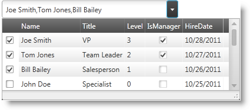

////

|metadata|
{
    "name": "xammulticce-using",
    "controlName": ["xamMultiColumnComboEditor"],
    "tags": ["Editing","Filtering","Getting Started","How Do I","Selection"],
    "guid": "da2f421e-bf5f-4982-b1e7-21949037dee1",  
    "buildFlags": [],
    "createdOn": "2016-05-25T18:21:57.558258Z"
}
|metadata|
////

= Using xamMultiColumnComboEditor

== Topic Overview

=== Purpose

This topic is dedicated to providing an overview of the link:{ApiPlatform}controls.editors.xamcomboeditor.v{ProductVersion}~infragistics.controls.editors.xammulticolumncomboeditor.html[xamMultiColumnComboEditor]™ control. In the following examples, you will learn how to configure and work with the editor and see how it can help you improve the user experience of your applications.

=== In this topic

This document contains the following sections:

* <<data,Data population and visualization>>
* <<config,Configuring the control’s layout>>
* <<filSel,Filtering and Selection>>

=== Required background

The following table lists the prerequisites required for this topic:

[options="header", cols="a,a"]
|====
|Background type|Content

|Concepts
|You need to be familiar with the following concepts: 

* General ComboBox Controls 

|====

=== Control configuration chart

The table below lists the main features of the xamMultiColumnComboEditor.

[options="header", cols="a,a"]
|====
|Feature|Details

|<<data,Data population and visualization>>
|This section shows how to populate the control with data and generate the columns in the dropdown.

|<<config,Configuring the control’s layout>>
|This section includes information on how to configure the look and feel of the xamMultiColumnComboEditor.

|<<filSel,Filtering and Selection>>
|This section describes the user interaction capabilities of the control such as filtering and selection.

|====

[[data]]
== Data population and visualization

=== Data Source

In order to populate the xamMultiColumnComboEditor control with data you must set its ItemsSource property to the given data source. You can use any IEnumerable collection of objects.

*Note:* The control doesn’t support adding items directly, so you must have an IEnumerable to bind it to.

=== Generating Columns

The xamMultiColumnComboEditor control can automatically generate columns for every public property on the data object that is contained in the IEnumerable that is set on the control’s ItemsSource property. The control’s AutoGenerateColumns property (which defaults to True) controls this behavior. Alternatively you can set AutoGenerateColumns to False and manually specify which columns to display by creating and adding columns directly to the control’s link:{ApiPlatform}controls.editors.xamcomboeditor.v{ProductVersion}~infragistics.controls.editors.xammulticolumncomboeditor~columns.html[Columns] collection:

*In XAML:*

----
<ig:XamMultiColumnComboEditor
    x:Name="xamMultiColumnComboEditor" 
    DisplayMemberPath="Company"                           
    AutoGenerateColumns=">
    <ig:XamMultiColumnComboEditor.Columns>
        <ig:ImageComboColumn
            Key="ImagePath" MaximumWidth="60" ImageWidth="50"/>
        <ig:TextComboColumn Key="ContactName"/>
        <ig:TextComboColumn Key="Company"/>
    </ig:XamMultiColumnComboEditor.Columns>
</ig:XamMultiColumnComboEditor>
----

The supported column types are:

* link:{ApiPlatform}controls.editors.xamcomboeditor.v{ProductVersion}~infragistics.controls.editors.checkboxcombocolumn.html[CheckboxComboColumn] – use to show Boolean values with a CheckBox control
* link:{ApiPlatform}controls.editors.xamcomboeditor.v{ProductVersion}~infragistics.controls.editors.datecombocolumn.html[DateComboColumn] – use to show dates
* link:{ApiPlatform}controls.editors.xamcomboeditor.v{ProductVersion}~infragistics.controls.editors.textcombocolumn.html[TextComboColumn] – use to display string information
* link:{ApiPlatform}controls.editors.xamcomboeditor.v{ProductVersion}~infragistics.controls.editors.imagecombocolumn.html[ImageComboColumn] – use to show images. You can load an Image either by binding the Key to a property containing the Uri to the image or binding to a property of type BitmapImage.

[[config]]
== Configuring the control’s layout

=== Controlling the Dropdown

The xamMultiColumnComboEditor control provides great flexibility in programmatically controlling the dropdown.

[options="header", cols="a,a"]
|====
|Property|Action

| link:{ApiPlatform}controls.editors.xamcomboeditor.v{ProductVersion}~infragistics.controls.editors.comboeditorbase`2~isdropdownopen.html[IsDropDownOpen]
|Gets or sets a value indicating whether the selectable drop-down is open.

| link:{ApiPlatform}controls.editors.xamcomboeditor.v{ProductVersion}~infragistics.controls.editors.comboeditorbase`2~allowdropdownresizing.html[AllowDropDownResizing]
|Gets/sets whether the drop down panel should be resizable by the end user or not.

| link:{ApiPlatform}controls.editors.xamcomboeditor.v{ProductVersion}~infragistics.controls.editors.comboeditorbase`2~dropdownbuttondisplaymode.html[DropDownButtonDisplayMode]
|Gets/sets drop down button visibility.

|====

[options="header", cols="a,a"]
|====
|Event|Action

| link:{ApiPlatform}controls.editors.xamcomboeditor.v{ProductVersion}~infragistics.controls.editors.comboeditorbase`2~dropdownclosing_ev.html[DropDownClosing]
|Occurs when the IsDropDownOpen property is changing from true to false.

| link:{ApiPlatform}controls.editors.xamcomboeditor.v{ProductVersion}~infragistics.controls.editors.comboeditorbase`2~dropdownclosed_ev.html[DropDownClosed]
|Occurs when the IsDropDownOpen property was changed from true to false and the drop-down is closed.

| link:{ApiPlatform}controls.editors.xamcomboeditor.v{ProductVersion}~infragistics.controls.editors.comboeditorbase`2~dropdownopening_ev.html[DropDownOpening]
|Occurs when the value of the IsDropDownOpen property is changing from false to true.

| link:{ApiPlatform}controls.editors.xamcomboeditor.v{ProductVersion}~infragistics.controls.editors.comboeditorbase`2~dropdownopened_ev.html[DropDownOpened]
|Occurs when the value of the IsDropDownOpen property has changed from false to true and the drop-down is open.

|====

When users start typing, the dropdown always opens in a direction chosen automatically by the control in order to show the entire dropdown.

=== Dropdown Footer

You can use the control’s Footer property to specify arbitrary content that should appear in the Footer area of the dropdown. A FooterTemplate property is also available to let you control the layout of the Footer content.

=== CheckBox Selection

To make selecting multiple items more convenient for users you can show a checkbox in each row by setting the CheckBoxVisibility property to Visible. When the AllowMultipleSelection property is set to True, users can select several items (by clicking on the rows or by marking their checkboxes) in single interaction and without having to hold down the CTRL key.

=== Reset Button

When the link:{ApiPlatform}controls.editors.xamcomboeditor.v{ProductVersion}~infragistics.controls.editors.xammulticolumncomboeditor~selecteditemsresetbuttonvisibility.html[SelectedItemsResetButtonVisibility] property is set to Visible, a button is displayed in the edit area of the control which can be clicked by the user to clear the current selection.

[[filSel]]
== Filtering and Selection

=== Filtering

The xamMultiColumnComboEditor control exposes a link:{ApiPlatform}controls.editors.xamcomboeditor.v{ProductVersion}~infragistics.controls.editors.xammulticolumncomboeditor~filtermode.html[FilterMode] property that lets you control how the dropdown list is filtered as user type text into the control’s text area. The FilterMode enumeration contains 2 values:

* link:{ApiPlatform}controls.editors.xamcomboeditor.v{ProductVersion}~infragistics.controls.editors.filtermode.html[FilterOnPrimaryColumnOnly] – filters items in the dropdown list by including only the items which primary column$$* $$ starts with the text typed in the control's TextBox
* link:{ApiPlatform}controls.editors.xamcomboeditor.v{ProductVersion}~infragistics.controls.editors.filtermode.html[FilterOnAllColumns] - filters the items in the dropdown list by including only those items that contain the text typed in the control's TextBox in  *_any_*  text column

*$$*$$* The ‘primary column’ is defined as the column specified via the control’s link:{ApiPlatform}controls.editors.xamcomboeditor.v{ProductVersion}~infragistics.controls.editors.comboeditorbase`2~displaymemberpath.html[DisplayMemberPath] property.

*Note:* The control automatically performs auto completion of user typed text when the FilterMode property is set to FilterOnPrimaryColumnOnly.

Custom filtering is also available with the xamMultiColumnComboBox control. In order to use custom filtering you should define the rules in an instance of the ItemsFilter class and set it to the control’s CustomItemsFilter property.

The following example demonstrates how to setup an item filter:

*In Visual Basic:*

----
Dim filter As New ItemsFilter()
filter.ObjectTypedInfo =
    New CachedTypedInfo() With { _
        .CachedType = GetType(Person)
}
filter.Conditions.LogicalOperator = LogicalOperator.[Or]
filter.Conditions.Add(New ComparisonCondition() With { _
    .[Operator] = ComparisonOperator.EndsWith, _
    .FilterValue = "" _
})
XamMultiColumnComboEditor.CustomItemsFilter = filter
----

*In C#:*

----
ItemsFilter filter = new ItemsFilter();
filter.ObjectTypedInfo = new CachedTypedInfo()
{
    CachedType = typeof(Person)
};
filter.Conditions.LogicalOperator = LogicalOperator.Or;
filter.Conditions.Add(new ComparisonCondition() 
{
    Operator = ComparisonOperator.EndsWith,
    FilterValue = ""
});
xamMultiColumnComboEditor.CustomItemsFilter = filter;
----

=== Entering Custom Values

You can control the behavior of the control when users type in the text box of the control by configuring the link:{ApiPlatform}controls.editors.xamcomboeditor.v{ProductVersion}~infragistics.controls.editors.comboeditorbase`2~customvalueenteredaction.html[CustomValueEnteredAction] property. There are three values contained in link:{ApiPlatform}controls.editors.xamcomboeditor.v{ProductVersion}~infragistics.controls.editors.customvalueenteredactions.html[CustomValueEnteredActions enumeration]:

* *Ignore* - prevents the user from typing in invalid data – the keystrokes are considered as a filter for the ComboBox thus no new value can be entered
* *Allow* - allows items to be typed, but no items are selected and the underlying ItemsSource remain untouched
* *Add* - adds the typed data to the underlying ItemsSource and the new addition becomes valid data for selection

=== Selection

You can configure the selection mode of the control by setting the AllowMultipleSelection property. When set to True users can choose multiple items that are displayed as comma separated strings by default. If you want to change the delimiter you can set the link:{ApiPlatform}controls.editors.xamcomboeditor.v{ProductVersion}~infragistics.controls.editors.comboeditorbase`2~multiselectvaluedelimiter.html[MultiSelectValueDelimiter] property to the desired character. Therefore, when users select multiple items, the control displays the primary column (DisplayMemberPath) values of each selected item. Selected items are joined in the selection string with the MultiSelectValueDelimiter character.

The screenshot below shows a xamMultiColumnComboEditor with multiple items selected where the MultiSelectValueDelimiter is set to a semicolon.

When AllowMultipleSelection is set to True users can add new items to the selection by clicking on an item while holding the CTRL key. If you want to let the user choose multiple items using a pointing device exclusively you can set the CheckBoxVisibility property to Visible. The check boxes allow users to check multiple RowSelectionCheckbox items without requiring use of the keyboard.

== Related Topics

Following are some other topics you may find useful.

link:xammulticce-about.html[About xamMultiColumnComboEditor]

link:xammulticce-adding.html[Adding xamMultiColumnComboEditor to Your Page]

link:xamcomboeditor-about-xamcomboeditor.html[About xamComboEditor]