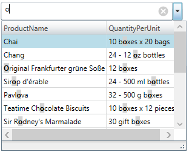
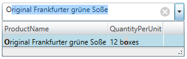
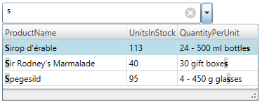
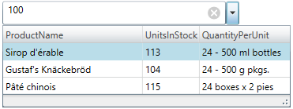

////
|metadata|
{
    "name": "xammulticee-configuring-item-filtering",
    "tags": ["Data Binding","Filtering","Getting Started","How Do I"],
    "controlName": ["xamMultiColumnComboEditor"],
    "guid": "a8f3a0ba-5581-4b51-8c9c-38c72776756d",
    "buildFlags": [],
    "createdOn": "2016-05-25T18:21:57.6022906Z"
}
|metadata|
////

= Configuring Item Filtering (xamMultiColumnComboEditor)

== Topic Overview

=== Purpose

This topic describes how to configure items filtering in the  _xamMultiColumnComboEditor_™ control.

=== Required background

The following topic is a prerequisite to understanding this topic:

[options="header", cols="a,a"]
|====
|Topic|Purpose

| link:xammulticce-adding.html[Adding xamMultiColumnComboEditor to Your Page]
|This topic describes how to add a _xamMultiColumnComboEditor_ control to an application and use some of its properties.

|====

=== In this topic

This topic contains the following sections:

* <<_Ref382663787,Introduction>>
* <<_Ref382663814,Filtering Configuration Summary>>
* <<_Ref382638566,Configuring Filtering Scope>>
* <<_Ref382638573,Configuring Custom Filters>>
* <<_Ref382638579,Related Content>>

** <<_Ref380247517,Topics>>
** <<_Ref380247522,Samples>>

[[_Ref382663787]]
[[_Ref380247491]]
== Introduction

=== Item filtering summary

The  _xamMultiColumnComboEditor_   control provides filtering on the items in the control’s Drop-Down when the user starts to type in the input text field. The data items are filtered according to the filters specified in the  _xamMultiColumnComboEditor_  .

In case there are no custom filters specified, the item filtering is executed on all columns in the control’s Drop-Down and it’s always enabled by default.

[[_Ref382663814]]
== Filtering Configuration Summary

=== Filtering configuration summary chart

The following table briefly explains the configurable aspects of the  _xamMultiColumnComboEditor_   filtering feature and maps them to the properties that configure them. Further details are available after the table.

[options="header", cols="a,a,a"]
|====
|Configurable aspect|Details|Properties

|<<_Ref382638566,Configuring Filtering Scope>>
|Configures on which columns item filtering is applied
| link:{ApiPlatform}controls.editors.xamcomboeditor.v{ProductVersion}~infragistics.controls.editors.xammulticolumncomboeditor~filtermode.html[FilterMode]

|<<_Ref382638573,Configuring Custom Filters>>
|Configures a collection of custom filters applied when filtering the _xamMultiColumnComboEditor_ data items
| link:{ApiPlatform}controls.editors.xamcomboeditor.v{ProductVersion}~infragistics.controls.editors.comboeditorbase`2~itemfilters.html[ItemFilters]

|====

[[_Ref382638445]]
[[_Ref380075017]]

[[_Ref382638566]]
== Configuring Filtering Scope

=== Overview

The  _xamMultiColumnComboEditor_   provides an option for specifying the item filtering scope.

Use the  _xamMultiColumnComboEditor_   `FilterMode` property to configure whether item filtering is performed on the primary column or on all visible columns in the control.

The primary column is the column that represents the data of the data object property specified by the `DisplayMemberPath` property.

.Note
[NOTE]
====
The  _xamMultiColumnComboEditor_   automatically performs auto completion of user typed text when the `FilterMode` property is set to `FilterOnPrimaryColumnOnly`.
====

=== Property settings

The following table maps the desired configuration to the property settings that manage it.

[options="header", cols="a,a,a"]
|====
|In order to:|Use this property:|And set it to:

|Apply filtering on the items in the primary column
| link:{ApiPlatform}controls.editors.xamcomboeditor.v{ProductVersion}~infragistics.controls.editors.xammulticolumncomboeditor~filtermode.html[FilterMode]
|`FilterOnPrimaryColumnOnly`

|Apply filtering on the items in all displayed columns
| link:{ApiPlatform}controls.editors.xamcomboeditor.v{ProductVersion}~infragistics.controls.editors.xammulticolumncomboeditor~filtermode.html[FilterMode]
|`FilterOnAllColumns`

|====

=== Example

The screenshot below demonstrates how the  _xamMultiColumnComboEditor_   behaves as a result of the following settings:

[options="header", cols="a,a"]
|====
|Property|Value

| link:{ApiPlatform}controls.editors.xamcomboeditor.v{ProductVersion}~infragistics.controls.editors.comboeditorbase`2~displaymemberpath.html[DisplayMemberPath]
| _ProductName_ 

| link:{ApiPlatform}controls.editors.xamcomboeditor.v{ProductVersion}~infragistics.controls.editors.xammulticolumncomboeditor~filtermode.html[FilterMode]
| _FilterOnAllColumns_ 

|====

Following is the code that implements this example.

*In XAML:*

[source,xaml]
----
<ig:XamMultiColumnComboEditor x:Name="ComboEditorProducts" 
                              Height="30" Width="300" 
                              ItemsSource="{Binding Path=Products}"
                              AutoGenerateColumns="False"
                              DisplayMemberPath="ProductName"
                              FilterMode="FilterOnAllColumns">
    <ig:XamMultiColumnComboEditor.Columns>
        <ig:TextComboColumn Key="ProductName"/>
        <ig:TextComboColumn Key="QuantityPerUnit"/>
    </ig:XamMultiColumnComboEditor.Columns>
</ig:XamMultiColumnComboEditor>
----

The screenshot below demonstrates how the  _xamMultiColumnComboEditor_   behaves as a result of the following settings:

[options="header", cols="a,a"]
|====
|Property|Value

| link:{ApiPlatform}controls.editors.xamcomboeditor.v{ProductVersion}~infragistics.controls.editors.comboeditorbase`2~displaymemberpath.html[DisplayMemberPath]
| _ProductName_ 

| link:{ApiPlatform}controls.editors.xamcomboeditor.v{ProductVersion}~infragistics.controls.editors.xammulticolumncomboeditor~filtermode.html[FilterMode]
| _FilterOnPrimaryColumnOnly_ 

|====

Following is the code that implements this example.

*In XAML:*

[source,xaml]
----
<ig:XamMultiColumnComboEditor x:Name="ComboEditorProducts" 
                              Height="30" Width="300" 
                              ItemsSource="{Binding Path=Products}"
                              AutoGenerateColumns="False"
                              DisplayMemberPath="ProductName"
                              FilterMode="FilterOnPrimaryColumnOnly">
    <ig:XamMultiColumnComboEditor.Columns>
        <ig:TextComboColumn Key="ProductName"/>
        <ig:TextComboColumn Key="QuantityPerUnit"/>
    </ig:XamMultiColumnComboEditor.Columns>
</ig:XamMultiColumnComboEditor>
----

[[_Ref382638573]]
== Configuring Custom Filters

=== Overview

The  _xamMultiColumnComboEditor_   control provides functionality for customizing the item filtering.

This is achieved by using the  _xamMultiColumnComboEditor_   link:{ApiPlatform}controls.editors.xamcomboeditor.v{ProductVersion}~infragistics.controls.editors.comboeditorbase`2~itemfilters.html[ItemFilters] property. An `ObservableCollection` of link:{ApiPlatform}controls.editors.xamcomboeditor.v{ProductVersion}~infragistics.controls.editors.comboitemfilter_members.html[ComboItemFilter] objects is set to this property to provide custom items filtering.

The Default/Custom filtering will not work in the case that the  _xamMultiColumnComboEditor_   `AllowFiltering` property is set to `False`.

.Note
[NOTE]
====
When creating a custom `ComboItemFilter`, the `ComboItemFilter` link:{ApiPlatform}controls.editors.xamcomboeditor.v{ProductVersion}~infragistics.controls.editors.comboitemfilter~fieldname.html[FieldName] property must be set to the name of the data property to be filtered. If `FieldName` property is not set, an exception is thrown.
====

.Note
[NOTE]
====
You cannot use the  pick:[wpf=" link:{ApiPlatform}datamanager.v{ProductVersion}~infragistics.comparisoncondition_members.html[ComparisonCondition]"]  pick:[sl=" link:{ApiPlatform}v{ProductVersion}~infragistics.comparisoncondition_members.html[ComparisonCondition]"]   pick:[wpf=" link:{ApiPlatform}datamanager.v{ProductVersion}~infragistics.comparisoncondition~filtervalue.html[FilterValue]"]  pick:[sl=" link:{ApiPlatform}v{ProductVersion}~infragistics.comparisoncondition~filtervalue.html[FilterValue]"]  property in code to preset the filter value. The  _xamMultiColumnComboEditor_   uses `FilterValue` property internally, and it is set to the text typed in the control input field.
====

=== Property settings

The following table maps the desired configuration to the property settings that manage it.

[options="header", cols="a,a,a"]
|====
|In order to:|Use this property:|And set it to:

|Create a collection of custom filters
| link:{ApiPlatform}controls.editors.xamcomboeditor.v{ProductVersion}~infragistics.controls.editors.comboeditorbase`2~itemfilters.html[ItemFilters]
|`ObservableCollection<` link:{ApiPlatform}controls.editors.xamcomboeditor.v{ProductVersion}~infragistics.controls.editors.comboitemfilter_members.html[ComboItemFilter]`>`

|Specify on which data model property the item filtering is performed
| link:{ApiPlatform}controls.editors.xamcomboeditor.v{ProductVersion}~infragistics.controls.editors.comboitemfilter.html[ComboItemFilter] link:{ApiPlatform}controls.editors.xamcomboeditor.v{ProductVersion}~infragistics.controls.editors.comboitemfilter~fieldname.html[FieldName]
|`string`

|Specify the logical operator used for combining all filter conditions
| link:{ApiPlatform}controls.editors.xamcomboeditor.v{ProductVersion}~infragistics.controls.editors.comboitemfilter.html[ComboItemFilter] link:{ApiPlatform}controls.editors.xamcomboeditor.v{ProductVersion}~infragistics.controls.editors.comboitemfilter~logicaloperator.html[LogicalOperator]
| link:{ApiPlatform}controls.editors.xamcomboeditor.v{ProductVersion}~infragistics.controls.editors.comboitemfilter~logicaloperator.html[LogicalOperator]

|Specify a collection of conditions to be applied
| link:{ApiPlatform}controls.editors.xamcomboeditor.v{ProductVersion}~infragistics.controls.editors.comboitemfilter.html[ComboItemFilter] link:{ApiPlatform}controls.editors.xamcomboeditor.v{ProductVersion}~infragistics.controls.editors.comboitemfilter~conditions.html[Conditions]
| pick:[wpf=" link:{ApiPlatform}datamanager.v{ProductVersion}~infragistics.conditioncollection_members.html[ConditionCollection]"] pick:[sl=" link:{ApiPlatform}v{ProductVersion}~infragistics.conditioncollection_members.html[ConditionCollection]"] 

|Specify a comparison condition operator
|pick:[wpf=" link:{ApiPlatform}datamanager.v{ProductVersion}~infragistics.comparisoncondition_members.html[ComparisonCondition]"] pick:[sl=" link:{ApiPlatform}v{ProductVersion}~infragistics.comparisoncondition_members.html[ComparisonCondition]"] pick:[wpf=" link:{ApiPlatform}datamanager.v{ProductVersion}~infragistics.comparisoncondition~operator.html[Operator]"] pick:[sl=" link:{ApiPlatform}v{ProductVersion}~infragistics.comparisoncondition~operator.html[Operator]"]
| pick:[wpf=" link:{ApiPlatform}datamanager.v{ProductVersion}~infragistics.comparisonoperator.html[ComparisonOperator]"] pick:[sl=" link:{ApiPlatform}v{ProductVersion}~infragistics.comparisonoperator.html[ComparisonOperator]"] 

|====

=== Example

The following screenshots demonstrate how the filtering in the  _xamMultiColumnComboEditor_   works as a result of the following code:

[start=1]
. Typing ‘s’ in the  _xamMultiColumnComboEditor_   text input field:

[start=2]
. Typing ‘100’ in the  _xamMultiColumnComboEditor_   text input field:

Following is the code that implements this example.

*In XAML:*

[source,xaml]
----
<ig:XamMultiColumnComboEditor x:Name="MultiColumnComboEditor"
                              ItemsSource="{Binding Path=Products}" 
                              Height="30" Width="300"
                              AutoGenerateColumns="False"
                              DisplayMemberPath="ProductName">          
    <ig:XamMultiColumnComboEditor.Columns>
        <ig:TextComboColumn Key="ProductName"/>
        <ig:TextComboColumn Key="UnitsInStock"/>
    </ig:XamMultiColumnComboEditor.Columns>
    <ig:XamMultiColumnComboEditor.ItemFilters>
        <ig:ComboItemFilter FieldName="ProductName" LogicalOperator="And">
            <ig:ComboItemFilter.Conditions>
                <ig:ComparisonCondition Operator="Contains" />
                <ig:ComparisonCondition Operator="StartsWith"/>
            </ig:ComboItemFilter.Conditions>
        </ig:ComboItemFilter>
        <ig:ComboItemFilter FieldName="UnitsInStock">
            <ig:ComboItemFilter.Conditions>
                <ig:ComparisonCondition Operator="GreaterThan"/>
            </ig:ComboItemFilter.Conditions>
        </ig:ComboItemFilter>
    </ig:XamMultiColumnComboEditor.ItemFilters>
</ig:XamMultiColumnComboEditor>
----

[[_Ref380247512]]

[[_Ref382638579]]
== Related Content

[[_Ref380247517]]

=== Topics

The following topics provide additional information related to this topic.

[options="header", cols="a,a"]
|====
|Topic|Purpose

| link:xam-multicee-configuring-the-behavior-on-user-input.html[Configuring the Behavior on User Input]
|This topic describes how to configure the executed action when the user types and after that hits 'Enter' key in the input text field in the _xamMultiColumnComboEditor_ control.

| link:xammulticce-configuring-data-binding-visualization.html[Configuring Data Binding and Visualization]
|This topic explains how to bind the _xamMultiColumnComboEditor_ control to data and configure the items layout in the control’s drop-down list.

| link:xammulticee-configuring-the-drop-down.html[Configuring the Drop-Down]
|This topic explains how to configure the layout and behavior of the _xamMultiColumnComboEditor_ Drop-Down.

| link:xammulticee-selection.html[Selection]
|The topics in this group explain selection feature in the _xamMultiColumnComboEditor_ control and its use.

|====

[[_Ref380247522]]

=== Samples

The following sample provides additional information related to this topic.

[options="header", cols="a,a"]
|====
|Sample|Purpose

| link:{SamplesURL}/multicolumn-combo/specify-a-custom-filter-for-multicolumncomboeditor[Custom Filters]
|This sample demonstrates configuring custom filters in the _xamMultiColumnComboEditor_ control.

|====