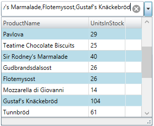
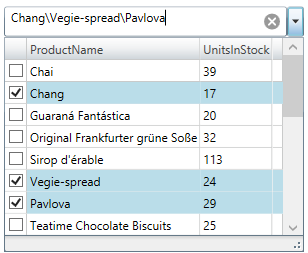

////
|metadata|
{
    "name": "xammulticee-configuring-multiple selection",
    "tags": ["Getting Started","How Do I","Selection"],
    "controlName": ["xamMultiColumnComboEditor"],
    "guid": "a242b5db-c515-47c6-9ad9-b59d20c71689",
    "buildFlags": [],
    "createdOn": "2016-05-25T18:21:57.6322969Z"
}
|metadata|
////

= Configuring Multiple Selection (xamMultiColumnComboEditor)

== Topic Overview

=== Purpose

This topic describes how to configure the multiple selection option in the  _xamMultiColumnComboEditor_™ control.

=== Required background

The following topic is a prerequisite to understanding this topic:

[options="header", cols="a,a"]
|====
|Topic|Purpose

| link:xammulticce-adding.html[Adding xamMultiColumnComboEditor to Your Page]
|This topic describes how to add a _xamMultiColumnComboEditor_ control to your application and use some of its properties.

|====

=== In this topic

This topic contains the following sections:

* <<_Ref381977598,Multiple Selection Configuration Summary>>
* <<_Enabling_Multiple_Items_selection,Enabling Multiple Items Selection>>
* <<_Ref382690795,Enabling Items Check Boxes Visibility>>
* <<_Ref382690730,Configuring the Selected Values Delimiter>>
* <<_Ref382690806,Related Content>>

** <<_Ref381977623,Topics>>

[[_Ref381977598]]
== Multiple Selection Configuration Summary

=== Multiple selection configuration summary chart

The following table briefly explains the configurable aspects of multiple selection in the  _xamMultiColumnComboEditor_   control and maps them to the properties that configure them. Further details are available after the table.

[options="header", cols="a,a,a"]
|====
|Configurable aspect|Details|Properties

|<<_Enabling_Multiple_Items_selection,Enabling Multiple Items Selection>>
|Enable Multiple selection to allow selecting many _xamMultiColumnComboEditor_ items at the same time.
| link:{ApiPlatform}controls.editors.xamcomboeditor.v{ProductVersion}~infragistics.controls.editors.comboeditorbase`2~allowmultipleselection.html[AllowMultipleSelection]

|<<_Ref381977332,Enabling Items Check Boxes>>
|Facilitate Multiple selection by enabling the _xamMultiColumnComboEditor_ items check boxes visibility.
| link:{ApiPlatform}controls.editors.xamcomboeditor.v{ProductVersion}~infragistics.controls.editors.comboeditorbase`2~checkboxvisibility.html[CheckBoxVisibility]

|<<_Ref382690730,Configuring the Selected Values Delimiter>>
|Customize the selected values delimiter symbol
| link:{ApiPlatform}controls.editors.xamcomboeditor.v{ProductVersion}~infragistics.controls.editors.comboeditorbase`2~multiselectvaluedelimiter.html[MultiSelectValueDelimiter]

|====

[[_Enabling_Multiple_Items_selection]]
== Enabling Multiple Items Selection

=== Overview

Enable multiple items selection in the  _xamMultiColumnComboEditor_   through the link:{ApiPlatform}controls.editors.xamcomboeditor.v{ProductVersion}~infragistics.controls.editors.comboeditorbase`2~allowmultipleselection.html[AllowMultipleSelection] property.

Select the various  _xamMultiColumnComboEditor_   items by holding the `CTRL` keyboard key while using the mouse’s left button clicks or by checking the items check boxes.

=== Property settings

The following table maps the desired configuration to the property settings that manage it.

[options="header", cols="a,a,a"]
|====
|In order to:|Use this property:|And set it to:

|Enable multiple items selection
| link:{ApiPlatform}controls.editors.xamcomboeditor.v{ProductVersion}~infragistics.controls.editors.comboeditorbase`2~allowmultipleselection.html[AllowMultipleSelection]
|`true`

|====

=== Example

The screenshot below demonstrates how the  _xamMultiColumnComboEditor_   behaves as a result of the following settings:

[options="header", cols="a,a"]
|====
|Property|Value

| link:{ApiPlatform}controls.editors.xamcomboeditor.v{ProductVersion}~infragistics.controls.editors.comboeditorbase`2~allowmultipleselection.html[AllowMultipleSelection]
| _true_ 

|====

Following is the code that implements this example.

*In XAML:*

[source,xaml]
----
<ig:XamMultiColumnComboEditor x:Name="MultiColumnComboEditor"
                              ItemsSource="{Binding Path=Products}" 
                              Height="30" Width="300"
                              AutoGenerateColumns="False"
                              DisplayMemberPath="ProductName"
                              AllowMultipleSelection="True">
    <ig:XamMultiColumnComboEditor.Columns>
        <ig:TextComboColumn Key="ProductName"/>
        <ig:TextComboColumn Key="UnitsInStock"/>
    </ig:XamMultiColumnComboEditor.Columns>
</ig:XamMultiColumnComboEditor>
----

[[_Ref381977332]]
[[_Ref382690795]]
== Enabling Items Check Boxes Visibility

=== Overview

Perform multiple selection in the  _xamMultiColumnComboEditor_   by checking the items check boxes. In order for the user to perform this, the items checkboxes must be visible.

The  _xamMultiColumnComboEditor_   link:{ApiPlatform}controls.editors.xamcomboeditor.v{ProductVersion}~infragistics.controls.editors.comboeditorbase`2~checkboxvisibility.html[CheckBoxVisibility] property configures the visibility of the items check boxes.

=== Property settings

The following table maps the desired configuration to the property settings that manage it.

[options="header", cols="a,a,a"]
|====
|In order to:|Use this property:|And set it to:

|Enable selection through items checkboxes
| link:{ApiPlatform}controls.editors.xamcomboeditor.v{ProductVersion}~infragistics.controls.editors.comboeditorbase`2~checkboxvisibility.html[CheckBoxVisibility]
|`Visible`

|====

=== Example

The screenshot below demonstrates how the  _xamMultiColumnComboEditor_   looks as a result of the following settings:

[options="header", cols="a,a"]
|====
|Property|Value

| link:{ApiPlatform}controls.editors.xamcomboeditor.v{ProductVersion}~infragistics.controls.editors.comboeditorbase`2~allowmultipleselection.html[AllowMultipleSelection]
| _True_ 

| link:{ApiPlatform}controls.editors.xamcomboeditor.v{ProductVersion}~infragistics.controls.editors.comboeditorbase`2~checkboxvisibility.html[CheckBoxVisibility]
| _Visible_ 

|====

Following is the code that implements this example.

*In XAML:*

[source,xaml]
----
<ig:XamMultiColumnComboEditor x:Name="MultiColumnComboEditor"
                              ItemsSource="{Binding Path=Products}" 
                              Height="30" Width="300"
                              AutoGenerateColumns="False"
                              DisplayMemberPath="ProductName"
                              AllowMultipleSelection="True"
                              CheckBoxVisibility="Visible"
                              MultiSelectValueDelimiter="\">
    <ig:XamMultiColumnComboEditor.Columns>
        <ig:TextComboColumn Key="ProductName"/>
        <ig:TextComboColumn Key="UnitsInStock"/>
    </ig:XamMultiColumnComboEditor.Columns>
</ig:XamMultiColumnComboEditor>
----

[[_Ref381977616]]

[[_Ref382690730]]
== Configuring the Selected Values Delimiter

[[_Hlk368069110]]

=== Overview

Configure the selected values delimiter using the `MultiSelectValueDelimiter` property to set a custom symbol.

By default, when multiple selection is enabled, the selected values are displayed as comma separated string.

=== Property settings

The following table maps the desired behavior to the property settings that manage it.

[options="header", cols="a,a,a"]
|====
|In order to:|Use this property:|And set it to:

|Customize the selected values delimiter
| link:{ApiPlatform}controls.editors.xamcomboeditor.v{ProductVersion}~infragistics.controls.editors.comboeditorbase`2~multiselectvaluedelimiter.html[MultiSelectValueDelimiter]
|`char`

|====

[[_Ref382690806]]
== Related Content

[[_Ref381977623]]

=== Topics

The following topics provide additional information related to this topic.

[options="header", cols="a,a"]
|====
|Topic|Purpose

| link:xammulticee-user-selection-interactions-and-usability.html[User Selection Interactions and Usability]
|This topic describes user selection interactions in the _xamMultiColumnComboEditor_ control.

| link:xammulticee-performing-selection-programmatically.html[Performing Selection Programmatically]
|This topic describes how to programmatically perform selection in the _xamMultiColumnComboEditor_ control.

|====