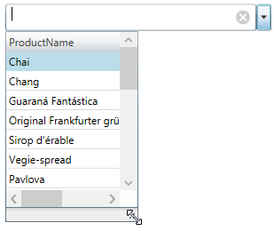

////
|metadata|
{
    "name": "xammulticee-configuring-the-drop-down",
    "tags": ["Getting Started","How Do I","Layouts"],
    "controlName": ["xamMultiColumnComboEditor"],
    "guid": "8a901899-1c6d-473a-b161-2943e9b79ff8",
    "buildFlags": [],
    "createdOn": "2016-05-25T18:21:57.5962595Z"
}
|metadata|
////

= Configuring the Drop-Down (xamMultiColumnComboEditor)

== Topic Overview

=== Purpose

This topic explains how to configure the layout and behavior of the  _xamMultiColumnComboEditor_™ Drop-Down.

=== Required background

The following topic is a prerequisite to understanding this topic:

[options="header", cols="a,a"]
|====
|Topic|Purpose

| link:xammulticce-adding.html[Adding xamMultiColumnComboEditor to Your Page]
|This topic describes how to add a _xamMultiColumnComboEditor_ control to your application and use some of its properties.

|====

=== In this topic

This topic contains the following sections:

* <<_Ref378177714,Drop-Down Configuration Summary>>
* <<_Ref378174923,Enabling/Disabling Users to Resize the Drop-Down>>
* <<_Ref378177126,Configuring the Minimum Drop-Down Width>>
* <<_Ref378177235,Configuring the Maximum Drop-Down Width>>
* <<_Ref408577946,Configuring the Minimum Drop-Down Height>>
* <<_Ref378177842,Configuring the Maximum Drop-Down Height>>
* <<_Ref382587011,Drop-Down Events Summary>>
* <<_Ref382587017,Related Content>>

** <<_Ref378177852,Topics>>
** <<_Ref378177855,Samples>>

[[_Ref378177714]]
== Drop-Down Configuration Summary

=== Drop-Down configuration summary chart

The following table briefly explains the configurable aspects of the  _xamMultiColumnComboEditor_   Drop-Down and maps them to the properties that configure them. Further details for some of the aspects are available after the table.

[options="header", cols="a,a,a"]
|====
|Configurable aspect|Details|Properties

|<<_Ref379990395,Enabling/Disabling Users to Resize the Drop-Down>>
|Configures if the Drop-Down is resizable via a resize handle.
|
* link:{ApiPlatform}controls.editors.xamcomboeditor{ApiVersion}~infragistics.controls.editors.comboeditorbase`2~allowdropdownresizing.html[AllowDropDownResizing] 

|<<_Ref378177126,Configuring the Minimum Drop-Down Width>>
|Returns or sets the minimum width of the Drop-Down.
|
* link:{ApiPlatform}controls.editors.xamcomboeditor{ApiVersion}~infragistics.controls.editors.comboeditorbase`2~mindropdownwidth.html[MinDropDownWidth] 

|<<_Ref378177235,Configuring the Maximum Drop-Down Width>>
|Returns or sets the maximum width of the Drop-Down.
|
* link:{ApiPlatform}controls.editors.xamcomboeditor{ApiVersion}~infragistics.controls.editors.comboeditorbase`2~maxdropdownwidth.html[MaxDropDownWidth] 

|<<_Ref408577946,Configuring the Minimum Drop-Down Height>>
|Returns or sets the minimum height of the Drop-Down.
|
* link:{ApiPlatform}controls.editors.xamcomboeditor{ApiVersion}~infragistics.controls.editors.comboeditorbase`2~mindropdownheight.html[MinDropDownHeight] 

|<<_Ref378177842,Configuring the Maximum Drop-Down Height>>
|Returns or sets the maximum height of the Drop-Down.
|
* link:{ApiPlatform}controls.editors.xamcomboeditor{ApiVersion}~infragistics.controls.editors.comboeditorbase`2~maxdropdownheight.html[MaxDropDownHeight] 

|Configuring if the Drop-Down is Opened
|Returns or sets if the selectable Drop-Down is open
|
* link:{ApiPlatform}controls.editors.xamcomboeditor{ApiVersion}~infragistics.controls.editors.comboeditorbase`2~isdropdownopen.html[IsDropDownOpen] 

|Configuring the Drop-Down Button Visibility
|Configures when the Drop-Down toggle button is visible.
|
* link:{ApiPlatform}controls.editors.xamcomboeditor{ApiVersion}~infragistics.controls.editors.comboeditorbase`2~dropdownbuttondisplaymode.html[DropDownButtonDisplayMode] 

|Configuring Footer Text
|Configures footer text
|
* link:{ApiPlatform}controls.editors.xamcomboeditor{ApiVersion}~infragistics.controls.editors.xammulticolumncomboeditor~footer.html[Footer] 

|Styling the Drop-Down Footer Template
|Customizes the Drop-Down footer and its content
|
* link:{ApiPlatform}controls.editors.xamcomboeditor{ApiVersion}~infragistics.controls.editors.xammulticolumncomboeditor~footertemplate.html[FooterTemplate] 

|====

[[_Ref378174923]]
[[_Ref379990395]]
== Enabling/Disabling Users to Resize the Drop-Down

[[_Hlk368069110]]

=== Overview

The  _xamMultiColumnComboEditor_   Drop-Down is resizable in order to view all the items information using a resize handle.

The  _xamMultiColumnComboEditor_   Drop-Down resizing feature is enabled by default.

=== Property settings

The following table maps the desired configuration to the property settings that manage it.

[options="header", cols="a,a,a"]
|====
|In order to:|Use this property:|And set it to:

|Enable/Disable the _xamMultiColumnComboEditor_ drop-down resizing feature
| link:{ApiPlatform}controls.editors.xamcomboeditor{ApiVersion}~infragistics.controls.editors.comboeditorbase`2~allowdropdownresizing.html[AllowDropDownResizing]
|`bool`

|====

[[_Hlk337817761]]

=== Example

The screenshot below demonstrates how the  _xamMultiColumnComboEditor_   looks as a result of the following settings:

[options="header", cols="a,a"]
|====
|Property|Value

| link:{ApiPlatform}controls.editors.xamcomboeditor{ApiVersion}~infragistics.controls.editors.comboeditorbase`2~allowdropdownresizing.html[AllowDropDownResizing]
| _true_ 

|====

Following is the code that implements this example.

*In XAML:*

[source,xaml]
----
<ig:XamMultiColumnComboEditor x:Name="ComboEditorProducts" 
                              Height="30" Width="300" 
                              ItemsSource="{Binding Path=Products}"
                              AutoGenerateColumns="False"
                              DisplayMemberPath="ProductName"
                              AllowDropDownResizing="True">
    <ig:XamMultiColumnComboEditor.Columns>
        <ig:TextComboColumn Key="ProductName"/>
        <ig:TextComboColumn Key="ProductID"/>
        <ig:TextComboColumn Key="UnitsInStock"/>
    </ig:XamMultiColumnComboEditor.Columns>
</ig:XamMultiColumnComboEditor>
----

[[_Ref378177126]]
== Configuring the Minimum Drop-Down Width

=== Overview

Specify the minimum Drop-Down width using the  _xamMultiColumnComboEditor_   link:{ApiPlatform}controls.editors.xamcomboeditor{ApiVersion}~infragistics.controls.editors.comboeditorbase`2~mindropdownwidth.html[MinDropDownWidth] property.

The property’s default value is `double.NaN`.

If the `MinDropDownWidth` property’s value is not set, the minimum width of the Drop-Down is limited to the width of the  _xamMultiColumnComboEditor_   control text input field.

If the `MinDropDownWidth` value is greater than the `MaxDropDownWidth` value, the Drop-Down is no longer resizable horizontally and its width is fixed to the `MinDropDownWidth` value.

.Note
[NOTE]
====
If a negative value is set to the `MinDropDownWidth` property, a `System.ArgumentException` is thrown.
====

=== Property settings

The following table maps the desired configuration to the property settings that manage it.

[options="header", cols="a,a,a"]
|====
|In order to:|Use this property:|And set it to:

|Limit the minimum Drop-Down width during resizing
| link:{ApiPlatform}controls.editors.xamcomboeditor{ApiVersion}~infragistics.controls.editors.comboeditorbase`2~mindropdownwidth.html[MinDropDownWidth]
|`double`

|====

=== Example

The screenshot below demonstrates how the  _xamMultiColumnComboEditor_   Drop-Down behaves as a result of the following settings:

[options="header", cols="a,a"]
|====
|Property|Value

| link:{ApiPlatform}controls.editors.xamcomboeditor{ApiVersion}~infragistics.controls.editors.comboeditorbase`2~mindropdownwidth.html[MinDropDownWidth]
| _150_ 

|====

[[_Ref378177235]]
== Configuring the Maximum Drop-Down Width

=== Overview

Specify the maximum Drop-Down width using the  _xamMultiColumnComboEditor_   link:{ApiPlatform}controls.editors.xamcomboeditor{ApiVersion}~infragistics.controls.editors.comboeditorbase`2~maxdropdownwidth.html[MaxDropDownWidth] property.

The property’s default value is `double.PositiveInfinity`.

.Note
[NOTE]
====
If a negative value is set to the `MaxDropDownWidth` property, a `System.ArgumentException` is thrown.
====

=== Property settings

The following table maps the desired configuration to the property settings that manage it.

[options="header", cols="a,a,a"]
|====
|In order to:|Use this property:|And set it to:

|Limit the maximum Drop-Down width during resizing
| link:{ApiPlatform}controls.editors.xamcomboeditor{ApiVersion}~infragistics.controls.editors.comboeditorbase`2~maxdropdownwidth.html[MaxDropDownWidth]
|`double`

|====

=== Example

The screenshot below demonstrates how the  _xamMultiColumnComboEditor_   Drop-Down behaves as a result of the following settings:

[options="header", cols="a,a"]
|====
|Property|Value

| link:{ApiPlatform}controls.editors.xamcomboeditor{ApiVersion}~infragistics.controls.editors.comboeditorbase`2~maxdropdownwidth.html[MaxDropDownWidth]
| _350_ 

|====

[[_Ref408577946]]
== Configuring the Minimum Drop-Down Height

=== Overview

Specify the minimum Drop-Down height using the  _xamMultiColumnComboEditor_   link:{ApiPlatform}controls.editors.xamcomboeditor{ApiVersion}~infragistics.controls.editors.comboeditorbase`2~mindropdownheight.html[MinDropDownHeight] property.

The property’s default value is 0.0.

If the `MinDropDownHeight` value is not set, the minimum height of the Drop-Down is limited to 40px.

If the `MinDropDownHeight` value is greater than the `MaxDropDownHeight` value, the Drop-Down is no longer resizable vertically and its height is fixed to the `MinDropDownHeight` value.

.Note
[NOTE]
====
If a negative value is set to the `MinDropDownHeight` property, a `System.ArgumentException` is thrown.
====

=== Property settings

The following table maps the desired configuration to the property settings that manage it.

[options="header", cols="a,a,a"]
|====
|In order to:|Use this property:|And set it to:

|Limit the minimum Drop-Down height during resizing and filtering
| link:{ApiPlatform}controls.editors.xamcomboeditor{ApiVersion}~infragistics.controls.editors.comboeditorbase`2~mindropdownheight.html[MinDropDownHeight]
|`double`

|====

=== Example

The screenshot below demonstrates how the  _xamMultiColumnComboEditor_   Drop-Down behaves as a result of the following settings:

[options="header", cols="a,a"]
|====
|Property|Value

| link:{ApiPlatform}controls.editors.xamcomboeditor{ApiVersion}~infragistics.controls.editors.comboeditorbase`2~mindropdownheight.html[MinDropDownHeight]
|_90_

|====

[[_Ref378177842]]
== Configuring the Maximum Drop-Down Height

=== Overview

Specify the maximum Drop-Down height using the  _xamMultiColumnComboEditor_   link:{ApiPlatform}controls.editors.xamcomboeditor{ApiVersion}~infragistics.controls.editors.comboeditorbase`2~maxdropdownheight.html[MaxDropDownHeight] property.

Failure to set this property results in the available space above and below the control being estimated. The Drop-Down list is restricted within the available height of the application.

.Note
[NOTE]
====
Setting the `MaxDropDownHeight` property to a negative value causes a `System.ArgumentException` to be thrown.
====

=== Property settings

The following table maps the desired configuration to the property settings that manage it.

[options="header", cols="a,a,a"]
|====
|In order to:|Use this property:|And set it to:

|Limit the maximum Drop-Down height
| link:{ApiPlatform}controls.editors.xamcomboeditor{ApiVersion}~infragistics.controls.editors.comboeditorbase`2~maxdropdownheight.html[MaxDropDownHeight]
|`double`

|====

=== Example

The screenshot below demonstrates how the  _xamMultiColumnComboEditor_   Drop-Down behaves as a result of the following settings:

[options="header", cols="a,a"]
|====
|Property|Value

| link:{ApiPlatform}controls.editors.xamcomboeditor{ApiVersion}~infragistics.controls.editors.comboeditorbase`2~maxdropdownheight.html[MaxDropDownHeight]
| _200_ 

|====

[[_Ref382587011]]
[[_Ref378177847]]
== Drop-Down Events Summary

=== Drop-Down events summary chart

The following table lists the events related to the user operations with the  _xamMultiColumnComboEditor_   Drop-Down.

[options="header", cols="a,a"]
|====
|Details|Event

|Occurs when the `IsDropDownOpen` property is changing from true to false.
|
* link:{ApiPlatform}controls.editors.xamcomboeditor{ApiVersion}~infragistics.controls.editors.comboeditorbase`2~dropdownclosing_ev.html[DropDownClosing] 

|Occurs when the `IsDropDownOpen` property has changed from true to false and the Drop-Down is closed.
|
* link:{ApiPlatform}controls.editors.xamcomboeditor{ApiVersion}~infragistics.controls.editors.comboeditorbase`2~dropdownclosed_ev.html[DropDownClosed] 

|Occurs when the value of the `IsDropDownOpen` property is changing from false to true.
|
* link:{ApiPlatform}controls.editors.xamcomboeditor{ApiVersion}~infragistics.controls.editors.comboeditorbase`2~dropdownopening_ev.html[DropDownOpening] 

|Occurs when the value of the `IsDropDownOpen` property has changed from false to true and the drop-down is open.
|
* link:{ApiPlatform}controls.editors.xamcomboeditor{ApiVersion}~infragistics.controls.editors.comboeditorbase`2~dropdownopened_ev.html[DropDownOpened] 

|====

[[_Ref382587017]]
== Related Content

[[_Ref378177852]]

=== Topics

The following topics provide additional information related to this topic.

[options="header", cols="a,a"]
|====
|Topic|Purpose

| link:xam-multicee-configuring-the-behavior-on-user-input.html[Configuring the Behavior on User Input]
|This topic describes how to configure the executed action when the user types and after that hits 'Enter' key in the input text field in the _xamMultiColumnComboEditor_ control.

| link:xammulticce-configuring-data-binding-visualization.html[Configuring Data Binding and Visualization]
|This topic explains how to bind the _xamMultiColumnComboEditor_ control to data and configure the items layout in the control’s drop-down list.

| link:xammulticee-configuring-item-filtering.html[Configuring Item Filtering]
|This topic describes how to configure items filtering in the _xamMultiColumnComboEditor_ control.

| link:xammulticee-selection.html[Selection]
|The topics in this group explain selection feature in the _xamMultiColumnComboEditor_ control and its use.

|====

[[_Ref378177855]]

=== Samples

The following sample provides additional information related to this topic.

[options="header", cols="a,a"]
|====
|Sample|Purpose

| link:{SamplesURL}/multicolumn-combo/manipulating-mcce-dropdown-size[Configuring the Drop-Down Size]
|This sample demonstrates how to configure the min/max drop-down size of the _xamMultiColumnComboEditor_, as well as how to enable/disable the drop-down resizing via the resize handle in the UI.

| link:{SamplesURL}/multicolumn-combo/mcc-drop-down-button-displaymode[Drop-Down Button Display Mode]
|This sample demonstrates how to use the DropDownButtonDisplayMode property to specify the cases when the drop-down button is displayed in the _xamMultiColumnComboEditor_ control.

| link:{SamplesURL}/multicolumn-combo/multicolumncomboeditor-footertemplate[Multi-Column Combo FooterTemplate]
|This sample demonstrates how to customize the drop-down footer in the _xamMultiColumnComboEditor_ control.

| link:{SamplesURL}/multicolumn-combo/multicolumncomboeditor-features[Multi-Column Combo Features]
|This sample demonstrates how to control the drop-down opening, allow multiple selection and filtering, and switching the visibility of the reset button in the _xamMultiColumnComboEditor_ control.

|====