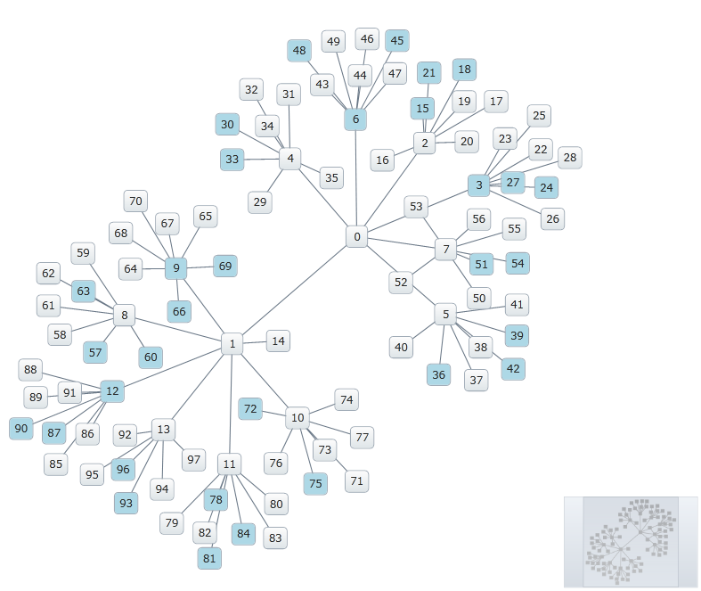

////

|metadata|
{
    "name": "xamnetworknode-conditional-formatting",
    "controlName": ["xamNetworkNode"],
    "tags": ["Formatting","How Do I"],
    "guid": "d21e3d1c-9433-440c-bd5e-9db92d3560db",  
    "buildFlags": [],
    "createdOn": "2016-05-25T18:21:57.435251Z"
}
|metadata|
////

= Conditional Formatting

This topic describes how to apply conditional formatting to the link:{ApiPlatform}controls.maps.xamnetworknode.v{ProductVersion}~infragistics.controls.maps.xamnetworknode.html[xamNetworkNode]™ control. At the end of the topic, a complete code sample is provided.

The topic is organized as follows:

* <<Introduction,Introduction>> 
* <<ConditionalFormatting,Applying Conditional Formatting to Nodes>>
** <<Preview,Preview>>
** <<Requirements,Requirements>>
** <<Steps,Steps>>
* <<CompleteCodeSample,Complete Code Sample>>
** <<View,View>>
** <<CodeBehind,Code Behind>>
** <<NodeModel,NodeModel.cs>>
** <<ConnectionModel,ConnectionModel.cs>>
** <<SimpleGraphData,SimpleGraphData.cs>>
* <<RelatedTopics,Related Topics>>

[[Introduction]]
== Introduction

The Network Node control supports conditional formatting via the link:{ApiPlatform}controls.maps.xamnetworknode.v{ProductVersion}~infragistics.controls.maps.xamnetworknode~nodecontrolattachedevent_ev.html[NodeControlAttachedEvent]. This walkthrough describes how to apply a custom background to each node when its integer label is evenly divisible by 3.

[[ConditionalFormatting]]
== Applying Conditional Formatting to Nodes

[[Preview]]
=== Preview

Following is a preview of the final result:

Figure 1: An implementation of conditional formatting as rendered by the sample code

[[Requirements]]
=== Requirements

This article assumes you have already read the topic on link:xamnetworknode-getting-started-with-xamnetworknode.html[Getting Started with xamNetworkNode], and uses the code from that walkthrough as a starting point.

[[Steps]]
=== Steps

[start=1]
1. **Add a custom style.**

Add the Style to the layout root’s Resources section as shown:

**In XAML:**

[source,xaml]
----
<Grid.Resources>
    ...
    
</Grid.Resources>
----

[start=2]
2. **Handle the link:{ApiPlatform}controls.maps.xamnetworknode.v{ProductVersion}~infragistics.controls.maps.xamnetworknode~nodecontrolattachedevent_ev.html[NodeControlAttachedEvent].** 

With the Style defined, configure the Network Node control to handle the NodeControlAttachedEvent with a method called xnn_NodeControlAttachedEvent:

**In XAML:**

[source,xaml]
----
<ig:XamNetworkNode x:Name="xnn"
                   ItemsSource="{Binding Nodes, Source={StaticResource GraphData}}"
                   NodeControlAttachedEvent="xnn_NodeControlAttachedEvent">
    ...
</ig:XamNetworkNode>
----

This event is fired whenever a NodeControl becomes attached to the rendering surface. In the handler method logic, check to see if the node’s integer label is divisible by 3. If it is, set the link:http://msdn.microsoft.com/en-us/library/system.windows.frameworkelement.style.aspx[Style] on the NodeControl accordingly:

**In C#:**

[source,csharp]
----
private void xnn_NodeControlAttachedEvent(object sender, Infragistics.Controls.Maps.NetworkNodeEventArgs e)
{
    NodeModel n = e.NodeControl.DataContext as NodeModel;
    int x = Convert.ToInt32(n.Label);
    if (x > 0 && x % 3 == 0)
    {
        e.NodeControl.Style = this.LayoutRoot.Resources["BlueStyle"] as Style;
    }
}
----

**In Visual Basic:**

[source,vb]
----
Private Sub xnn_NodeControlAttachedEvent(sender As Object, e As Infragistics.Controls.Maps.NetworkNodeEventArgs)
    Dim n As NodeModel = TryCast(e.NodeControl.DataContext, NodeModel)
    Dim x As Integer = Convert.ToInt32(n.Label)
    If x > 0 AndAlso x Mod 3 = 0 Then
        e.NodeControl.Style = TryCast(Me.LayoutRoot.Resources("BlueStyle"), Style)
    End If
End Sub
----

[start=3]
3. **Save your project.**

[start=4]
4. **(Optional) Verify the result.**

Run the application. Nodes with integer labels evenly divisible by 3 will render with a blue background. You can modify the Style and handler logic to meet other requirements as necessary.

[[CompleteCodeSample]]
== Complete Code Sample

Following is the code of the full example implemented in context.

[[View]]
== View

**In XAML:**

[source,xaml]
----
<UserControl x:Class="xamNetworkNode_ConditionalFormatting.MainPage"
    xmlns="http://schemas.microsoft.com/winfx/2006/xaml/presentation"
    xmlns:x="http://schemas.microsoft.com/winfx/2006/xaml"
    xmlns:d="http://schemas.microsoft.com/expression/blend/2008"
    xmlns:mc="http://schemas.openxmlformats.org/markup-compatibility/2006"
    xmlns:ig="http://schemas.infragistics.com/xaml"
    xmlns:data="clr-namespace:xamNetworkNode_ConditionalFormatting.Data"
    mc:Ignorable="d"
    d:DesignHeight="300" d:DesignWidth="400">
 
    <Grid x:Name="LayoutRoot" Background="White">
        <Grid.Resources>
            <data:SimpleGraphData x:Key="GraphData" />
            
        </Grid.Resources>
        <ig:XamNetworkNode x:Name="xnn"
                           ItemsSource="{Binding Nodes, Source={StaticResource GraphData}}"
                           NodeControlAttachedEvent="xnn_NodeControlAttachedEvent">
            <ig:XamNetworkNode.GlobalNodeLayouts>
                <ig:NetworkNodeNodeLayout
                    TargetTypeName = "NodeModel"
                    DisplayMemberPath = "Label"
                    ConnectionsMemberPath = "Connections"
                    ConnectionTargetMemberPath = "Target"
                    />
            </ig:XamNetworkNode.GlobalNodeLayouts>
        </ig:XamNetworkNode>
    </Grid>
</UserControl>
----

[[CodeBehind]]
== Code Behind

**In C#:**

[source,csharp]
----
using System;
using System.Windows;
using System.Windows.Controls;
using xamNetworkNode_ConditionalFormatting.Models;
 
namespace xamNetworkNode_ConditionalFormatting
{
    public partial class MainPage : UserControl
    {
        public MainPage()
        {
            InitializeComponent();
        }
 
        private void xnn_NodeControlAttachedEvent(object sender, Infragistics.Controls.Maps.NetworkNodeEventArgs e)
        {
            NodeModel n = e.NodeControl.DataContext as NodeModel;
            int x = Convert.ToInt32(n.Label);
            if (x > 0 && x % 3 == 0)
            {
                e.NodeControl.Style = this.LayoutRoot.Resources["BlueStyle"] as Style;
            }
        }
    }
}
----

**In Visual Basic:**

[source,vb]
----
Imports System
Imports System.Windows
Imports System.Windows.Controls
Imports xamNetworkNode_ConditionalFormatting.Models

Namespace xamNetworkNode_ConditionalFormatting
    Public Partial Class MainPage
        Inherits UserControl
        Public Sub New()
            InitializeComponent()
        End Sub

        Private Sub xnn_NodeControlAttachedEvent(sender As Object, e As Infragistics.Controls.Maps.NetworkNodeEventArgs)
            Dim n As NodeModel = TryCast(e.NodeControl.DataContext, NodeModel)
            Dim x As Integer = Convert.ToInt32(n.Label)
            If x > 0 AndAlso x Mod 3 = 0 Then
                e.NodeControl.Style = TryCast(Me.LayoutRoot.Resources("BlueStyle"), Style)
            End If
        End Sub
    End Class
End Namespace
----

[[NodeModel]]
== NodeModel.cs

**In C#:**

[source,csharp]
----
using System.Collections.ObjectModel;
using System.ComponentModel;
 
namespace xamNetworkNode_ConditionalFormatting.Models
{
    public class NodeModel : INotifyPropertyChanged
    {
        private string _label;
        public string Label
        {
            get { return _label; }
            set
            {
                if (value != _label)
                {
                    _label = value;
                    NotifyPropertyUpdated("Label");
                }
            }
        }
 
        private string _toolTip;
        public string ToolTip
        {
            get { return _toolTip; }
            set
            {
                if (value != _toolTip)
                {
                    _toolTip = value;
                    NotifyPropertyUpdated("ToolTip");
                }
            }
        }
 
        private ObservableCollection<ConnectionModel> _connections;
        public ObservableCollection<ConnectionModel> Connections
        {
            get { return _connections; }
            set
            {
                if (value != _connections)
                {
                    _connections = value;
                    NotifyPropertyUpdated("Connections");
                }
            }
        }
 
        public event PropertyChangedEventHandler PropertyChanged;
 
        protected virtual void NotifyPropertyUpdated(string propertyName)
        {
            var handler = PropertyChanged;
 
            if (handler != null)
            {
                handler(this, new PropertyChangedEventArgs(propertyName));
            }
        }
    }
}
----

**In Visual Basic:**

[source,vb]
----
Imports System.Collections.ObjectModel
Imports System.ComponentModel

Namespace xamNetworkNode_ConditionalFormatting.Models
    Public Class NodeModel
        Implements INotifyPropertyChanged
        Private _label As String
        Public Property Label() As String
            Get
                Return _label
            End Get
            Set
                If value <> _label Then
                    _label = value
                    NotifyPropertyUpdated("Label")
                End If
            End Set
        End Property

        Private _toolTip As String
        Public Property ToolTip() As String
            Get
                Return _toolTip
            End Get
            Set
                If value <> _toolTip Then
                    _toolTip = value
                    NotifyPropertyUpdated("ToolTip")
                End If
            End Set
        End Property

        Private _connections As ObservableCollection(Of ConnectionModel)
        Public Property Connections() As ObservableCollection(Of ConnectionModel)
            Get
                Return _connections
            End Get
            Set
                If value <> _connections Then
                    _connections = value
                    NotifyPropertyUpdated("Connections")
                End If
            End Set
        End Property

        Public Event PropertyChanged As PropertyChangedEventHandler

        Protected Overridable Sub NotifyPropertyUpdated(propertyName As String)
            Dim handler = PropertyChanged

            RaiseEvent handler(Me, New PropertyChangedEventArgs(propertyName))
        End Sub

    End Class
End Namespace
----

[[ConnectionModel]]
== ConnectionModel.cs

**In C#:**

[source,csharp]
----
using System.ComponentModel;
 
namespace xamNetworkNode_ConditionalFormatting.Models
{
    public class ConnectionModel : INotifyPropertyChanged
    {
        private NodeModel _target;
        public NodeModel Target
        {
            get { return _target; }
            set
            {
                if (value != _target)
                {
                    _target = value;
                    NotifyPropertyUpdated("Target");
                }
            }
        }
 
        #region Implementation of INotifyPropertyChanged
 
        public event PropertyChangedEventHandler PropertyChanged;
 
        protected virtual void NotifyPropertyUpdated(string propertyName)
        {
            var handler = PropertyChanged;
 
            if (handler != null)
            {
                handler(this, new PropertyChangedEventArgs(propertyName));
            }
        }
        #endregion
    }
}
----

**In Visual Basic:**

[source,vb]
----
Imports System.ComponentModel

Namespace xamNetworkNode_ConditionalFormatting.Models
    Public Class ConnectionModel
        Implements INotifyPropertyChanged
        Private _target As NodeModel
        Public Property Target() As NodeModel
            Get
                Return _target
            End Get
            Set
                If value IsNot _target Then
                    _target = value
                    NotifyPropertyUpdated("Target")
                End If
            End Set
        End Property

        Public Event PropertyChanged As PropertyChangedEventHandler

        Protected Overridable Sub NotifyPropertyUpdated(propertyName As String)
            Dim handler = PropertyChanged

            RaiseEvent handler(Me, New PropertyChangedEventArgs(propertyName))
        End Sub
    End Class
End Namespace
----

[[SimpleGraphData]]
== SimpleGraphData.cs

**In C#:**

[source,csharp]
----
using System.Collections.ObjectModel;
using xamNetworkNode_Intro.Models;
 
namespace xamNetworkNode_ConditionalFormatting.Data
{
    public class SimpleGraphData
    {
        public ObservableCollection<NodeModel> Nodes { get; set; }
        private const int K = 7; // number of connections per node (maximum)
        private const int NUM_NODES = 98; // number of nodes in the graph
 
        public SimpleGraphData()
        {
            Nodes = new ObservableCollection<NodeModel>();
 
            // add NUM_NODES node objects to the collection
            for (int i = 0; i < NUM_NODES; i++)
            {
                NodeModel node = new NodeModel();
                node.Label = i.ToString();
                node.ToolTip = "ToolTip for " + node.Label;
                Nodes.Add(node);
            }
 
            // starting with node 0, set that node as the root.
            // add up to K connections to the root node.
            // then, increment the root node index and repeat until all nodes have been connected.
            int root = 0;
            int first = 1;
            int last = K;
            while (first < Nodes.Count)
            {
                Nodes[root].Connections = new ObservableCollection<ConnectionModel>();
                for (int i = first; i <= last; i++)
                {
                    if (i >= Nodes.Count)
                    {
                        break;
                    }
                    Nodes[root].Connections.Add(new ConnectionModel { Target = Nodes[i] });
                }
                root++;
                first = last + 1;
                last += K;
            }
        }
    }
}
----

**In Visual Basic:**

[source,vb]
----
Imports System.Collections.ObjectModel
Imports xamNetworkNode_Intro.Models

Namespace xamNetworkNode_ConditionalFormatting.Data
    Public Class SimpleGraphData
        Public Property Nodes() As ObservableCollection(Of NodeModel)
            Get
                Return m_Nodes
            End Get
            Set
                m_Nodes = Value
            End Set
        End Property
        Private m_Nodes As ObservableCollection(Of NodeModel)
        Private Const K As Integer = 7
        ' number of connections per node (maximum)
        Private Const NUM_NODES As Integer = 98
        ' number of nodes in the graph
        Public Sub New()
            Nodes = New ObservableCollection(Of NodeModel)()

            ' add NUM_NODES node objects to the collection
            For i As Integer = 0 To NUM_NODES - 1
                Dim node As New NodeModel()
                node.Label = i.ToString()
                node.ToolTip = "ToolTip for " & node.Label
                Nodes.Add(node)
            Next

            ' starting with node 0, set that node as the root.
            ' add up to K connections to the root node.
            ' then, increment the root node index and repeat until all nodes have been connected.
            Dim root As Integer = 0
            Dim first As Integer = 1
            Dim last As Integer = K
            While first < Nodes.Count
                Nodes(root).Connections = New ObservableCollection(Of ConnectionModel)()
                For i As Integer = first To last
                    If i >= Nodes.Count Then
                        Exit For
                    End If
                    Nodes(root).Connections.Add(New ConnectionModel() With { _
                        Key .Target = Nodes(i) _
                    })
                Next
                root += 1
                first = last + 1
                last += K
            End While
        End Sub
    End Class
End Namespace
----

[[RelatedTopics]]
== Related Topics

* link:xamnetworknode.html[xamNetworkNode]
* link:xamnetworknode-getting-started-with-xamnetworknode.html[Getting Started with xamNetworkNode]
