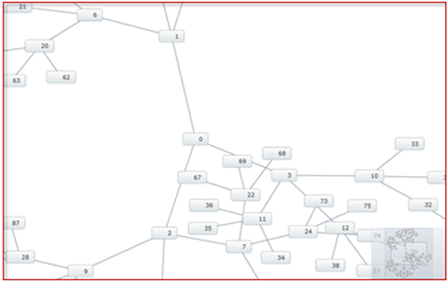

////

|metadata|
{
    "name": "xamnetworknode-configuring-panning-and-zooming",
    "controlName": ["xamNetworkNode"],
    "tags": ["Data Presentation","Getting Started","How Do I","Navigation"],
    "guid": "604c301e-4017-4b83-bc73-bcc5c8ebb16b",  
    "buildFlags": [],
    "createdOn": "2016-05-25T18:21:57.4822485Z"
}
|metadata|
////

= Configuring Panning and Zooming

This topic demonstrates how to configure the panning and zooming settings of the link:{ApiPlatform}controls.maps.xamnetworknode.v{ProductVersion}~infragistics.controls.maps.xamnetworknode.html[xamNetworkNode™] control.

== Allowing Panning and Zooming

Panning and zooming are controlled by the following Boolean properties of the xamNetworkNode control’s link:{ApiPlatform}datavisualization.v{ProductVersion}~infragistics.controls.navigationsettings.html[Navigation Settings]:

* link:{ApiPlatform}datavisualization.v{ProductVersion}~infragistics.controls.navigationsettings~allowpan.html[AllowPan] – when True, panning with the mouse is enabled
* link:{ApiPlatform}datavisualization.v{ProductVersion}~infragistics.controls.navigationsettings~allowzoom.html[AllowZoom] – when True, zooming with the mouse is enabled

.Note:
[NOTE]
====
If AllowPan and AllowZoom are set to False, panning and zooming can still be performed through either the code-behind or using the link:xamoverviewplusdetailpane.html[xamOverviewPlusDetailPane]™ control.
====

The following code demonstrates how to allow both panning and zooming:

*In XAML:*

----
<ig:XamNetworkNode>
    <ig:XamNetworkNode.NavigationSettings>
        <ig:NavigationSettings AllowPan="True" AllowZoom="True" />
    </ig:XamNetworkNode.NavigationSettings>
</ig:XamNetworkNode>
----

*In Visual Basic:*

----
Dim networkNode As New XamNetworkNode()
Dim navigationSettings As New NavigationSettings()
navigationSettings.AllowPan = True
navigationSettings.AllowZoom = True
networkNode.NavigationSettings = navigationSettings
----

*In C#:*

----
XamNetworkNode networkNode = new XamNetworkNode();
NavigationSettings navigationSettings = new NavigationSettings();
navigationSettings.AllowPan = true;
navigationSettings.AllowZoom = true;
networkNode.NavigationSettings = navigationSettings;
----

== Configuring the Zoom Levels

The zoom levels are controlled by the zoom level properties of the xamNetworkNode control. For all these properties, the valid values are numbers greater than zero, including decimal fractions; the zoom level value multiplied by 100 produces the zoom scale in percentages, or, schematically speaking,

`zoom level $$*$$ 100 = zoom %`.

For example, a value of would 1 scale the nodes to 100%.

The zoom level properties of the xamNetworkNode control are as follows:

* link:{ApiPlatform}datavisualization.v{ProductVersion}~infragistics.controls.surfaceviewer~minimumzoomlevel.html[Minimum Zoom Level] –the minimum scale of the NetworkNode’s content
* link:{ApiPlatform}datavisualization.v{ProductVersion}~infragistics.controls.surfaceviewer~zoomlevel.html[Zoom Level] – the current scale of the NetworkNode’s content
* link:{ApiPlatform}datavisualization.v{ProductVersion}~infragistics.controls.surfaceviewer~maximumzoomlevel.html[Maximum Zoom Level] – this is the maximum scale of the NetworkNode’s content

The following code demonstrates configuring the zoom settings as follows:

* maximum zoom level – 300%
* minimum zoom level – 50%
* current zoom level– 100%

*In XAML:*

----
<ig:XamNetworkNode
    MaximumZoomLevel="3"
    MinimumZoomLevel="0.5"
    ZoomLevel="1">
</ig:XamNetworkNode>
----

*In Visual Basic:*

----
Dim networkNode As New XamNetworkNode()
networkNode.MaximumZoomLevel = 3
networkNode.MinimumZoomLevel = 0.5
networkNode.ZoomLevel = 1
----

*In C#:*

----
XamNetworkNode networkNode = new XamNetworkNode();
networkNode.MaximumZoomLevel = 3;
networkNode.MinimumZoomLevel = 0.5;
networkNode.ZoomLevel = 1;
----

== Code Example

The code below demonstrates how to implement link:{ApiPlatform}datavisualization.v{ProductVersion}~infragistics.controls.surfaceviewer~scaletofit.html[Scale-to-Fit] and link:{ApiPlatform}datavisualization.v{ProductVersion}~infragistics.controls.surfaceviewer~zoomto100.html[Zoom-to-100%] features. The Scale to Fit feature scales the contents of xamNetworkNode to fit the viewable area; Zoom to 100% scales the contents of the NetworkNode to 100% (equivalent to ZoomLevel=1).

Figure 1: The Scale-to-Fit feature

Figure 2: The Zoom-to-100% feature

*In Visual Basic:*

----
Dim networkNode As New XamNetworkNode()
networkNode.ScaleToFit()
networkNode.ZoomTo100()
‘Performs a 10% zoom in.
networkNode.ZoomIn()
‘Performs a 10% zoom out.
networkNode.ZoomOut()
----

*In C#:*

----
XamNetworkNode networkNode = new XamNetworkNode();
networkNode.ScaleToFit();
networkNode.ZoomTo100();
//Performs a 10% zoom in.
networkNode.ZoomIn();
//Performs a 10% zoom out.
networkNode.ZoomOut();
----

== Related Topics

* link:xamnetworknode-using-xamnetworknode.html[Using xamNetworkNode]