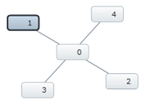
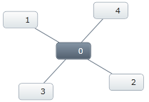
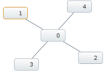

////

|metadata|
{
    "name": "xamnetworknode-display-visualstates",
    "controlName": ["xamNetworkNode"],
    "tags": ["Getting Started","Templating"],
    "guid": "ba84771b-78ba-4e1e-9de9-0d27945ae533",  
    "buildFlags": [],
    "createdOn": "2016-05-25T18:21:57.5122498Z"
}
|metadata|
////

= Display Visual States on xamNetworkNode

== Topic Overview

== Purpose

The purpose of this topic is to show how to display the different visual states of nodes in the link:{ApiPlatform}controls.maps.xamnetworknode{ApiVersion}~infragistics.controls.maps.xamnetworknode.html[xamNetworkNode™] control. The visual states are organized in groups, each consisting of several visual state properties where the control can be set to one of the states from any of the selected groups.

== In this topic

*Introducing visual states in groups for XamNetworkNode*

* Common Group

** Normal – Not selected nor in focus
** Disabled – Gray foreground color and cannot be selected with mouse, Mouse-Over or Mouse-Pressed

* Focus group

** Focused – Shows with dark color border
** Unfocused – Without dark color border

* Selection Group

** Selected – Shows with dark highlighted background
** Unselected – Without dark highlighted background

* Editing Group

** Editing – Shows with highlighted border
** NotEditing – Without highlighted border

== Required background

The table below lists the required background you need for fully understanding the information in this topic.

[options="header", cols="a,a"]
|====
|Background type|Content

|*Concepts*
|You need to be familiar with the following concepts: 

* Only one node can get focus 

* In order to set focus to a node, the node must be in normal state (normal state is the default) 

|*Topics*
|You need to first read the following topics: 

link:xamnetworknode-getting-started-with-xamnetworknode.html[Get Started with XamNetworkNode]

|====

== Control Configuration Overview

== Display Visual States

The table below lists the configurable visual states of the nodes on the xamNetworkNode control.

[options="header", cols="a,a,a"]
|====
|Configurable visual states|Configuration details|Configuration properties

|Group Common 

(Normal/Disabled)
|Normal state allows for selecting the nodes or giving them a focus to it, while the disabled mode does not.
| link:{ApiPlatform}controls.maps.xamnetworknode{ApiVersion}~infragistics.controls.maps.networknodenode~isenabled.html[IsEnabled]

|Group Focus 

(Focused/Unfocused)
|Focused state displays the nodes with darker border and highlighted background, and the Unfocused state is the same as Normal.
| link:{ApiPlatform}controls.maps.xamnetworknode{ApiVersion}~infragistics.controls.maps.xamnetworknode_methods.html[Focus()] method

|Group Select 

(Selected/Unselected)
|Selected state of the nodes display with darker background highlighted, and Unselected state is the same as Normal.
| link:{ApiPlatform}controls.maps.xamnetworknode{ApiVersion}~infragistics.controls.maps.networknodenode~isselected.html[IsSelected]

|Group Edit 

(Editing/Not Editing)
|Editing state of the nodes display with golden color border around the nodes to stand out, and Not editing is the same as Normal
| link:{ApiPlatform}controls.maps.xamnetworknode{ApiVersion}~infragistics.controls.maps.networknodenode~isediting.html[IsEditing]

|====

== Disabled state property settings

The table below maps the various visual states to the corresponding property settings. The properties are accessed through *NetworkNodeNode* object of XamNetworkNode control. The method Focus() is called on *NetworkNodeNode.Control* object of XamNetworkNode .

[options="header", cols="a,a,a"]
|====
|In order to configure the visual state of the nodes|Use this property:|And set it to one of the following

|Normal / Disabled
| link:{ApiPlatform}controls.maps.xamnetworknode{ApiVersion}~infragistics.controls.maps.networknodenode~isenabled.html[IsEnabled]
|true / false

|Focused / Unfocused
| link:{ApiPlatform}controls.maps.xamnetworknode{ApiVersion}~infragistics.controls.maps.xamnetworknode_methods.html[Focus()]
|Call link:{ApiPlatform}controls.maps.xamnetworknode{ApiVersion}~infragistics.controls.maps.xamnetworknode_methods.html[Focus()] method / IsSelected=false

|Selected / Unselected
| link:{ApiPlatform}controls.maps.xamnetworknode{ApiVersion}~infragistics.controls.maps.networknodenode~isselected.html[IsSelected]
|true / false

|Editing / NotEditing
| link:{ApiPlatform}controls.maps.xamnetworknode{ApiVersion}~infragistics.controls.maps.networknodenode~isediting.html[IsEditing]
|true / false

|====

== Normal / Disabled state property settings

The picture bellow demonstrates the result of normal and disabled states:

[options="header", cols="a,a"]
|====
|Property|Setting

| link:{ApiPlatform}controls.maps.xamnetworknode{ApiVersion}~infragistics.controls.maps.networknodenode~isenabled.html[IsEnabled]
|true (Normal state) 

false (Disabled state)

|====

[cols="a,a"]
|====
|True
|False

|image::images/xamNetworkNode_Visual_States_01.png[]
|image::images/xamNetworkNode_Visual_States_02.png[]

|====

== Focused / Unfocused state property settings

The picture bellow demonstrates the result of placing a node in a focused state. The node transitions to an unfocused state when clicking away from the focused node. There is no property or method to specifically unfocus the node. The normal state is considered unfocused, or the node can be unselected to be out of focus.

[options="header", cols="a,a"]
|====
|Method to call|Setting

| link:{ApiPlatform}controls.maps.xamnetworknode{ApiVersion}~infragistics.controls.maps.xamnetworknode_methods.html[Focus()]
|[C#]: node.Control.Focus(); 

[VB]: node.Control.Focus()

|====

== Selected / Unselected state property settings

The picture bellow demonstrates the result of selected state. Unselected state is the same as normal, described above:

[options="header", cols="a,a"]
|====
|Property|Setting

| link:{ApiPlatform}controls.maps.xamnetworknode{ApiVersion}~infragistics.controls.maps.networknodenode~isselected.html[IsSelected]
|true (Selected state) 

false (Normal state - described above)

|====

== Editing / NotEditing state property settings

The picture bellow demonstrates the result of editing state. Not editing state is the same as normal, described above:

[options="header", cols="a,a"]
|====
|Property|Setting

| link:{ApiPlatform}controls.maps.xamnetworknode{ApiVersion}~infragistics.controls.maps.networknodenode~isediting.html[IsEditing]
|true (Editing state) 

false (Normal state - described above)

|====

== Code Examples

== Examples overview

Visual states of various groups defined through code examples.

The following table lists the code examples provided below.

[options="header", cols="a,a"]
|====
|Example|Description

|Disabled
|Displays with gray foreground color and cannot be selected with mouse.

|Focused
|Displays with dark color border

|Selected
|Displays with dark highlighted background

|Editing
|Displays with highlighted border

|====

== Code Example: Disabled

== Example description

The Disabled state of the node displays with gray foreground color, and will not respond to mouse click, mouse over, or mouse pressed actions.

*In C#:*

----
foreach (NetworkNodeNode node in xnn.Nodes)
{
    node.IsEnabled = false;
}
----

*In Visual Basic:*

----
For Each node As NetworkNodeNode In xnn.Nodes
    node.IsEnabled = False
Next
----

== Code Example: Focused

== Example description

The Focused state of the node by default displays with dark color border. If the node is disabled it cannot be in focus. Only one node can be in focus at a time. In this example the node gives a focus to a node using an index.

*In C#:*

----
xnn.Nodes.ElementAt(3).Control.Focus();
----

*In Visual Basic:*

----
xnn.Nodes.ElementAt(3).Control.Focus()
----

== Code Example: Selected

== Example description

The Selected state of the node by default displays with darker background to stand out among other nodes. The selected nodes are added in the SelectedNodes collection of XamNetworkNode.

*In C#:*

----
foreach( var node in xnn.Search((NodeModel item) => item.Label.Equals("1")))
{
     node.IsSelected = true;
     // Or
     xnn.SelectedNodes.Add(node);
}
----

*In Visual Basic:*

----
For Each node As var In xnn.Search(Function(item As NodeModel) item.Label.Equals("1"))
    node.IsSelected = True
    ' Or
     xnn.SelectedNodes.Add(node)
Next
----

== Code Example: Editing

== Example description

The Editing state of the node is only a visual state; the nodes are not editable. By default the Editing visual state displays with golden color border around the node, while not editing state is the same as normal

*In C#:*

----
foreach( var node in xnn.Search((NodeModel item) => item.Label.Equals("1")))
{
    node.IsEditing = true;
}
----

*In Visual Basic:*

----
For Each node As var In xnn.Search(Function(item As NodeModel) item.Label.Equals("1"))
    node.IsEditing = True
Next
----

== Related Topics

* link:xamnetworknode-getting-started-with-xamnetworknode.html[Getting Started with xamNetworkNode]
* link:xamnetworknode-using-xamnetworknode.html[Using xamNetworkNode]