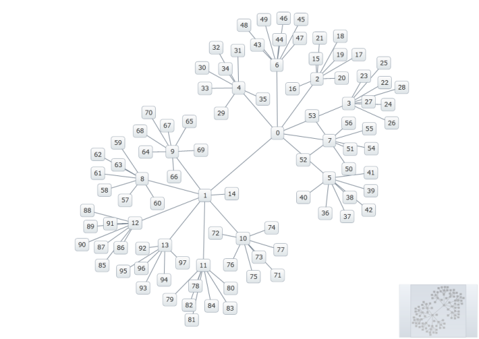

////
|metadata|
{
    "name": "xamnetworknode-getting-started-with-xamnetworknode",
    "controlName": ["xamNetworkNode"],
    "tags": ["API","Data Binding","Data Presentation","Getting Started"],
    "guid": "24154995-a0a3-4111-b249-b8eacd85df71",
    "buildFlags": [],
    "createdOn": "2016-05-25T18:21:57.403243Z"
}
|metadata|
////

= Getting Started with xamNetworkNode

This topic demonstrates how to add the link:{ApiPlatform}controls.maps.xamnetworknode{ApiVersion}~infragistics.controls.maps.xamnetworknode.html[xamNetworkNode]™ control to an application. Approaches using XAML and using procedural code are described. At the end of the topic, a complete code sample is provided.

The topic is organized as follows:

* <<Introduction,Introduction>> 
* <<Preview,Preview>>
* <<Requirements,Requirements>>
* <<AddingNetworkNodeUsingXAML,Adding a Network Node Control Using XAML>>
** <<AddingNetworkNodeUsingXAMLOverview,Overview>>
** <<AddingNetworkNodeUsingXAMLSteps,Steps>>
* <<AddingNetworkNodeUsingProceduralCode,Adding a Network Node Control Using Procedural Code>>
* <<CompleteCodeSample,Complete Code Sample>>
** <<View,View>>
** <<CodeBehind,Code Behind>>
** <<NodeModel,NodeModel.cs>>
** <<ConnectionModel,ConnectionModel.cs>>
** <<SimpleGraphData,SimpleGraphData.cs>>
* <<RelatedTopics,Related Topics>>

[[Introduction]]
== Introduction

The procedures below demonstrate how to define a data model, add the xamNetworkNode control to an application, and then bind that control to data.

[[Preview]]
== Preview

Following is a preview of the final result:

Figure 1: An implementation of the xamNetworkNode control as rendered by the sample code

[[Requirements]]
== Requirements

1. Required assembly references: 
 * {ApiPlatform}Controls.Maps.XamNetworkNode.v{ProductVersion}.dll 
 * {ApiPlatform}DataVisualization.v{ProductVersion}.dll 
 * {ApiPlatform}v{ProductVersion}.dll
2. Required XAML namespace references (XAML implementation only): 
+
*In XAML:*
+
[source,xaml]
----
xmlns:ig="http://schemas.infragistics.com/xaml"
xmlns:data="clr-namespace:xamNetworkNode_Intro.Data"
----
+
In this case, xamNetworkNode_Intro.Data is the namespace in which we defined the SimpleGraphData class.

[[AddingNetworkNodeUsingXAML]]
== Adding a Network Node Control Using XAML

[[AddingNetworkNodeUsingXAMLOverview]]
=== Overview

Conceptual overview of the procedure:

1. <<DefiningDataModel,Defining a data model>>
2. <<DefiningDataCollection,Defining a data collection>>
3. <<AddNetworkNode,Add the Network Node>> 
4. <<SavingYourProject,Saving your project>>
5. <<VerifyingResult,(Optional) Verifying the result>>

[[AddingNetworkNodeUsingXAMLSteps]]
== Steps

[[DefiningDataModel]]
[start=1]
1. *Define a data model.*
+
The Network Node control requires two data model classes: one for node items, and one for the connections between those items. The data model for a node must reference a set of connections, while the data model for a connection must reference a node item.
+
.Note
[NOTE]
====
If you want changes in the data to be propagated to the graph layout, then both data models must implement INotifyPropertyChanged.
====
+
To get started, use the NodeModel and ConnectionModel classes provided at the end of this topic.

[[DefiningDataCollection]]
[start=2]
2. *Define a data collection.*
+
The following data class populates a connected set of nodes upon construction, and makes the data available via a property called link:{ApiPlatform}controls.maps.xamnetworknode{ApiVersion}~infragistics.controls.maps.xamnetworknode~nodes.html[Nodes]
+
*In C#:*
+
[source,csharp]
----
public class SimpleGraphData
{
    public ObservableCollection<NodeModel> Nodes { get; set; }

    private const int K = 7; // number of connections per node (maximum)
    private const int NUM_NODES = 98; // number of nodes in the graph
 
    public SimpleGraphData()
    {
        Nodes = new ObservableCollection<NodeModel>();

        // add NUM_NODES node objects to the collection
        for (int i = 0; i < NUM_NODES; i++)
        {
            NodeModel node = new NodeModel();
            node.Label = i.ToString();
            node.ToolTip = "ToolTip for " + node.Label;
            Nodes.Add(node);
        }

        // starting with node 0, set that node as a root.
        // add up to K connections to the root node.
        // then, increment the root node index and repeat until all nodes have been connected.
        int root = 0;
        int first = 1;
        int last = K;
        while (first < Nodes.Count)
        {
            Nodes[root].Connections = new ObservableCollection<ConnectionModel>();
            for (int i = first; i <= last; i++)
            {
                if (i >= Nodes.Count)
                {
                    break;
                }
                Nodes[root].Connections.Add(new ConnectionModel { Target = Nodes[i] });
            }
            root++;
            first = last + 1;
            last += K;
        }
    }
}
----
+
*In Visual Basic:*
+
[source,vb]
----
Public Class SimpleGraphData
    Public Property Nodes() As ObservableCollection(Of NodeModel)
        Get
            Return m_Nodes
        End Get
        Set
            m_Nodes = Value
        End Set
    End Property
    Private m_Nodes As ObservableCollection(Of NodeModel)
    Private Const K As Integer = 7
    ' number of connections per node (maximum)
    Private Const NUM_NODES As Integer = 98
    ' number of nodes in the graph
    Public Sub New()
        Nodes = New ObservableCollection(Of NodeModel)()

        ' add NUM_NODES node objects to the collection
        For i As Integer = 0 To NUM_NODES - 1
            Dim node As New NodeModel()
            node.Label = i.ToString()
            node.ToolTip = "ToolTip for " & node.Label
            Nodes.Add(node)
        Next

        ' starting with node 0, set that node as the root.
        ' add up to K connections to the root node.
        ' then, increment the root node index and repeat until all nodes have been connected.
        Dim root As Integer = 0
        Dim first As Integer = 1
        Dim last As Integer = K
        While first < Nodes.Count
            Nodes(root).Connections = New ObservableCollection(Of ConnectionModel)()
            For i As Integer = first To last
                If i >= Nodes.Count Then
                    Exit For
                End If
                Nodes(root).Connections.Add(New ConnectionModel() With { _
                    Key .Target = Nodes(i) _
                })
            Next
            root += 1
            first = last + 1
            last += K
        End While
    End Sub
End Class
----

[[AddNetworkNode]]
[start=3]
3. *Add the Network Node.*
+
--
a. Add an instance of SimpleGraphData as a resource. 
b. Add an instance of the Network Node control, setting its link:{ApiPlatform}controls.maps.xamnetworknode{ApiVersion}~infragistics.controls.maps.xamnetworknode~itemssource.html[ItemsSource] and link:{ApiPlatform}controls.maps.xamnetworknode{ApiVersion}~infragistics.controls.maps.xamnetworknode~globalnodelayouts.html[GlobalNodeLayouts] properties appropriately. The GlobalNodeLayouts collection must contain at least one link:{ApiPlatform}controls.maps.xamnetworknode{ApiVersion}~infragistics.controls.maps.networknodenodelayout.html[NetworkNodeNodeLayout] object, which tells the control how to retrieve the information it needs from the data model. 
--
+
[NOTE]
====
Note: For some more advanced scenarios, you can add an arbitrary number of NetworkNodeNodeLayout objects to the GlobalNodeLayouts collection. This allows multiple data types to be used in the ItemsSource.
====
+
*In XAML:*
+
[source,xaml]
----
<Grid x:Name="LayoutRoot" Background="White">
    <Grid.Resources>
        <data:SimpleGraphData x:Key="GraphData" />
    </Grid.Resources>
    <ig:XamNetworkNode x:Name="xnn"
                       ItemsSource="{Binding Nodes, Source={StaticResource GraphData}}">
        <ig:XamNetworkNode.GlobalNodeLayouts>
            <ig:NetworkNodeNodeLayout
                TargetTypeName = "NodeModel"
                DisplayMemberPath = "Label"
                ToolTipMemberPath = "ToolTip"
                ConnectionsMemberPath = "Connections"
                ConnectionTargetMemberPath = "Target"
                />
        </ig:XamNetworkNode.GlobalNodeLayouts>
    </ig:XamNetworkNode>
</Grid>
----

[[SavingYourProject]]
[start=4]
4. *Save your project.*

[[VerifyingResult]]
[start=5]
5. *(Optional) Verify the result.*
+
Verify the result, run your application. If you have added the Network Node control successfully, your application should now display as shown in Figure 1 above.

[[AddingNetworkNodeUsingProceduralCode]]
== Adding a Network Node Control Using Procedural Code

It is possible to use the Network Node control without relying on XAML. Following is the equivalent procedural code for the application we have just set up.

*In C#:*
[source,csharp]
----
using System.Windows.Controls;
using Infragistics.Controls.Maps;
using xamNetworkNode_Intro.Data;

namespace xamNetworkNode_Intro
{
    public partial class MainPage : UserControl
    {
        public MainPage()
        {
            InitializeComponent();
            InitializeNetworkNode();
        }
 
        private void InitializeNetworkNode()
        {
            SimpleGraphData data = new SimpleGraphData();
            XamNetworkNode xnn = new XamNetworkNode();
            xnn.GlobalNodeLayouts.Add(
                new NetworkNodeNodeLayout
                {
                    TargetTypeName = "NodeModel",
                    DisplayMemberPath = "Label",
                    ToolTipMemberPath = "ToolTip",
                    ConnectionsMemberPath = "Connections",
                    ConnectionTargetMemberPath = "Target"
                });
            xnn.ItemsSource = data.Nodes;
            this.LayoutRoot.Children.Add(xnn);
        }
    }
}
----

*In Visual Basic:*
[source,vb]
----
Imports System.Windows.Controls
Imports Infragistics.Controls.Maps
Imports xamNetworkNode_Intro.Data

Namespace xamNetworkNode_Intro
    Public Partial Class MainPage
        Inherits UserControl
        Public Sub New()
            InitializeComponent()
            InitializeNetworkNode()
        End Sub

        Private Sub InitializeNetworkNode()
            Dim data As New SimpleGraphData()
            Dim xnn As New XamNetworkNode()
            xnn.GlobalNodeLayouts.Add(New NetworkNodeNodeLayout() With { _
                Key .TargetTypeName = "NodeModel", _
                Key .DisplayMemberPath = "Label", _
                Key .ToolTipMemberPath = "ToolTip", _
                Key .ConnectionsMemberPath = "Connections", _
                Key .ConnectionTargetMemberPath = "Target" _
            })
            xnn.ItemsSource = data.Nodes
            Me.LayoutRoot.Children.Add(xnn)
        End Sub
    End Class
End Namespace
----

[[CompleteCodeSample]]
== Complete Code Sample

Following is the code of the full example implemented in context.

[[View]]
== View

*In XAML:*
[source,xaml]
----
<UserControl x:Class="xamNetworkNode_Intro.MainPage"
    xmlns="http://schemas.microsoft.com/winfx/2006/xaml/presentation"
    xmlns:x="http://schemas.microsoft.com/winfx/2006/xaml"
    xmlns:d="http://schemas.microsoft.com/expression/blend/2008"
    xmlns:mc="http://schemas.openxmlformats.org/markup-compatibility/2006"
    xmlns:ig="http://schemas.infragistics.com/xaml"
    xmlns:data="clr-namespace:xamNetworkNode_Intro.Data"
    mc:Ignorable="d"
    d:DesignHeight="300" d:DesignWidth="400">
 
    <Grid x:Name="LayoutRoot" Background="White">
        <Grid.Resources>
            <data:SimpleGraphData x:Key="GraphData" />
        </Grid.Resources>
        <ig:XamNetworkNode x:Name="xnn"
                           ItemsSource="{Binding Nodes, Source={StaticResource GraphData}}">
            <ig:XamNetworkNode.GlobalNodeLayouts>
                <ig:NetworkNodeNodeLayout
                    TargetTypeName = "NodeModel"
                    DisplayMemberPath = "Label"
                    ToolTipMemberPath = "ToolTip"
                    ConnectionsMemberPath = "Connections"
                    ConnectionTargetMemberPath = "Target"
                    />
            </ig:XamNetworkNode.GlobalNodeLayouts>
        </ig:XamNetworkNode>
    </Grid>
</UserControl>
----

[[CodeBehind]]
== Code Behind

*In C#:*
[source,csharp]
----
using System.Windows.Controls;
 
namespace xamNetworkNode_Intro
{
    public partial class MainPage : UserControl
    {
        public MainPage()
        {
            InitializeComponent();
        }
    }
}
----

*In Visual Basic:*
[source,vb]
----
Imports System.Windows.Controls

Namespace xamNetworkNode_Intro
    Public Partial Class MainPage
        Inherits UserControl
        Public Sub New()
            InitializeComponent()
        End Sub
    End Class
End Namespace
----

[[NodeModel]]
== NodeModel.cs

*In C#:*
[source,csharp]
----
using System.Collections.ObjectModel;
using System.ComponentModel;
 
namespace xamNetworkNode_Intro.Models
{
    public class NodeModel : INotifyPropertyChanged
    {
        private string _label;
        public string Label
        {
            get { return _label; }
            set
            {
                if (value != _label)
                {
                    _label = value;
                    NotifyPropertyUpdated("Label");
                }
            }
        }
 
        private string _toolTip;
        public string ToolTip
        {
            get { return _toolTip; }
            set
            {
                if (value != _toolTip)
                {
                    _toolTip = value;
                    NotifyPropertyUpdated("ToolTip");
                }
            }
        }
 
        private ObservableCollection<ConnectionModel> _connections;
        public ObservableCollection<ConnectionModel> Connections
        {
            get { return _connections; }
            set
            {
                if (value != _connections)
                {
                    _connections = value;
                    NotifyPropertyUpdated("Connections");
                }
            }
        }
 
        public event PropertyChangedEventHandler PropertyChanged;
 
        protected virtual void NotifyPropertyUpdated(string propertyName)
        {
            var handler = PropertyChanged;
 
            if (handler != null)
            {
                handler(this, new PropertyChangedEventArgs(propertyName));
            }
        }
    }
}
----

*In Visual Basic:*
[source,vb]
----
Imports System.Collections.ObjectModel
Imports System.ComponentModel

Namespace xamNetworkNode_Intro.Models
    Public Class NodeModel
        Implements INotifyPropertyChanged
        Private _label As String
        Public Property Label() As String
            Get
                Return _label
            End Get
            Set
                If value <> _label Then
                    _label = value
                    NotifyPropertyUpdated("Label")
                End If
            End Set
        End Property

        Private _toolTip As String
        Public Property ToolTip() As String
            Get
                Return _toolTip
            End Get
            Set
                If value <> _toolTip Then
                    _toolTip = value
                    NotifyPropertyUpdated("ToolTip")
                End If
            End Set
        End Property

        Private _connections As ObservableCollection(Of ConnectionModel)
        Public Property Connections() As ObservableCollection(Of ConnectionModel)
            Get
                Return _connections
            End Get
            Set
                If value <> _connections Then
                    _connections = value
                    NotifyPropertyUpdated("Connections")
                End If
            End Set
        End Property

        Public Event PropertyChanged As PropertyChangedEventHandler

        Protected Overridable Sub NotifyPropertyUpdated(propertyName As String)
            Dim handler = PropertyChanged

            RaiseEvent handler(Me, New PropertyChangedEventArgs(propertyName))
        End Sub
 
    End Class
End Namespace
----

[[ConnectionModel]]
== ConnectionModel.cs

*In C#:*
[source,csharp]
----
using System.ComponentModel;
 
namespace xamNetworkNode_Intro.Models
{
    public class ConnectionModel : INotifyPropertyChanged
    {
        private NodeModel _target;
        public NodeModel Target
        {
            get { return _target; }
            set
            {
                if (value != _target)
                {
                    _target = value;
                    NotifyPropertyUpdated("Target");
                }
            }
        }
 
        #region Implementation of INotifyPropertyChanged
 
        public event PropertyChangedEventHandler PropertyChanged;
 
        protected virtual void NotifyPropertyUpdated(string propertyName)
        {
            var handler = PropertyChanged;
 
            if (handler != null)
            {
                handler(this, new PropertyChangedEventArgs(propertyName));
            }
        }
        #endregion
    }
}
----

*In Visual Basic:*
[source,vb]
----
Imports System.ComponentModel

Namespace xamNetworkNode_Intro.Models
    Public Class ConnectionModel
        Implements INotifyPropertyChanged
        Private _target As NodeModel
        Public Property Target() As NodeModel
            Get
                Return _target
            End Get
            Set
                If value IsNot _target Then
                    _target = value
                    NotifyPropertyUpdated("Target")
                End If
            End Set
        End Property

        Public Event PropertyChanged As PropertyChangedEventHandler

        Protected Overridable Sub NotifyPropertyUpdated(propertyName As String)
            Dim handler = PropertyChanged

            RaiseEvent handler(Me, New PropertyChangedEventArgs(propertyName))
        End Sub
        
    End Class
End Namespace
----

[[SimpleGraphData]]
== SimpleGraphData.cs

*In C#:*
[source,csharp]
----
using System.Collections.ObjectModel;
using xamNetworkNode_Intro.Models;
 
namespace xamNetworkNode_Intro.Data
{
    public class SimpleGraphData
    {
        public ObservableCollection<NodeModel> Nodes { get; set; }
        private const int K = 7; // number of connections per node (maximum)
        private const int NUM_NODES = 98; // number of nodes in the graph
 
        public SimpleGraphData()
        {
            Nodes = new ObservableCollection<NodeModel>();
 
            // add NUM_NODES node objects to the collection
            for (int i = 0; i < NUM_NODES; i++)
            {
                NodeModel node = new NodeModel();
                node.Label = i.ToString();
                node.ToolTip = "ToolTip for " + node.Label;
                Nodes.Add(node);
            }
 
            // starting with node 0, set that node as the root.
            // add up to K connections to the root node.
            // then, increment the root node index and repeat until all nodes have been connected.
            int root = 0;
            int first = 1;
            int last = K;
            while (first < Nodes.Count)
            {
                Nodes[root].Connections = new ObservableCollection<ConnectionModel>();
                for (int i = first; i <= last; i++)
                {
                    if (i >= Nodes.Count)
                    {
                        break;
                    }
                    Nodes[root].Connections.Add(new ConnectionModel { Target = Nodes[i] });
                }
                root++;
                first = last + 1;
                last += K;
            }
        }
    }
}
----

*In Visual Basic:*
[source,vb]
----
Imports System.Collections.ObjectModel
Imports xamNetworkNode_Intro.Models

Namespace xamNetworkNode_Intro.Data
    Public Class SimpleGraphData
        Public Property Nodes() As ObservableCollection(Of NodeModel)
            Get
                Return m_Nodes
            End Get
            Set
                m_Nodes = Value
            End Set
        End Property
        Private m_Nodes As ObservableCollection(Of NodeModel)
        Private Const K As Integer = 7
        ' number of connections per node (maximum)
        Private Const NUM_NODES As Integer = 98
        ' number of nodes in the graph
        Public Sub New()
            Nodes = New ObservableCollection(Of NodeModel)()

            ' add NUM_NODES node objects to the collection
            For i As Integer = 0 To NUM_NODES - 1
                Dim node As New NodeModel()
                node.Label = i.ToString()
                node.ToolTip = "ToolTip for " & node.Label
                Nodes.Add(node)
            Next

            ' starting with node 0, set that node as the root.
            ' add up to K connections to the root node.
            ' then, increment the root node index and repeat until all nodes have been connected.
            Dim root As Integer = 0
            Dim first As Integer = 1
            Dim last As Integer = K
            While first < Nodes.Count
                Nodes(root).Connections = New ObservableCollection(Of ConnectionModel)()
                For i As Integer = first To last
                    If i >= Nodes.Count Then
                        Exit For
                    End If
                    Nodes(root).Connections.Add(New ConnectionModel() With { _
                        Key .Target = Nodes(i) _
                    })
                Next
                root += 1
                first = last + 1
                last += K
            End While
        End Sub
    End Class
End Namespace
----

[[RelatedTopics]]
== Related Topics

* link:xamnetworknode.html[xamNetworkNode]
* link:xamnetworknode-using-xamnetworknode.html[Using xamNetworkNode]